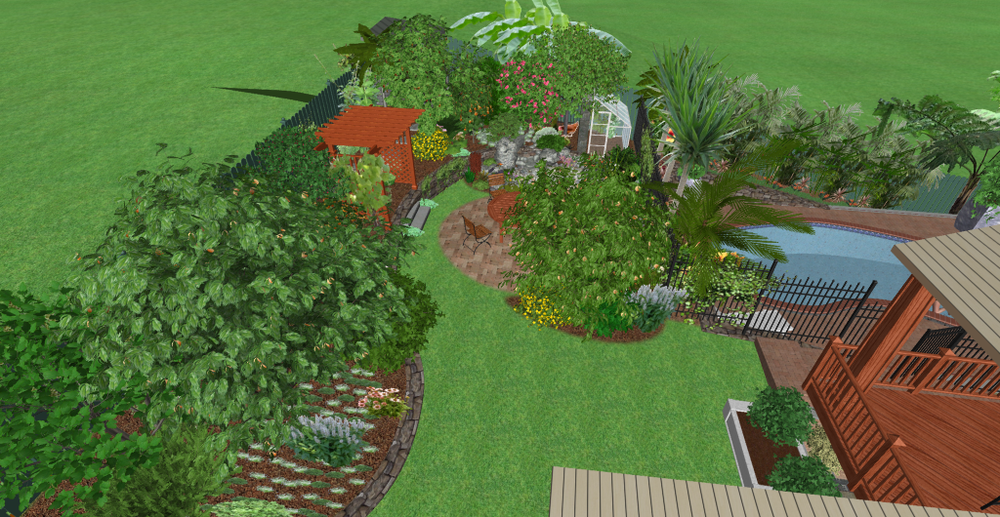
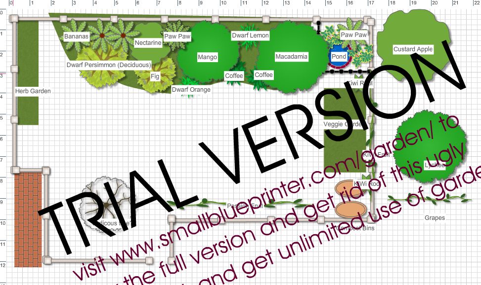
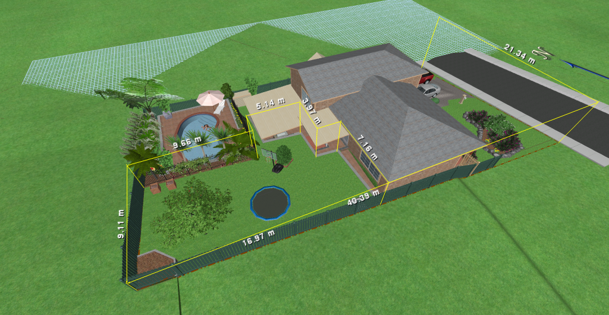
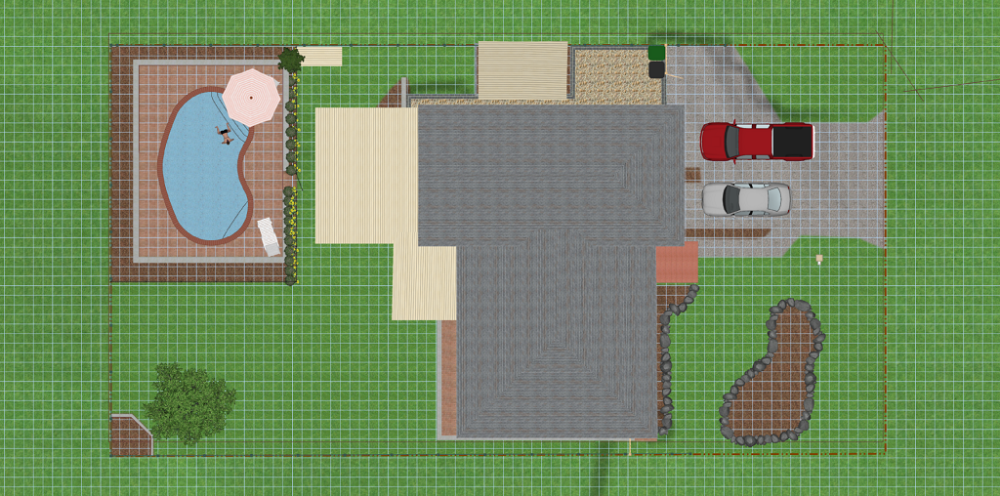
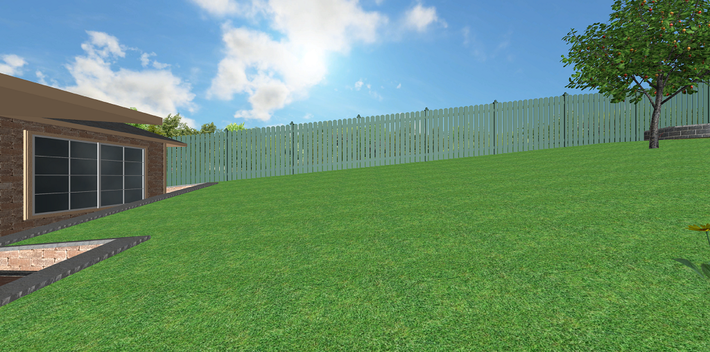
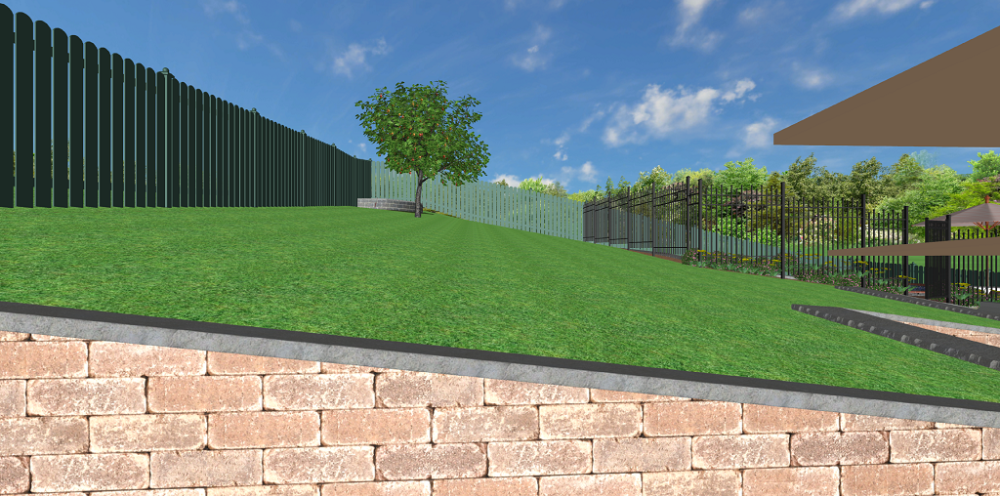
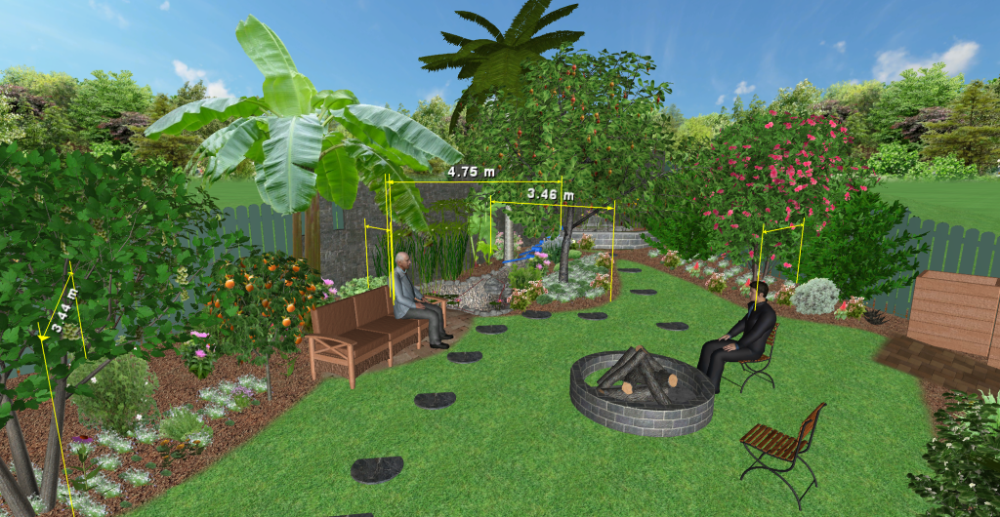

# Asthectically pleasing, productive landscaping

This project will be used as a place to document my learnings and decisions made for a landscaping project in my backyard.

If others are interested in designing an asthectically pleasing yet productive landscape in their suburban back yards, then maybe they can learn from my mistakes.

## Goal statement

I used this as guide to create the goal statement: https://www.milkwood.net/2015/10/26/permaculture-design-process-1-writing-a-goal-statement/

The purpose of the goal statement is to ensure that decisions I make along the way contribute to the high level outcome instead of getting lost in the details.

Our small suburban back yard is a is productive and beautiful ecosystem. With a focus on sustainable closed loop ecosystems, it provides us with some edible food and a habitat for local wildlife.

Providing shade in the summer, it is a perfect space to entertain a few guests in a calming and peaceful environment.

# Inspiration

Many things have provided inspiration in this design. Two areas in particular though stand out; Permaculture and Aquaponics.

# Old Designs

This is a list of previous designs I made to a fairly stable point and then decided to change something significant. It gives a reasonable idea of the process tha has happened over the last few years:

## First Draft 2018/12

Using a very simple 2D garden planning tool (http://www.smallblueprinter.com/garden/), I outlined a basic structure for my back-yard design.

This included rough measurements of the yard, and identified a few key things I would like in the design:
* Deciduous trees near the house to permit light to enter the house in winter and maybe some shade in summer
* Taller trees on the south boundary and layer plants like in a food forrest smaller towards the north and down-slope, providing light at all layers
* Covering all boundaries with something productive (vines on fences for example)
* Started to identify the types of plants I wanted
* Raised beds for annuals (Veggies and herbs)
* Herbs and leafy greens closer to the kitchen for easy access
* Pond near back (I love water features)

I started to realize that I couldnt easily visualize what this would look like and how the sunlight would work etc, so I went looking for other software to model it better.

## Existing Propert Modeling 2019/01

I played with a few CAD packages, and finally settled on one called Realtime Landscaping Pro (https://www.ideaspectrum.com/landscape-design-software-overview/) It was simple to use, flexible and fairly cheap as CAD packages go.

All the free ones I tried were much less productive to use, where as this software had a nice intuitive interface, a good set of features and the tutorial videos were amazing (https://www.ideaspectrum.com/landscaping-software-tutorials/). The free version was sufficient for what I wanted to do, but I ended up paying for it to support what I think is good software and get access to more tree models.

To model my house + yard, I did a few things:
* Lots of measuring dimensions and photos of my house and yard
* Downloaded image from googe maps for base : https://www.ideaspectrum.com/using-google-maps/
* Used another overlay image of the houses floor plan to accuratly line up doors / windows
* Estimated the slope of my yard using a long straight pole, tape measure and some math
* Drew up the landscape with slope, then modeled the house
* Using photos, validate the landscape contour and make relevant minor adjustments
* Validated the aspect was set correctly in the software for shadow simulation

After this I had a fairly accurate model of the existing property including landscape contour and house. It took a while to get the contour correct and I think contour and elevation controls are probably the worst parts of the Realtime Landscaping pro software. 

Perspective View  |  Topdown View
:---:|:---:
  |  

Slope viewed from north  |  Slope viewed from east
:---:|:---:
  |  

## First 3D Model 2019/02

This was my first 3D modeled design. It was simple, based off the 2D one. 

I also included a significant design for an extension to the house with a deck overlooking the yard and pool and closing in a granny flat under the deck that I thought would maybe be something we might do one day.

Some things I tried to achieve in this design were:
* Tall trees on the south and layer plants like in a food forrest smaller towards the north and down-slope, providing light at all layers
* Pond and stream near back to create a micro-climate with more temperate/tropical plants near it (Bananas, Mango, Davidsons Plum)
* Black bricks along southern boundary fence to hold warmth and create a micro-climate good for bananas, mangos etc
* Use the existing raised bed in the corner for a small pond
* Cover back fence with bushes to hide it
* Keep compost bins, paving near them to make easier access
* Include a fire-pit as we were using one regulary
* Minimal work

There were many issues with this but the key ones to caused me to start a new design included:
* The space was still basically the same as what we had + some plants and a pond that wouldnt work

## Second Draft 2019/09/05

In this revision, a key point was to try ad make the grassy space more usable by adding a retaining wall. 

Additionally, I thought the area near the house could have vegetable gardens as the grass doesnt grow well there and they are close for easy harvesting and it would tidy a slightly ugly area of the yard.

* Added raised beds near kitchen window
* Added more planting next to pool fence
* Added entertainment area instead of a simple seat that has view of pond and shade
* Added chicken coup near pool area (Sufficient distance from surrounding dwellings)
* Added small chicken-run along back fence, hidden by bushes so ugly chicken scratched soil is not visible

Issues:
* Vegetable gardens are often ugly
* Vegetable gardens occasionally smell bad after digning in compost
* Building the pond was infeasible, the pond was sloped
* Creating a long stream served little purpose
* I read the ponds in the shade were a bad idea
* retaining wall was not feasible (too sharp angles, difficult to draw on ground not geometric shapes)
* Digging pond and stream next to boundary fence might cause issues with fence stability
* Retaining walls adjusted boundary fence level 
* Deciduous and large trees overhang petes yard/pool and he wont like that
* Pond was still on a slop, not feacible to build without more retaining

# References

