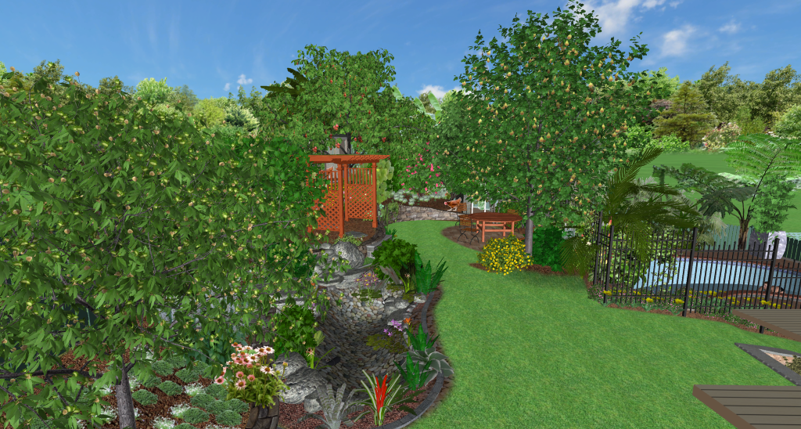

# Asthectically pleasing, productive backyard landscaping

This is the challange:

> Can I turn a my typical surburban backyard into something that is both beautiful and productive?

I plan to keep track of all the key areas considered as part of the design to meet this challange. I want my backyard to be:
* Asthetically pleasing (Most permaculture, aquaponic systems I see are ugly, with a bit of planning and cost I think there is no need for them to be)
* Productive (Fruit, vegetables, eggs, fish)
* Efficient/Sustainable (Setting up as many natural cycles as possible, working with nature instead of against it)
* Low maintainence (through automation and good up-front design)

**Why am I doing this?**

I love gardening, love eating food I have grown, married to a marine scientist (who likes conservation and understanding of ecosystems), want to make my yard look good and want to make a difference on my impact in the world. Finally my approach may be very design oriented and well as an engineer thats just how I like to do things (regulary to the rolling eyes of my wife) :-) 

TODO: Add an image for each section makes it simpler to read and separate/find what we are after

## Big question to answer early

I have narrowed down to two main design options that have a big impact on the structure of the overall backyard. It is about where to place the retaining wall and pond. This decision needs to be made early, can't be changed later and has a big impact on everything else.

You can find more info here: 

[pond/ponds.md](pond/ponds.md)

## Goal statement

I used this as guide to create the goal statement: https://www.milkwood.net/2015/10/26/permaculture-design-process-1-writing-a-goal-statement/

The purpose of the goal statement is to help us imagine what it is like and ensure that decisions made along the way contribute to the high level outcome instead of getting lost in the details of specific technologies (I can't help myself though I MUST have a pond).

> Our small suburban back yard is productive and beautiful. With a focus on sustainable closed loop ecosystems, it provides us with some edible food and a habitat for local wildlife while reducing our detrimental impact on the environment.
> 
> Providing shade in the summer and open to sunlight in the winter, it is a perfect space to entertain a few guests in a calming and peaceful environment.

# Key technologies

## Polyculture/Diversity

The idea here is that a diverse ecosystem is typically more resiliant. This includes diversity in plants animals and insects and many of the technologies listed on this page contribute to this diversity. 

We plan to plant various different species and types of plants. This includes flowers, fruit, vegetables and other possily non-edible support plants that help define the eco-system. 

We will have a bias towards plants for human consumption which may cause some inbalance in the system, however I will adjust this as necessary after identifying specific issues.

## Creating artificial ecosystems

In an ideal world, I would base this entire design on local native ecosystems for the area in which I live. These are well adapted for the environment and would likely be the most resiliant. However this design, although learning where possible from local ecosystems I will instead attempt to artificially create non-native natural ecosystems in my backyard that better meet the goals.

I have written more about my thinking on this [ecosystems/ecosystems.md](ecosystems/ecosystems.md). However in summary, in order to achieve the goals of productivity and sustainability in a small area of my backyard I think we need to focus on ecosystems that are tuned to produce some of what we consume. 

Two good examples of this in the design are:

**Adding a pond** : A pond is not natural in my backyard, and will require maintainence and some electricity. However its my personal opinion that the benefits far outweigh these drawbacks.

**Tree selection** : A good choice here would likely be some kind of Eucalypt. It is a consideration, but in order to achieve the productivity and density for the backyard I will be selecting various kinds of fruit and nut trees.

## Pond / water feature

Adding running water into an ecosystem can introduce a huge diversity of wildlife to your back yard. This include birds, insects, frogs and lizzards. 

A diverse ecosystem is often naturally more robust, helping to improve its stability as there are fewer cases of individual parts of it going unchecked because of missing predators.

Additionally, having a body of water in the back-yard will affect the micro-climate. Adding humidity and a bit more thermal stability. Especially if it is enclosed by structure such as trees/shrubs to hold the humidity in a little.

Finally ponds/water features are just plain amazing and beautiful!

Some issues with adding a pond might be unwanted guests like mosquitos, however if the pond is stocked correctly by say adding rainbowfish (again not a mono-culture of fish) we can minimise the impact of this. 

The goal with the pond stocking will be to have diversity. By choosing species carefully I believe we can have diversity + productivity. My initial goal here is to consider stocking native fish that each have a purpose:
* Silver perch for eating
* Eel tailed catfish for eating and stirring up the bottom to help clean the pond
* Some form of rainbowfish (or other suitable species) for preying on mosquitos
* Maybe some alae eating species like galss shrimp

I know that some of these may eat each other, however if we design it correctly by including sufficient aquatic plants, rock formations and shallow sections we may be able to minimise this impact.

The biggest issue with a pond is its complexity and potentially power usage. Designing to include it is taking more time than the rest of the garden. Hopefully with the right design, the maintainence can be minimised. 

I expect to use a small 45W pump to run it 24/7 to keep the water oxygenated and flowing and bacteria alive, but automate a larger pump during the day when the solar panels are generating excess power to permit suficient water flow for additional filtering. The pump is a critical part of the system and we should account for redundancy by having two pumps installed (or a backup aerator) and a battery with automatic failover.

## Retaining wall

Originally was going to be added just to level off a grassy area for the kids to play. 

However there are a few other benefits that I have considered since then (depending on how the wall is made).
* Help drainage in heavy clay soil as most planting will be above the wall
* Separate the levels giving more light on south side to plants
* Clear separation of grass from garden so wont be continually fighting weeds
* Necessary to make level section for pond
* Provides space for growing hanging plants or vines down the front of the wall
* Adds asthetic appeal IMO if done nicely out of raw sandstone
* Integrates nicely with rock work for pond waterfall which provides habitat for lizzards

Issues:
* Cant afford huge drainage behind wall, so limits size of wall and what it is capable of retaining
* Possible tree root issues
* Possible issues with structural soundness of the pond so close to foot of retaining wall

## Water management

There is a lot of literature on this and it is a big focus in many permaculture designs and important to think about in the current Australian climate when we regulary have water restrictions. The idea is to consider the flow of water through the property and how you can slow the movement of the water down and direct it to achieve better passive water retention and provide water storage for dry times. 

There are a lot of considerations here. For example, in my design I have deliberatly added:
* Chickens at top of slope (nutrient rich run-off to plants)
* Swales in circular pattern going down the slope to slow water down
* Protection of pond from run-off using berms and drainage
* Collection of water into tanks from hard surfaces
* Overflow from roof collection tank into the pond
* Overflow from pond to another swale

You will notice that the water flow is linked across various aspects of the entire system to try and retain and get as much use from it as possible.

I think these swales are probably a little bit small, and I will consider changing this a bit. But it gives the general idea.

### Swales 

A common tool to help water retention are swales. These are usually depressions/trenches dug to hold water so it can infiltrate the soil better instead of running off the top.

If you look at the image, you can see the swales and water flow direction on the diagram. A key point to note is that as water flows from the chickens at the top of the slope it will take nutrient rich water down with it, not just watering but also providing nourishment to the plants. Also, the pond is further away to try and prevent this nutrient rich run off entering the pond.

As the water hits a swale it dams up, forcing the water to puddle a little and sink into the ground.

Swales can be "hidden" by digging a trench and filling it with something like blue-metal, or can be above ground using berms or a combination of both. Currently I have designed using berms to create little dams, but its likely I will use a combination of both to increase the volume and reduce the unsightly impact. 

Berms also have the issue of eroding away and need to be constructed of a suitable material like clay. An important consideration when adding raised berms is to be sure that the height is such that the top of the berm is lower than the natural land level on my up-hill boundary fence to ensure there is no impact on the surrounding properties water drainage.

### Evaporation

By completely mulching the garden area and adding trees to provide a shade canopy with layered shrubs etc, we are planning to design such that the property does its best to retain water where it is needed and has no directly exposed soil. 

### Irrigation

I have a water tank and will be using that for irrigation occasionally during dry periods. The irrigation lines should aim to make use of the swales by irrigating from the upper area of the slope.

TODO Not really fleshed this out

## Fowl (Chickens)

Using chickens or pheasants as part of a suburban ecosystem is hugely beneficial. They perform multiple different duties that help in the recycling of waste and health of the overall garden.

Most likely we will include some bantam chickens, however if we are unable to do that due to various constraints, I will consider using spotted pheasants or other form of fowl. They are good at:
* Recycling human waste converting to manure good for the garden
* Cleaning bugs from lower storey plants
* Scratching around and aerating the soil
* Providing meat and eggs

Issues to consider:
* Space requirements for happy chooks
* Nutrient run-off into pond
* Asthetics (chooks decimate landscape in runs and pens)

## Insect larvae

Insect larvae are becoming more popular as a means to efficiently convert human food waste into protien/fat for feeding chikens and fish (and occasionally the brave human).

One of the more common species used for this is Black soldier fly larvae. I have also seen occasional use of native flies which maybe preferrable for the local climate but pose a few extra challenges.

With black soldier fly larvae, when they are getting ready to pupate they will crawl upwards, so a ramp can be made in the holding container and they will automatically crawl up when big enough and drop into a bucket which we can then use for feeding the chickens and fish.

There are other benefits specifically of the black soldier fly. They do not bother people much and will return to the same container to lay eggs so can sustain a continual production of eggs.

Issues we need to overcome are:
* Smell
* Are native flies suitable for this
* Which scraps to feed the larvae and which to feed the chickens

## Sunlight

TODO add page showing analysis of sun progress over time (time-lapse)
Show video of modeled sun/shadows from landscaping software
Describe aspect of block, slope, retaining wall design, plant layout etc all playing a part in the passive use of sunlight on the block in summer/winter

## Composting

TODO

## Mulching
TODO

## Symbiotic mycelium
TODO Layer wood mulch on top of soil and innocuate with edible mushroom mycelium

## Bees
Honey/Native

## Aquaponics

This is something I am super interested in. I will plan to try it in my garden unless the upkeep becomes too much.
TODO

### Radio flow filter cleaning/fertalizer

### Design of grow beds

### Red wriggler worms
TODO lots of individual ideas/technologies in the aquaponics section

# Observations

## Soil

TODO: Add details about what is important here generally and why (not speifically for my garden)

TODO: This page will document the details about my soil test.
[soil/soil.md](soil/soil.md)

## Walking Paths

## Other

* South boundry fence not stable, soil moves 
* Neighboring property on west has unobstructed view into our back yard, extended balcony
* Neighboring property on south is very tidy and has a pool, will avoid overhanging deciduous trees on boundary
* Pee-wees, bower birds, willy wagtails frequent yard gathering food and insects from ope compost bins

# Process

TODO:

The high level process for this is that now I have an idea of what I want to include int he design, a rough idea of restrictions. I want to get the high level macro view of how this is going to look. Once I know roughly where the planting will be, where the retaining wall will be, where I might put the chooks, the pond, a glasshouse, table + chairs etc. I can then start looking more into the detail and adding to the design.

There was some element of this detailed planning before when I thought I had a decent high level design, however the detail aspects raised some concerns that caused me to change the larger macro view. In particular around retaining wall placement and council regulations, cost and where to place the pond. The rest of the design I believe will fall in around those two much larger pieces so I need to get those correct up front.

TODO:
* For each element added in the design (once finalized), document its purposes. This includes each planting choice, pond, choocks etc

# Inspirations

Many things have provided inspiration in this design. Two areas in particular though stand out; Permaculture and Aquaponics.
TODO

# Achieving density

For each thing I add to the garden, I would like it to have more than one purpose. An example is that trees in this design will provide:
* Shade and protection from the wind (Most trees are good for this)
* Edible food (Fruit and nut trees are good for this)
* Light regulation to define different micro-climates (Deciduous trees near house for light, evergreen near back to create a shady area)
* Pollinator and bird attractants
* Asthetics (Some trees like cherries have beautify flower displays, 

# Design Zones
TODO Identify zones in design and key points of the micro-climates / ecosystems in those zones

# Old Designs

This is a list of previous designs I made to a fairly stable point and then decided to change something significant. It gives a reasonable idea of the process tha has happened over the last few years:

[history/history.md](history/history.md)

# References

