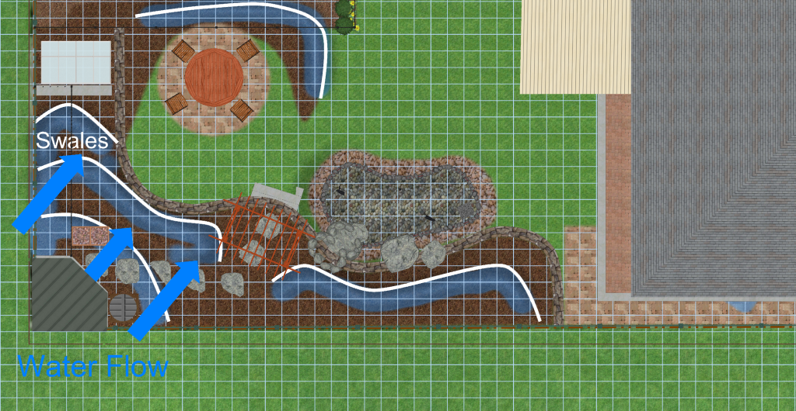

 

# Beautiful and productive backyard landscaping

This is the challange:

> Can I turn a my typical surburban backyard into something that is both beautiful and productive?

I plan to keep track of all the key areas considered as part of the design to meet this challange. I want my backyard to be:
* **Asthetically pleasing** : Most permaculture and aquaponic systems I see are ugly, with a bit of planning and cost I think there is no need for them to be
* **Productive** : Creating food for us to consume including fruit, vegetables, eggs, fish
* **Efficient/Sustainable** : Setting up as many natural cycles as possible, reusing our waste and working with nature instead of against it
* **Low maintainence** : Through automation and good up-front design

# Contents
{:.no_toc}

1. Will be replaced with the ToC, excluding the "Contents" header
{:toc}

# Introduction

**Why am I doing this?**

I love gardening, love eating food I have grown, married to a marine scientist (who likes conservation and understanding of ecosystems), want to make my yard look good and want to make a difference on my impact in the world. 

My approach is very design oriented, largely because as an engineer thats just how I like to do things (regulary to the rolling eyes of my wife) :-) 

On this page you can expect to find the various design aspects I have considered for my garden and how they work together to result in a beautiful and productive backyard (lets hope so). This page is more for my sanity (so I dont forget things) than anything else. Maybe someday I will be able to reduce it down to something useful for others too but you are welcome to take it as it is and use any ideas for yourself.

TODO: Add an image for each section makes it simpler to read and separate/find what we are after

## Goal statement

The purpose of the goal statement is to help us imagine what then end result might be like and ensure that decisions made along the way contribute to the high level outcome instead of getting lost in the details of specific technologies (I can't help myself though I MUST have a pond and I focus on details too quickly).

> Our small suburban back yard is productive and beautiful. With a focus on sustainable closed loop ecosystems, it provides us with some edible food and a habitat for local wildlife while reducing our detrimental impact on the environment.
> 
> Providing shade in the summer and open to sunlight in the winter, it is a perfect space to entertain a few guests in a calming and peaceful environment.

I used this guide to create the goal statement: <https://www.milkwood.net/2015/10/26/permaculture-design-process-1-writing-a-goal-statement/>

# Asthetics

Creative design is not my forte and honestly I have had very little help with this so far, so any feedback or ideas would be super useful!

Using edible plants to create a beautiful landscape is not new. It has increased in popularity in recent times and has been given a few different names including [Foodscaping](<https://en.wikipedia.org/wiki/Foodscaping>), Edible Landscaping and even one company gaining some momentum adopting the term [Agriscaping](<https://agriscaping.com/about-us/>) after the name of the company. 

My approach in the asthetic design of the garden is to:
* Find examples of gardens I like
* Analyse them to understand what makes them pleasing to me
* Use the analysis to define what garden style I want to achieve
* Attempt to design something in that style and evaluate using the same techniques used to understand other gardens

It has been difficult finding examples of foodscapes that I really appreciate. Most of them are much more open than I would like and integrate a lot of lower storey bushes and ground covers with very little tree canopy. They also often use many annuals which I want to avoid. It is likely this is caused by the fact that most productive plants require a significant amount of sunlight and thus the foodscapes are all very open to achieve this.

The oter side is that many of the ones creating food forrests and using perannials are often tuned for production and have less emphasis on asthetic design.

Looking through some example [Garden Styles](<https://www.homestolove.com.au/garden-design-styles-19942>) and some from many other places, I have identified the styles I like the most are:
* Tropical
* Woodland
* Japanese

I also like gardens that borrow from the above styles, but have the density often seen in those typical styles at the edges of the garden and are more open in the center with a small area of closed in joining between the two sides that contains seating areas etc of fucs under the shade. 

I have been keeping a lot of notes on [Foodscape asthetics](asthetics/README.md) and how it applies to and informs my garden design.

On of the better edible landscape examples I have seen is:

**Small Urban Edible Forest**

# Polyculture/Diversity

The idea is that a diverse ecosystem is typically more resiliant. This includes diversity in plants animals and insects. Many of the technologies listed on this page contribute to this diversity in one way or another. 

We plan to plant various different species of plants. This includes flowers, fruit, vegetables, herbs and other non-edible support plants that help define the ecosystem. 

We will have a bias towards plants for human consumption which may cause some inbalance in the system, however I will adjust this as necessary after identifying specific issues.

# Creating artificial ecosystems

In an ideal world, I would base this entire design on local native ecosystems for the area in which I live. These are well adapted for the environment and would likely be the most resiliant and least maintainence. However this design, although learning where possible from local ecosystems, will instead attempt to artificially create non-native ecosystems in the backyard that better meet the goal of productivity.

I have written more about my thinking on this in the page on [Sustainability and Artificial vs Native Ecosystems](ecosystems/README.md). However in summary, in order to achieve the goals of productivity and sustainability in a small area of my backyard I think we need to focus on ecosystems that are tuned to produce food for us to consume. 

Two good examples of this in the design are:

**Adding a pond** : A pond is not natural in my backyard, and will require maintainence and some electricity to sustain it. However its my opinion that the benefits this will add in attracting diversity into the ecosystem (birds, lizards, insects), and the ability to produce leafy greens and fish to consume with minimal input far outweigh these drawbacks.

**Tree selection** : A good choice for trees in my area based on local ecosystems would likely be some kind of Eucalypt, or Lilli Pilli etc. But in order to achieve the productivity and density for the backyard I will be selecting various kinds of fruit and nut trees which maye require extra maintainence that a native would not. Lilli-Pilli trees though able to produce fruit that we can use, it is not fruit we will regulary use and so the space would largely be wasted.

# Sunlight

Most productive plants require a lot of sunlight. In fact most of them are expecting full sunlight which is often hard to ensure when trying to also increase the planting density. In addition to providing sunlight for trees as necessary we also want to consider providing places to sit in the shade during summer but in the sun during winter/autumn. Having a block that slopes downwards towards the north is a huge benefit here. We got lucky with the aspect of our block of land.

Overall, we have made use of a few things to achieve these goals:
* Design with different plant sizes layered such that they all get sun and dont shade each other out (taller on south, smaller on north side)
* Add a retaining wall to provide extra height on the southern side of the block giving access to more sun through vertical space usage
  * This allows us to use taller trees on the north side separated by some grass and the retaining wall. The shade thrown by the trees doesn't impact the smaller plants south of the retaining wall as it raises them abov ethe shade level thrown by the trees on the north. As a result we get a slightly higher planting density without impacting the sunlight for the lower canopy plants.
* Create different micro-climate/planting zones in the garden. We have trees in the canopy (full sun), space for understorey in full sun, part shade, full shade, and summer only shaded zones
* Place structures (chicken coop, water tank, compost etc) in the shaded portion of the block so not to waste areas of full sun on these strctures
* Make use of deciduous trees to the very north side to permit sulight through during winter when the sun is lower in the sky, but shade it a little in summer
* Make use of artificial risers like trellises/arbours to raise creeping plants higer and get more sunlight (Make more use of vertical space)

There are various tools that can be used to model the sunlight and shading for a project like this. I have documented more information about this on the separate page on [Thoughtful Solar Design](sun/README.md)

# Water management

There is a lot of literature on this and it is a big focus in many permaculture designs. It is very important to think about in the current Australian climate when we regulary have water restrictions with hot dry summers. The idea is to consider the flow of water through the property from all sources, to slow the movement of the water down and direct it to achieve better passive water retention and provide water storage for dry times. 

Below is a small diagram showing some of the water flow considerations I have made in my design so far, I wont be able to afford all of them to start with though:

There are a lot of considerations here. For example, in my design I have deliberatly added:
* Chickens at top of slope (nutrient rich run-off to plants) with small water tank storage draining into swales
* Swales in circular pattern going down the slope to slow water down and let it sink into the soil
* Protection of pond from run-off using berms, drainage and positioning
* Collection of water into tank + under house storage bladder from roof
* Overflow from roof collection tank into the pond
* Overflow from pond to more under ground water storage 
* Large run off overflow from pond, and overflow from underground storage to swale
* Pumping from underground storage back to pond waterfall to keep water oxygenated and healthy

You will notice that the water flow is linked across various aspects of the entire system to try and keep it on the property as long as possible.

## Swales 

A common tool to help water retention are swales. These are usually depressions/trenches dug in the ground to hold water for a small period of time so it can infiltrate the soil better instead of running off the top. 

If you look at the image, you can see the swales and water flow direction on the diagram. A key point to note is that as water flows from the chickens at the top of the slope it will take nutrient rich water down with it, not just watering but also providing nourishment to the plants. Also, the pond is further away to try and prevent this nutrient rich run off entering the pond.

As the water hits a swale it dams up, forcing the water to puddle a little and sink into the ground rather than running over the top of it.

Swales can be "hidden" under the ground as well by digging a trench and filling it with something like blue-metal and then permitting grass/much over the top of it, or can be above ground using berms or a combination of both. Currently I have designed using berms to create little dams, but its likely I will use a combination of both to increase the volume and reduce the unsightly impact. 

Berms also have the issue of eroding away and need to be constructed of a suitable material like clay. An important consideration when adding raised berms is to be sure that the height is such that the top of the berm is lower than the natural land level on my up-hill boundary fence to ensure there is no impact on the surrounding properties water drainage.

TODO Add to this list
Good info about swales:
* [Constructing Urban Swales with Weeping Tile & Mulch](<https://www.youtube.com/watch?v=c0DedomHqVs&ab_channel=VergePermaculture>)

## Evaporation

By completely mulching the garden area and adding trees to provide a shade canopy with layered shrubs etc, we are planning to design such that the property does its best to retain water where it is needed and has no directly exposed soil. 

## Irrigation

I have a main water tank attached to the house south-roof and will be using that for irrigation occasionally during dry periods. The irrigation lines should aim to make use of the swales by irrigating from the upper area of the slope hopefully directly into the swales. It could be useful to permit application of water soluble fertalizers through the irrigation, I will likely avoid using misters and try to irrigate directly into the swales using larger pipes that are less likely to block.

Additionally I expect this irrigation will be driven by a small water tank in the back corner. I would like to use this as a tool for controlled irrigation and occasional fertalizer application if required. The idea is that we can have markers identifying the volume of water on this tank and mix/irrigate from it known quantities of water. I.e. Fill it to N litres, then turn the tap on to drain to the irrigation swales and not have to worry about over/under watering as we know the exact quantity of water used and it is also used as a mixing tank.

Longer term, I will likely create an automated watering controller using moisture, water level, temperature and other data gathered from local weather stations and weather preditions to make automated irrigation decisions. This would be a fun little project, but wont happen for a long time.

## Water storage

We already have a traditional water tank on our property. I plan to add more water storage to collect from the northern roof someday as we are not collecting any water from that section of the house yet and also try and increase the water holding capacity through extra storage options.

There are many options to consider for the storage of water:
* Traditional water tank (Often requires significant space and is an eyesore, I will avoid these going forward)
* Under house water storage tanks or bladders
* Under ground water storage (tanks or custom shape constructed with pond liner and aquablocks) : <https://www.youtube.com/watch?v=2x23ljyT0S4>

The underground water storage is quite an interesting solution and can be placed such as to not use up more valuable space. It has many similarities to building a pond but under the ground and can apparently be installed under pavers for example. I would like to consider this as an option one day in the future in our front yard and possibly also under the seating area in the back yard. The idea is that the water storage is hidden under the ground and is constructed from aquablocks inside a pond liner. Often a pondless waterfall is used as a means to circulate this water and keep it aerated and healthy, though with a real pond it is often sent over the waterfall and takes its inlet from the pond overflow.

A common thing I have seen with rainwater harvesting as often promoted by aquascape is to connect the different water storage options on the property together and continually cycle the water from the lowest storage unit to the highest, connecting the overflows of them together. It works best with just two storage units like a pond + underground vault, but can with some effort be extended to multiple storage units.

The idea here is you pump water from the lowest storage point (say underground storage tank) to the pond waterfall, the overflow of the pond then drains back in to the underground storage unit and gets pumped back again. The goal here is to make sure the water in the system is flowing and aerated. Oxygenating it you prevent stagnation etc. 

## Grey Water

You can use some grey water on the garden to prevent wasting water used in washing machines etc. Not all plants will be able to use this and you also require use of safe detergents. There is a lot of information on this and very specific requirements in different local government areas you wil lneed to understand.

On a farm, there is a LOT more you can do. For example often sewerage and storm water is non piped to rural properties and it is necessary for you to use a septic system with overflow to a drainage trench. I grew up on a farm that was setup like this. We had  some lemon trees next to the drainage trench and noticed how well they were going. So we ended up adding a pump to the septic that we used to irrigate directly to the roots of some fruit trees (not spraying in the air for obvious reasons). This worked great and made sure our waste water was being reused.

There are very specific requirements around grey-water usage often with specific rules in different areas. I know some grey-water usage is permitted in my local area, however there are very specific ruling around how deep it is and where it is located to prevent ground-water contamination. I will look into this later, but I believe it is permitted to use grey-water from a clothes washing machine but not from other sources like showers, sinks etc.

Interesting found a group to contact in the local area, but they have some decent info on greywater use: <http://happyearth.com.au/greywater/>

# Soil

The type of soil available will have a large impact on the decisions made. In all cases soil can be built up and improved with a lot of effort. The two extremes are sandy soil and clay soil. Both can be improved through the ongoing addition of organic matter to the soil. 

In my case we have a heavy clay subsoil. The topsoil is ok, but the subsoil is very solid clay and doesn't drain very well. It is important to get a proper soil test to have a better understanding of the local conditions. In some places it is free (various universities in Australia I believe offer free soil reports).

The drainage is just one aspect to be considered though. The chemical balance is also quite important as incorrectly balanced soil prevents uptake of various nutrients by plans etc.

For me I know we had heavy clay soil. But the soil test also showed low concentration of calcium and high concentration of sodium and a littl high magnesium. What this means is that I needed to be careful about any lime applications to ensure it was calcium carbonate and not dolomitic lime which also includes magnesium. 

Additionally the pH of the soil is very acidic, and so a calcium carbonate application will help bring this closer to neutral and be better for many of the plants that we would like in the garden. 

Another comment was that the lead levels in the subsoil were quite high (though below toxic levels). This is more an issue for leafy greens and a few specific types of plants, less an issue for fruit trees from what I have read. I expect after the garden is setup I will try and use phytoremediation by planting sunflowers over the space and discarding them properly. This might have minimal impact but will be interesting to test before/after.

Additionally I plan to not grow leafy greens and other highly impacted plants in the main garden, but instead use raised beds and aquaculture to grow these.

I have a lot more information about this documented on the page about [Soil analysis and remediation](soil/README.md) where I will also discuss plants to improve the quality of the soil in a way that reduces maintainence over time.

# Retaining wall

Originally I was going to just add a retaining wall to level off a grassy area for the kids to play.  However there are a few other benefits that have arisen since then. In many ways, a retaining wall will permit us to make better use of vertical space:

* Helps drainage in heavy clay soil as most planting will be above the wall
* Raising southern side giving more light to plants that would otherwise be shaded out
* Clear separation of grass from garden so wont be continually fighting weeds
* Necessary to make level section for pond
* Integrates nicely with rock work for pond waterfall which provides habitat for lizzards
* Provides space for growing hanging plants or vines down the front of the wall
* Adds asthetic appeal IMO if done nicely out of raw sandstone

Issues:
* Cant have huge drainage behind wall, so limits size of wall and what it is capable of retaining
* Possible tree root issues
* Possible issues with structural soundness of the pond so close to foot of retaining wall

This retaining wall has quite a low height (600 mm at peak), but there were a lot of technical decisions going into it largely because of the pond and various regulations for the local council. Its design changed multiple times and the retaining wall an pond are closely linked. Overall the decision on where to put the pond and retaining wall needs to be made together and upfron in the project.

Find more information about the retaining wall documented on the page about [Retaining wall design](retain/README.md)

# Pond / water feature

Adding running water into an ecosystem can introduce a huge diversity of wildlife to your back yard. This include birds, insects, frogs and lizzards. 

A diverse ecosystem is often naturally more robust, as there are fewer cases of individual parts of it going unchecked because of missing predators.

Additionally, having a body of water in the back-yard will affect the micro-climate. Adding humidity and a bit more thermal stability. Especially if it is enclosed by structure such as trees/shrubs to hold the humidity in a little.

Finally ponds/water features look beautiful and the sound of running water provides a relaxing atmosphere to any landscape that can even hekp to drown out undesirable noises like cars in the background.

Some issues with adding a pond might be unwanted guests like mosquitos, however if the pond is stocked correctly by say adding rainbowfish (again not a mono-culture of fish) we can minimise the impact of this. 

The goal with the pond stocking will be to have diversity. By choosing species carefully I believe we can have diversity, beauty and productivity. My initial goal here is to consider stocking native fish that each have a purpose:
* Silver perch for eating and looking at
* Eel tailed catfish for eating and stirring up the bottom to help clean the pond
* Some form of rainbowfish (or other suitable species) for preying on mosquitos
* Maybe some alae eating species like glass shrimp

I know that some of these may eat each other, however if we design it correctly by including sufficient aquatic plants, rock formations and shallow sections for protection we may be able to minimise this impact.

The biggest issue with a pond is its complexity and power usage. Designing to include it is taking more time than the rest of the garden. Hopefully with the right design, the maintainence can be minimised. 

I expect to use a small 45W pump to run it 24/7 to keep the water oxygenated and flowing and bacteria alive, but automate a larger pump during the day when the solar panels are generating excess power to permit suficient water flow for additional filtering. The pump is a critical part of the system and we should account for redundancy by having two pumps installed (or a backup aerator) and a battery with automatic failover.

At the page on [Pond Design](pond/README.md) I have a lot more detail on generic elements of pond design and how they applied specifically to my backyard.

# Plant selection

When I started this project, plant selection was incorrectly where I initially started the design as I was excited about the food I could grow. I looked at the plants I wanted and then tried to plan everything else  around them. It soon became apparently that you can choose to base the design around a few key plants in the yard.

A better tactic is to resolve all the larger structural things first (Like retaining wall, pond placement, shed placement, tree positioning and shade, water availability etc) in a way that maximizes the usable space and then find plants that fit the roles and spaces available. These structural aspects of the design will help define what the various planting zones and micro-climates are in the yard so we can then start choosing species that are more suitable.

My key goals for plant selection are:
* Define a list of "requirements" that must be met, things like max height for shading, no deciduous near neigbouring property, plants poisonous to fish not near ponds etc.
* Start with key trees based on required heights for shade and lighting requirements for the yard and then add other things around them
* Each plant should serve multiple purposes (food, shade, insect attractant, soil improver, asthetic appeal, ...)
* Define planting zones and find species that fit those zones
* Optimize for productivity of species that we will actually use especially for the larger plants
  * There is no point in planting strange fruit we will only eat occasionally, or only one person in the family eats, prefer planting staples especially for much larger trees as they will have the highest impact on our consumption and take up a lot of space
  * This comes back to the idea of trying to have as big an impact on sustainability as possible. I like the idea of having weird and wonderful fruit, but if we are not going to use it then give it a much lower priority as we have limited space

This is a large topic, I have documented a lot more information about it on the page on [Plant Selection and Positioning](plants/README.md)

# Fowl (Chickens)

Using chickens or pheasants as part of a suburban ecosystem is hugely beneficial. They perform multiple different duties that help in the recycling of waste and health of the overall garden.

Most likely we will include some bantam chickens (because they are smaller and require less space), however if we are unable to do that due to various constraints, I will consider using spotted pheasants or other form of fowl. They are good at:
* Recycling human waste converting to manure that is good fertalizer for the garden
* Cleaning bugs from lower storey plants
* Scratching around and aerating the soil
* Providing meat and eggs

Issues to consider:
* Space requirements for happy chooks
* Nutrient run-off into pond
* Asthetics (chooks decimate landscape in runs and pens)

# Insect larvae

Insect larvae are becoming more popular as a means to efficiently convert human food waste into protien/fat for feeding chikens and fish (and occasionally the brave human).

One of the more common species used for this is Black soldier fly larvae. I have also seen occasional use of native flies which maybe preferrable for the local climate but pose a few extra challenges.

With black soldier fly larvae, when they are getting ready to pupate they will crawl upwards, so a ramp can be made in the holding container and they will automatically crawl up when big enough and drop into a bucket which we can then use for feeding the chickens and fish.

There are other benefits specifically of the black soldier fly. They do not bother people much and will return to the same container to lay eggs so can sustain a continual production of eggs.

Issues we need to consider are:
* Smell
* Are native flies suitable
* Which scraps to feed the larvae and which to feed the chickens
* How to best automate a system that maintains itself except for food input

# Mulching
TODO:
* Describe back-to-eden, especially issues with nitrogen loss and how to ameliorate it and get the most out of it
* Use in supporting mushroom growth
* Impacts on soil, nutrients, moisture and various microbes in the soil
* How often to refresh, how to start off 

# Composting

TODO

# Symbiotic mycelium

TODO Layer wood mulch on top of soil and innocuate with edible mushroom mycelium

# Beneficial instects and fauna

# Bees
Honey/Native
TODO Will see if possible for native, might be a bit cold for them but less space required (but no honey really this far south), honey bees more difficult as they need singificant space for flight path I dont think I have. Also both need positions with early morning sun and shelter from midday heat in summer. Under a tree on western side is best

# Aquaponics

This is something I am super interested in. I will plan to try it in my garden unless the upkeep becomes too much. Lots of info to post here
TODO

## Radio flow filter cleaning/fertalizer

## Design of grow beds

## Red wriggler worms
TODO lots of individual ideas/technologies in the aquaponics section

# Usage Observations

## Walking Paths

## Existing willife

## Existing growth patterns

## Weather

## Other

* South boundry fence not stable, soil moves 
* Neighboring property on west has unobstructed view into our back yard, extended balcony
* Neighboring property on south is very tidy and has a pool, will avoid overhanging deciduous trees on boundary
* Pee-wees, bower birds, willy wagtails frequent yard gathering food and insects from ope compost bins

# Maintainence

I have a bunch of ideas on how to reduce the maintainence and expect this will be something that I will adjust over time as I find things that need to be done. 

In some aspects of the design have sacrificed maintainence to achieve other goals like productivity. One example is use of deciduous trees on the north side of the block. The leaves are going to get annoying in the pool/pond. I have seen suggestions on using netting in autumn, or intake bays instead of skimmers to make it simpler, or even automated solutions (like a mesh conveyor belt taking leaves out of skimmer and dumping in pile next to pond).

Other ideas is as we see what plants work and what dont, I will consider removing some of the plants to replace with others of lower maintainence. The other design decision is keeping any annuals out of the main garden, just using perannials. This will leave the aquaponics grow bed and some raised gardens soley for annuals which require regular significant maintainence.

I also plant to create a calendar, identifying bits of work I need to do (like pruning, fertalizer, bug checking, extra irrigation etc) at what times of the year once I have my planting figured out. The goal here is to reduce the mental load of remembering what I have to do when and how. if it is all at my fingertips it will be simpler IMO.

As a engineer, I enjoy creating small device to help me out. I hope as time goes on I can identify small projects I can develop to reduce maintainence. Some obvious targets include:
* Automated watering
* Robot lawn mower :-)
* Different pond filtering ideas
* Automated feeder

# Permaculture

TODO: Good things about permaculture
TODO: Aspects of permaculture I am not following and why

# Process

TODO:

The high level process for this is that now I have an idea of what I want to include int he design, a rough idea of restrictions. I want to get the high level macro view of how this is going to look. Once I know roughly where the planting will be, where the retaining wall will be, where I might put the chooks, the pond, a glasshouse, table + chairs etc. I can then start looking more into the detail and adding to the design.

There was some element of this detailed planning before when I thought I had a decent high level design, however the detail aspects raised some concerns that caused me to change the larger macro view. In particular around retaining wall placement and council regulations, cost and where to place the pond. The rest of the design I believe will fall in around those two much larger pieces so I need to get those correct up front.

TODO:
* For each element added in the design (once finalized), document its purposes. This includes each planting choice, pond, choocks etc

# Inspirations

Many things have provided inspiration in this design. Two areas in particular though stand out; Permaculture and Aquaponics.
TODO I have lots documented elsewhere I need to bring across

# Achieving density

For each thing I add to the garden, I would like it to have more than one purpose. An example is that trees in this design will provide:
* Shade and protection from the wind (Most trees are good for this)
* Edible food (Fruit and nut trees are good for this)
* Light regulation to define different micro-climates (Deciduous trees near house for light, evergreen near back to create a shady area)
* Pollinator and bird attractants (Consider flowering trees, requirements for nesting etc)
* Asthetics (Some trees like cherries have beautify flower displays)

# Design Zones
TODO Identify zones in design and key points of the micro-climates / ecosystems in those zones

# Old Designs

I have also kept a rough record of previous design choices made on ap age about [Garden design history](history/README.md) to help me ensure I haven't forgotten something in later designs and consider the progress and changes in thinking over time. Looking at this can give a reasonable idea of the process that has happened over the last few years

# References

* Questions do polycultures work (no definitive answer): <https://youtu.be/S2F7gIp2y9c?t=597>

<!-- Global site tag (gtag.js) - Google Analytics -->

