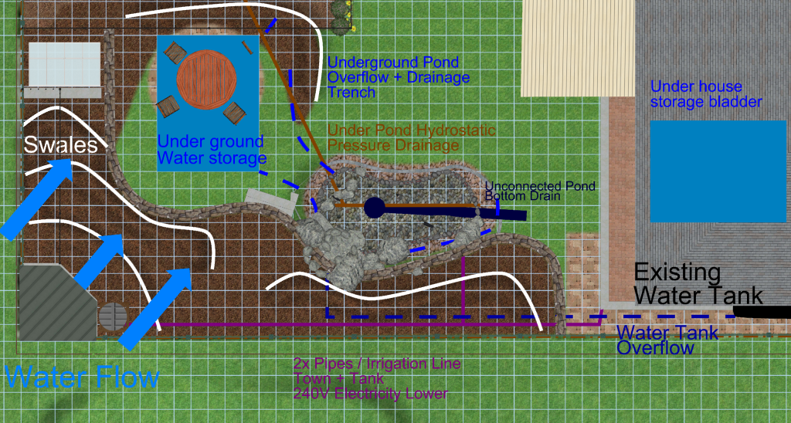

 

# Beautiful and productive backyard landscaping

This is the challenge:

> Can I turn a my typical suburban backyard into something that is both beautiful and productive?

I want my backyard to be:
* **Aesthetically pleasing** : Most permaculture and aquaponic systems I see are ugly, with a bit of planning and cost I think there is no need for them to be
* **Productive** : Creating food for us to consume including fruit, vegetables, eggs and fish
* **Efficient/Sustainable** : Setting up as many natural cycles as possible, reusing our waste and working with nature instead of against it
* **Low maintenance** : Through automation and good up-front design

<iframe width="560" height="315" src="https://www.youtube-nocookie.com/embed/1Z0dSOvgFRM" frameborder="0" allow="accelerometer; autoplay; encrypted-media; gyroscope; picture-in-picture" allowfullscreen></iframe>

# Contents
{:.no_toc}

1. Will be replaced with the ToC, excluding the "Contents" header
{:toc}

# Introduction

TODO: This page is getting too large, I need to summarize things better and link to more detail elsewhere to make it more easily consumable

**Why am I doing this?**

I love gardening, love eating food I have grown, want to make my yard look good, married to a marine scientist (who likes conservation and understanding of ecosystems), and I want to make a positive impact on the world through reducing my external consumption. 

My approach is very design oriented, largely because as an engineer that's just how I like to do things (regularly to the rolling eyes of my wife) :-) 

On this page you can expect to find the various aspects I have considered in the design of my garden and how they work together to hopefully result in a beautiful and productive backyard. This page is place to store my thoughts (so I don't forget things). Maybe someday I will be able to reduce it down to something useful for others to use but you are welcome to take it as it is and use any ideas in your own backyard.

Existing  |  Proposed
:---:|:---:
  |  

TODO: Add overview diagram showing where everything is placed, flow of resources through the system (food, waste, water, sun, electricity, pruning's)

**Goal statement**

The purpose of the goal statement is to help us imagine what the end result might be like and ensure that decisions made along the way contribute to the high level outcome instead of getting lost in the details of specific technologies (I can't help myself though I MUST have a pond and I focus on details too quickly).

> Our small suburban back yard is productive and beautiful. With a focus on sustainable closed loop ecosystems, it provides us with some edible food and a habitat for local wildlife while reducing our detrimental impact on the environment.
> 
> Providing shade in the summer and open to sunlight in the winter, it is a perfect space to entertain a few guests in a calming and peaceful environment.

I used this guide to create the goal statement: <https://www.milkwood.net/2015/10/26/permaculture-design-process-1-writing-a-goal-statement/>

# Aesthetics

More information on: [Foodscape aesthetics](aesthetics/README.md)

Creative design is not my forte and honestly I have had very little help with this so far, so any feedback or ideas would be super useful!

Using edible plants to create a beautiful landscape is not new. It has increased in popularity in recent times and has been given a few different names including [Foodscaping](<https://en.wikipedia.org/wiki/Foodscaping>), Edible Landscaping and even one company gaining some momentum adopting the term [Agriscaping](<https://agriscaping.com/about-us/>) after the name of the company. 

My approach in the aesthetic design of the garden is to:
* Find examples of gardens I like
* Analyze them to understand what makes them pleasing
* Use the analysis to define characteristics that define the garden style I like
* Attempt to design something in with those characteristics

It has been difficult finding examples of foodscapes that I really appreciate. Most of them are much more open than I would like and integrate a lot of lower story bushes and ground covers with very little tree canopy. They also often use many annuals which I want to avoid for maintenance reasons. It is likely most existing foodscapes are so open is caused by the fact that many productive plants require a significant amount of sunlight and thus the foodscapes are all very open to achieve this.

The main reason I think it has been difficult finding good examples, is that the majority of gardens using edibles are often tuned for production and have less emphasis on aesthetic design.

Looking through some example [Garden Styles](<https://www.homestolove.com.au/garden-design-styles-19942>), I have identified the styles I like the most are:
* Tropical
* Woodland
* Japanese

I also like gardens that borrow from the above styles, having their characteristic density restricted to the edges of the garden and slightly more open space in the center. Some characteristics I appreciate about these designs is they often incorporate various zones or open areas hidden behind dense walls of plants connected by paths.

One of the better edible landscape examples I have seen is:

**Small Urban Edible Forest**

# Polyculture/Diversity

A diverse ecosystem is typically more resilient than one that lacks diversity. This includes diversity in plants animals and insects. Many of the design aspects identified on this page contribute to diversity in one way or another. 

I expect to plant various different species of plants. This includes flowers, fruit, vegetables, herbs and other non-edible support plants that help define the ecosystem. 

We will have a bias towards plants for human consumption which may cause some imbalance in the system, however I will adjust this as necessary after identifying specific issues.

# Creating artificial ecosystems

More information on: [Sustainability and Artificial vs Native Ecosystems](ecosystems/README.md)

In an ideal world, I would base this entire design on local native ecosystems for the area in which I live. These are well adapted for the environment and would likely be the most resilient and least maintenance. However this design, although learning where possible from local ecosystems, will instead attempt to artificially create non-native ecosystems in the backyard that better meet the goal of productivity.

I have written more about my thinking on this in the page on [Sustainability and Artificial vs Native Ecosystems](ecosystems/README.md). However in summary, in order to achieve the goals of productivity and sustainability in a small area of my backyard I think we need to focus on ecosystems that are tuned to produce food for us to consume. 

Two examples of this in the design are:

**Adding a pond** : A pond is not a natural feature in my backyard, and will require maintenance and some electricity to sustain it. However its my opinion that the benefits this will add in attracting diversity into the ecosystem (birds, lizards, insects), and the ability to produce leafy greens and fish to consume with minimal input and its beauty far outweigh the drawbacks.

**Tree selection** : A good choice for trees in my area based on local ecosystems would likely be some kind of Eucalypt, or Lilli Pilli etc. But in order to achieve the productivity and density for the backyard I will be selecting various kinds of fruit and nut trees which may require extra maintenance that a native would not. Lilli-Pilli trees is able to produce fruit that we may use, it is not fruit we will regularly use however and so the space would largely be wasted.

# Construction Plan

More information on: [Staged Garden Construction Plan](stages/README.md)

It is not feasible to create an ecosystem like this all at once but the process can be accelerated so instead of taking 100 years it can take a few years (usually about 10 apparently for a stable ecosystem), but it needs to be planned well in such a confined space to avoid too many mistakes that are difficult to rectify. For example, swales should really be designed before starting planting (at least in my constrained space). 

The idea of accelerating ecological succession is well covered in lots of the permaculture literature. I have more information where I describe my specific [Staged Garden Construction Plan](stages/README.md) and how I expect to achieve this. Unlike other gardens I often see in permaculture designs, I do expect my design will take more inputs and achieve less reuse as part of construction. There are various reasons for this including: aesthetics, space requirements and startup time. But the end goal is to reach a stable ecosystem that looks good in a short space of time but is very much like the other typical permaculture ecosystems once established, reducing inputs by using natural cycles in the long run.

Below is a summary of the main processes I expect I will be following to start with.

**Base infrastructure**

These are the key items I feel I should complete up front early as many other things will depend on this work.

* Construction of structural elements
  * Retaining wall for aesthetics, drainage, light penetration and space usability
  * Swales, and plumbing for water flow and management
  * Pond as it will be difficult to create later and will start to setup a keystone of the ecosystem
    * I will need to make this a self sustaining planted ecosystem pond with maybe a few small fish to start with. The extra ideas improving density/stocking rates, aquaponics, fish diversity, improved filtration, intake bays can all be done later.
* Subsoil preparation to help accelerate setup of the ecosystem
  * Ensuring sufficient drainage around retaining wall to prevent stagnant pooling of water above it
  * Ripping clay subsoil where necessary
  * Adding charged biochar for raising pH and increasing water and nutrient retention
  * *Maybe* adding lime and/or clay-breaker to subsoil/topsoil if necessary for initial application
* Top soil preparation to help accelerate setup of the ecosystem
  * Add bacterial rich organic matter in the form of compost or manure on top of soil first
  * Add cardboard weed barrier layer
  * Add 10cm thick nutrient dense layer (compost or manure, or maybe fungal dominant would be better here)
  * Add 15cm thick woody layer (Full tree wood chips)
* Add any irrigation planned to nurture plants early in the process
  * Hopefully swales and house roof run-off/capture are sufficient long term for most watering (once ecosystem is established)
  * Likely we will occasionally still need to irrigate during summer from stored water sources because of space limitations and our dry hot environment
  * During the pioneer stage we plan to also plant out some non-pioneer trees, they will need nurturing in the early years until the ecosystem is established
* Plant out pioneer plants and trees
  * Add larger non-pioneer trees as they need time to grow (nurturing them with irrigation, artificial shade and some inputs as necessary like fertilizations etc.) 
  * Add strong tap root plants to help break up the clay subsoil and raise nutrients like comfrey
  * Add nitrogen fixers and ground covers like clover
  * Add sacrificial fast growing trees (like acacia and bananas) to nurse other plants earlier before the larger trees are established
  * Add hardy flowers to help attract pollinators
  * Maybe grow a phytoremediation crop like sunflowers (if necessary) and discard it, though will set back our ecosystem a bit

**Incremental changes**

After the above foundational work is done, the work listed below that follows can be much more incremental and ordering is less important.

* Chooks (Want early for composting and food)
* Shrub layer when pioneers are sufficient to nurse them
* Edible mycelium once sufficient shaded areas (probably on second round of wood chips)
* Shelters for beneficial predators like bat boxes
* Pond aquaponics
* Plant out desired shrubs, ground covers flowers herbs etc.
* Underground water storage (under proposed seating area using aqua blocks)
* Hardscaping and seating area near pond

There are many more things I will consider as you can see in the below categories. But I expect those to be added incrementally. As I try different things, observe the outcomes and iterate. I will try and continue to document the technologies I am trialing and my experiences.

# Sunlight

More information on: [Thoughtful Solar Design](sun/README.md)

Most productive plants require a lot of sunlight. In fact most of them are expecting full sunlight which is often hard to provide when trying maximize the planting density. In addition to providing sunlight for trees we also want to consider providing places to sit in the shade during summer and in the warm sun during winter/autumn. Having a block that slopes downwards towards the north is a huge benefit here. 

Overall, we have made use of a few things to achieve these goals:
* Design with different plant sizes layered such that they all get sun and don't shade each other out (taller on south, smaller on north side)
* Add a retaining wall to provide extra height on the southern side of the block giving access to more sun through vertical space usage
  * This allows us to use taller trees on the north side separated by some grass and the retaining wall. The shade thrown by the trees doesn't impact the smaller plants south of the retaining wall as it raises them above the shade level thrown by the trees on the north. As a result we get a slightly higher planting density without impacting the sunlight for the lower canopy plants.
* Create different micro-climate/planting zones in the garden. We have trees in the canopy (full sun), space for understory in full sun, part shade, full shade, and summer only shaded zones
* Place structures (chicken coop, water tank, compost etc) in the shaded portion of the block so not to waste areas of full sun on these structures
* Make use of deciduous trees to the very north side to permit sunlight through during winter when the sun is lower in the sky, but shade it a little in summer
* Make use of artificial risers like trellises/arbors to raise creeping plants higher and get more sunlight (Make more use of vertical space)

There are various tools that can be used to model the sunlight and shading for a project like this. I have documented more information about this on the separate page on [Thoughtful Solar Design](sun/README.md)

There are other technologies related to this I may consider if necessary if I think they will be helpful down the track. Including solar absorption and thermal storage for maintaining a more consistent temperature through winter in some areas (that are shaded in summer). Or adding solar reflectors in key locations to make better use of the light otherwise wasted (might be a bit unsightly depending on where they are located unless say on roof or other hardscape areas).

# Water flow

There is a lot of literature on this and it is a big focus in many permaculture designs. It is very important to think about in the current Australian climate when we regularly have water restrictions with hot dry summers. The idea is to consider the flow of water through the property from all sources, to slow the movement of the water down and direct it to achieve better passive water retention and provide water storage for dry times. 

Below is a small diagram showing some of the water flow considerations I have made in my design so far, I wont be able to afford all of them to start with though:

There are a lot of considerations here. For example, in my design I have deliberately added:
* Chickens at top of slope (nutrient rich run-off to plants) with small water tank storage draining into swales
* Swales in circular pattern going down the slope to slow water down and let it sink into the soil
* Protection of pond from run-off using berms, drainage and positioning
* Collection of water into tank + under house storage bladder from roof
* Overflow from roof collection tank into the pond
* Overflow from pond to more under ground water storage 
* Large run off overflow from pond, and overflow from underground storage to swale
* Pumping from underground storage back to pond waterfall to keep water oxygenated and healthy

You will notice that the water flow is linked across various aspects of the entire system to try and keep it on the property as long as possible.

## Swales 

A common tool to help water retention are swales. These are usually depressions/trenches dug in the ground to hold water for a small period of time so it can infiltrate the soil better instead of running off the top. 

If you look at the image, you can see the swales and water flow direction on the diagram. A key point to note is that as water flows from the chickens at the top of the slope it will take nutrient rich water down with it, not just watering but also providing nourishment to the plants. Also, the pond is further away to try and prevent this nutrient rich run off entering the pond.

As the water hits a swale it dams up, forcing the water to puddle a little and sink into the ground rather than running over the top of it.

Swales can be "hidden" under the ground as well by digging a trench and filling it with something like blue-metal and then permitting grass/much over the top of it, or can be above ground using berms or a combination of both. Currently I have designed using berms to create little dams, but its likely I will use a combination of both to increase the volume and reduce the unsightly impact. 

Berms also have the issue of eroding away and need to be constructed of a suitable material like clay. An important consideration when adding raised berms is to be sure that the height is such that the top of the berm is lower than the natural land level on my up-hill boundary fence to ensure there is no impact on the surrounding properties water drainage.

TODO Add to this list
Good info about swales:
* [Constructing Urban Swales with Weeping Tile & Mulch](<https://www.youtube.com/watch?v=c0DedomHqVs&ab_channel=VergePermaculture>)

## Evaporation

By completely mulching the garden area and adding trees to provide a shade canopy with layered shrubs etc, we are planning to design such that the property does its best to retain water where it is needed and has no directly exposed soil. 

## Retention

In addition to preventing water from running off using swales and evaporating using mulch, we also want to consider the water retention capabilities of our soil. Sandy soil doesn't retain water at all and acts like a strainer, clay soil causes water to pool stagnate like a bowl. But the goal here is to improve the soils water retention capabilities such that it acts more like a sponge. It stores water but along with air pockets.

There are many ways of achieving this, the most commonly suggested way is by adding lots of composted organic matter to the soil. Another option I have seem some research on recently is using [biochar](#biochar). This is basically charcoal, usually produced by burning organic matter in an oxygen depleted environment. I have more information on this elsewhere, but the biochar ideally will be inoculated with nutrients and soil microorganisms before adding to the garden. 

I plan to dig a significant amount of organic compost mixed with charged biochar into my garden. 

## Irrigation

I have a main water tank attached to the house south-roof and will be using that for irrigation occasionally during dry periods. The irrigation lines should aim to make use of the swales by irrigating from the upper area of the slope hopefully directly into the swales. It could be useful to permit application of water soluble fertilizers through the irrigation, I will likely avoid using misters and try to irrigate directly into the swales using larger pipes that are less likely to block.

Additionally I expect this irrigation will be driven by a small water tank in the back corner. I would like to use this as a tool for controlled irrigation and occasional fertilizer application if required. The idea is that we can have markers identifying the volume of water on this tank and mix/irrigate from it known quantities of water. I.e. Fill it to N liters, then turn the tap on to drain to the irrigation swales and not have to worry about over/under watering as we know the exact quantity of water used and it is also used as a mixing tank.

Longer term, I will likely create an automated watering controller using moisture, water level, temperature and other data gathered from local weather stations and weather predictions to make automated irrigation decisions. This would be a fun little project, but wont happen for a long time.

## Water storage

We already have a traditional water tank on our property. I plan to add more water storage to collect from the northern roof someday as we are not collecting any water from that section of the house yet and also try and increase the water holding capacity through extra storage options.

There are many options to consider for the storage of water:
* Traditional water tank (Often requires significant space and is an eyesore, I will avoid these going forward)
* Under house water storage tanks or bladders
* Under ground water storage (tanks or custom shape constructed with pond liner and aqua-blocks) : <https://www.youtube.com/watch?v=2x23ljyT0S4>

The underground water storage is quite an interesting solution and can be placed such as to not use up more valuable space. It has many similarities to building a pond but under the ground and can apparently be installed under pavers for example. I would like to consider this as an option one day in the future in our front yard and possibly also under the seating area in the back yard. The idea is that the water storage is hidden under the ground and is constructed from aqua-blocks inside a pond liner. Often a pond-less waterfall is used as a means to circulate this water and keep it aerated and healthy, though with a real pond it is often sent over the waterfall and takes its inlet from the pond overflow.

A common thing I have seen with rainwater harvesting as often promoted by aquascape is to connect the different water storage options on the property together and continually cycle the water from the lowest storage unit to the highest, connecting the overflows of them together. It works best with just two storage units like a pond + underground vault, but can with some effort be extended to multiple storage units.

The idea here is you pump water from the lowest storage point (say underground storage tank) to the pond waterfall, the overflow of the pond then drains back in to the underground storage unit and gets pumped back again. The goal here is to make sure the water in the system is flowing and aerated. Oxygenating it you prevent stagnation etc. 

## Grey Water

You can use some grey water on the garden to prevent wasting water used in washing machines etc. Not all plants will be able to use this and you also require use of safe detergents. There is a lot of information on this and very specific requirements in different local government areas you will need to understand.

On a farm, there is a LOT more you can do. For example often sewerage and storm water is non piped to rural properties and it is necessary for you to use a septic system with overflow to a drainage trench. I grew up on a farm that was setup like this. We had  some lemon trees next to the drainage trench and noticed how well they were going. So we ended up adding a pump to the septic that we used to irrigate directly to the roots of some fruit trees (not spraying in the air for obvious reasons). This worked great and made sure our waste water was being reused.

There are very specific requirements around grey-water usage often with specific rules in different areas. I know some grey-water usage is permitted in my local area, however there are very specific ruling around how deep it is and where it is located to prevent ground-water contamination. I will look into this later, but I believe it is permitted to use grey-water from a clothes washing machine but not from other sources like showers, sinks etc.

Interesting found a group to contact in the local area, but they have some decent info on greywater use: <http://happyearth.com.au/greywater/>

# Soil

More information on: [Soil analysis and remediation](soil/README.md)

The type of soil available will have a large impact on the decisions made. In all cases soil can be built up and improved with a lot of effort. The two extremes are sandy soil and clay soil. Both can be improved through the ongoing addition of organic matter to the soil. 

In my case we have a heavy clay subsoil. The topsoil is ok, but the subsoil is very solid clay and doesn't drain very well. It is important to get a proper soil test to have a better understanding of the local conditions. In some places it is free (various universities in Australia I believe offer free soil reports).

The drainage is just one aspect to be considered though. The chemical balance is also quite important as incorrectly balanced soil prevents uptake of various nutrients by plans etc.

For me I know we had heavy clay soil. But the soil test also showed low concentration of calcium and high concentration of sodium and magnesium. What this means is that I needed to be careful about any lime applications to ensure it was calcium carbonate and not dolomitic lime which also includes magnesium. 

Additionally the pH of the soil is very acidic, and so a calcium carbonate application will help bring this closer to neutral and be better for many of the plants that we would like in the garden. 

Another comment was that the lead levels in the subsoil were quite high (though below toxic levels). This is more an issue for leafy greens and a few specific types of plants, less an issue for fruit trees from what I have read. I expect after the garden is setup I will try and use phytoremediation by planting sunflowers over the space and discarding them properly. This might have minimal impact but will be interesting to test before/after.

Additionally I plan to not grow leafy greens and other highly impacted plants in the main garden, but instead use raised beds and aquaculture to grow these.

TODO: Discuss adding organic matter
TODO: Discuss using biochar on acidic soils, its nutrient and water retention capabilities while still permitting oxygenation

I have a lot more information about this documented on the page about [Soil analysis and remediation](soil/README.md) where I will also discuss plants to improve the quality of the soil in a way that reduces maintenance over time.

# Retaining wall

More information on: [Retaining wall design](retain/README.md)

Originally I was going to just add a retaining wall to level off a grassy area for the kids to play.  However there are a few other benefits that have arisen since then. In many ways, a retaining wall will permit us to make better use of vertical space:

* Helps drainage in heavy clay soil as most planting will be above the wall
* Raising southern side giving more light to plants that would otherwise be shaded out
* Clear separation of grass from garden so wont be continually fighting weeds
* Necessary to make level section for pond
* Integrates nicely with rock work for pond waterfall which provides habitat for lizards
* Provides space for growing hanging plants or vines down the front of the wall
* Adds aesthetic appeal IMO if done nicely out of raw sandstone

Issues:
* Cant have huge drainage behind wall, so limits size of wall and what it is capable of retaining
* Possible tree root issues
* Possible issues with structural soundness of the pond so close to foot of retaining wall

This retaining wall has quite a low height (600 mm at peak), but there were a lot of technical decisions going into it largely because of the pond and various regulations for the local council. Its design changed multiple times and the retaining wall an pond are closely linked. Overall the decision on where to put the pond and retaining wall needs to be made together and upfront in the project.

Find more information about the retaining wall documented on the page about [Retaining wall design](retain/README.md)

# Pond / water feature

More information on: [Pond Design](pond/README.md)

Adding running water into an ecosystem can introduce a huge diversity of wildlife to your back yard. This include birds, insects, frogs and lizards. 

A diverse ecosystem is often naturally more robust, as there are fewer cases of individual parts of it going unchecked because of missing predators.

Additionally, having a body of water in the back-yard will affect the micro-climate. Adding humidity and a bit more thermal stability. Especially if it is enclosed by structure such as trees/shrubs to hold the humidity in a little.

Finally ponds/water features look beautiful and the sound of running water provides a relaxing atmosphere to any landscape that can even help to drown out undesirable noises like cars in the background.

Some issues with adding a pond might be unwanted guests like mosquitos, however if the pond is stocked correctly by say adding rainbowfish (again not a mono-culture of fish) we can minimize the impact of this. 

The goal with the pond stocking will be to have diversity. By choosing species carefully I believe we can have diversity, beauty and productivity. My initial goal here is to consider stocking native fish that each have a purpose:
* Silver perch for eating and looking at
* Eel tailed catfish for eating and stirring up the bottom to help clean the pond
* Some form of rainbowfish (or other suitable species) for preying on mosquitos
* Maybe some alae eating species like glass shrimp

I know that some of these may eat each other, however if we design it correctly by including sufficient aquatic plants, rock formations and shallow sections for protection we may be able to minimize this impact.

The biggest issue with a pond is its complexity and power usage. Designing to include it is taking more time than the rest of the garden. Hopefully with the right design, the maintenance can be minimized. 

I expect to use a small 45W pump to run it 24/7 to keep the water oxygenated and flowing and bacteria alive, but automate a larger pump during the day when the solar panels are generating excess power to permit sufficient water flow for additional filtering. The pump is a critical part of the system and we should account for redundancy by having two pumps installed (or a backup aerator) and a battery with automatic failover.

At the page on [Pond Design](pond/README.md) I have a lot more detail on generic elements of pond design and how they applied specifically to my backyard.

# Plant selection

More information on: [Plant Selection and Positioning](plants/README.md)

When I started this project, plant selection was incorrectly where I initially started the design as I was excited about the food I could grow. I looked at the plants I wanted and then tried to plan everything else  around them. It soon became apparently that you can choose to base the design around a few key plants in the yard.

A better tactic is to resolve all the larger structural things first (Like retaining wall, pond placement, shed placement, tree positioning and shade, water availability etc) in a way that maximizes the usable space and then find plants that fit the roles and spaces available. These structural aspects of the design will help define what the various planting zones and micro-climates are in the yard so we can then start choosing species that are more suitable.

My key goals for plant selection are:
* Define a list of "requirements" that must be met, things like max height for shading, no deciduous near neighboring property, plants poisonous to fish not near ponds etc.
* Start with key trees based on required heights for shade and lighting requirements for the yard and then add other things around them
* Each plant should serve multiple purposes (food, shade, insect attractant, soil improver, aesthetic appeal, ...)
* Define planting zones and find species that fit those zones
* Optimize for productivity of species that we will actually use especially for the larger plants
  * There is no point in planting strange fruit we will only eat occasionally, or only one person in the family eats, prefer planting staples especially for much larger trees as they will have the highest impact on our consumption and take up a lot of space
  * This comes back to the idea of trying to have as big an impact on sustainability as possible. I like the idea of having weird and wonderful fruit, but if we are not going to use it then give it a much lower priority as we have limited space

This is a large topic, I have documented a lot more information about it on the page on [Plant Selection and Positioning](plants/README.md)

# Fowl (Chickens)

Using chickens or pheasants as part of a suburban ecosystem is hugely beneficial. They perform multiple different duties that help in the recycling of waste and health of the overall garden.

Most likely we will include some bantam chickens (because they are smaller and require less space), however if we are unable to do that due to various constraints, I will consider using spotted pheasants or other form of fowl. They are good at:
* Recycling human waste converting to manure that is good fertilizer for the garden
* Cleaning bugs from lower story plants
* Scratching around and aerating the soil
* Providing meat and eggs

Issues to consider:
* Space requirements for happy chooks
* Nutrient run-off into pond
* Aesthetics (chooks decimate landscape in runs and pens)

# Insect larvae

Insect larvae are becoming more popular as a means to efficiently convert human food waste into proteins/fats for feeding chickens and fish (and occasionally the brave human).

One of the more common species used for this is Black soldier fly larvae. I have also seen occasional use of native flies which maybe preferable for the local climate but pose a few extra challenges.

With black soldier fly larvae, when they are getting ready to pupate they will crawl upwards, so a ramp can be made in the holding container and they will automatically crawl up when big enough and drop into a bucket which we can then use for feeding the chickens and fish.

There are other benefits specifically of the black soldier fly. They do not bother people much and will return to the same container to lay eggs so can sustain a continual production of eggs.

Issues we need to consider are:
* Smell
* Are native flies suitable
* Which scraps to feed the larvae and which to feed the chickens
* How to best automate a system that maintains itself except for food input

# Mulching
TODO:
* Describe back-to-eden, especially issues with nitrogen loss and how to ameliorate it and get the most out of it
* Use in supporting mushroom growth
* Impacts on soil, nutrients, moisture and various microbes in the soil
* How often to refresh, how to start off 

# Composting

TODO

# Biochar

TODO: Some great references (discuss pros/cons, not always pro but can be useful for water and nutrient retention and soil addition for acidic soils):
* <http://www.ithaka-journal.net/wege-zu-terra-preta-aktivierung-von-biokohle?lang=en>
* <https://www.sgaonline.org.au/is-biochar-wonderstuff/>
* <https://en.wikipedia.org/wiki/Biochar#Soil_amendment>

# Chop-drop

TODO: Deep rooted (Comfrey for example)

# Symbiotic mycelium

TODO Layer wood mulch on top of soil and inoculate with edible mushroom mycelium

# Beneficial instects and fauna

# Bees
Honey/Native
TODO Will see if possible for native, might be a bit cold for them but less space required (but no honey really this far south), honey bees more difficult as they need significant space for flight path I don't think I have. Also both need positions with early morning sun and shelter from midday heat in summer. Under a tree on western side is best

# Pests

The philosophy I plan to take with pest management is to create an ecosystem that is suitable to a diverse range of animals and plants and that will provide sufficient habitat for different predators to keep the pests under control. So rather than manually spraying, trapping, baiting pests all the time, we instead ensure there is habitat for predators of those pests and wait for those predators to move in.

One video I found informative and describes the process and experience of someone from Canada using this method to manage pests can be seen at <https://youtu.be/8SGEkQ9vFec>. In his experience when you start spraying pests, you become the predator and from that point on you will need to continue to spray to keep the pests in check. If however you promote an environment which is ideal for the natrual predators to live in and you leave the pests alone to provide a food source, the natural predators will arrive to eat the pests and hopefully stay or regularly return to keep the pests in check.

There are many different types of predators that exist for different problems. Observation becomes important here. You can plan for issues you can anticipate but things will arise that you failed to anticipate and need to reconsider. Creating as diverse an ecosystem as possible you are ensuring there is habitat for many different species and are less likely to find specific pests getting out of control.

It is important to understand that a few pests are NOT a problem as you will always need to ensure there is sufficient food source for the predators or they will just leave. 

Some examples of specific actions I plan to take to encourage specific predators in our garden include:

* Suitable fish stocked in the pond to eat mosquito larvae (non invasive species though)
* Microbat boxes to encourage native bats to colonize and manage mosquitos and other insects (Idea from: <https://youtu.be/WOeTdUqAOWY>)
* Rockery around pond to encourage lizards
* A pond with shallow planted sections to encourage frogs

It may also make sense in some cases to occasionally attract pests to the garden to provide food sources for predators and encourage their presence or event to consider the pests as an input to the system for feeding say chickens and fish. 

As an example, I would like to consider adding a solar powered floating UV or white/blue light that turns on automatically early evening floating on the surface of the pond. The goal here is to *attract* insects that otherwise might be dispersed elsewhere which may land on the surface of the pond and be eaten by the fish and the concentration of insects may also attract microbats. By doing this we may be able to direct the insects to areas that are less bothersome to us and attract predators that will keep them under check.

There are pests which I expect to be taken care of by the ecosystem we are going to create almost automatically like aphids and lady beetles to prey on them. I am not going to address these specifically unless I observe specific problems.

On the other end of the spectrum, I also have noticed some pests already in our back yard and want to think through these early on to consider how they might be managed.

*European paper wasps*

We currently have *LOTS* of these around and apparently not much except the occasional unsuspecting frog will eat them. A few  close relatives and friends are highly allergic to the wasp stings and they are very aggressive which is a bad combination.

If they were not so aggressive and dangerous to people we know, then these wasps would themselves be very useful predators in the garden. In fact we also have some solitary wasps that are quite good at keeping other insects under control and not at all aggressive.

One specific issue I have observed with the paper wasps is that when we use of our pool and splash water around the edges, the wasps come down to consume the water splashed onto the pavers and can easily be trodden on causing a nasty sting. My current plan to mitigate this problem is that I expect the pond and especially around the waterfall will instead become a regular source of water for them making the transient pool water a less desirable source and moving them away from our common usage areas. I am not sure if this will however make the environment more favorable for them, which I hope is not the case.

*Snakes*

Many snakes are good predators for the garden, keeping rodents under control. However we do get some dangerous species here in NSW Australia. I think the best option is to manage the environment so if snakes do arrive, we will be able to easily see them and not accidentally step on them or that available hiding locations for the snakes are in locations that we do not typically visit.

For example, placing the rockeries for the pond largely on the remote side of the pond that is not easily accessible means any snakes will likely be separated from us by the body of water. Also I expect most frequently used paths in our yard to not be overgrown but be lawn so snakes would be easily visible if they do arrive.

Other things to consider, are properly enclosing any chicken roost and nesting boxes to snake proof them (not as easy as it sounds) so they don't have access to eggs. 

*Spiders*

Most spiders are beneficial to have in our garden and all but my youngest son will welcome them :-)

We do occasionally get some dangerous spiders though.

Red back spiders are not very aggressive and are very sedentary so bites can be easily avoided through care when gardening.

Funnel web spiders though can be quite dangerous and we will want to mitigate this somehow. Funnel webs usually desire very specific locations for nesting where they can create their characteristic funnel web. Apparently they like damp places so it is possible we may see some more of them.

Apparently centipedes are common predators for funnel webs and like similar habitats.

*Rodents*

I know rodents are high on the minds of people in my neighborhood as they were raised as a concern for a local community garden project. The key to managing this (without bringing in predators for rodents like cats, which will also kill snakes but also other beneficial animals like frogs, lizards, bats) is to reduce their access to food sources like compost bins and chicken food scraps. This can be managed using well designed chicken feeders and compost bins. Instead of composting, I am considering composting worm tubes which if designed properly can limit access to the scraps.

# Diseases

TODO: More detail 

The plan to avoid disease are a few fold:
* Promote healthy plants through a healthy environment (soil, sun access, water access, aeration, drainage etc)
* Place species in the design in locations they are most suited
* Plant a diverse range of plants and observe what thrives in different locations
* Replace plants that fail to thrive with better suited species
* Ensure sufficient light and aeration (fungal disease is common)

# Aquaponics

More information on: [aquaponics](aquaponics/README.md)

TODO: This is something I am super interested in. I will plan to try it in my garden unless the upkeep becomes too much. Lots of info to post here

# Usage Observations

## Walking Paths

## Existing willife

## Existing growth patterns

## Weather

## Other

* South boundary fence not stable, soil moves or at least shrunk with dryness causing fence posts and clothes line to shift
* Neighboring property on west has unobstructed view into our back yard, extended balcony
* Neighboring property on south is very tidy and has a pool, will avoid overhanging deciduous trees on boundary
* Pee-wees, bower birds, willy wagtails frequent yard gathering food and insects from ope compost bins

# Maintainence

There are numerous aspects of maintenance I have tried to reduce through design, like crowding out weeds, hard separation between lawn and gardens, and mulching. But also some cases I have made trade-offs to increase maintenance in order to improve aesthetics and/or productivity like using deciduous trees near pond/pool.

I have a few ideas on how to use technology and automation to try and reduce this maintenance long term, but will get things going first to see how they go over time. I expect once the garden is up and running, I can identify things that need to be done and see if I can improve them.

**Weeding**

Ideally the plan is to reduce the weeding we will need to do by densely planting covering all areas with plants, having hard boundaries between the lawn and garden, and mulching any areas not covered by ground cover plants. In food forests, the idea is to out-compete the weeds for sunlight and space with other useful plants like in a natural forest.

**Pruning**

Pruning is something we will likely need to do occasionally. By choosing species with a goal so that their natural size fits the expected area, we can reduce the pruning required to just that necessary for the health and initial shaping of the plant.

**Pest management**

Ideally we want to attract numerous predators into the garden like lizards, birds frogs etc. The goal here is that if we create habitat that these predators need making it attractive for them, then they will keep any pests under control. A few pests isn't an issue, and part of a natural ecosystem. Its when they get out of check because of missing predators that problems arise.

The selection of plant species may also have an impact on this. I know from past experience for example, that thin skinned nectarines/tomatoes have numerous issues with fruit fly in the area. Where as bananas and other thicker skinned fruits were fine. I need to do more research on this but maybe for example peaches are less impacted by this than nectarines as an example.

Finally some level of management can be obtained through companion planting and creating diversity in the ecosystem, we expect to have less impact from pests due to design of this, planting strongly aromatic herbs next to fruit trees/bushes etc. 

**Disease Management**

This might be a bit more difficult, in particular I think there is a high chance for fungal disease, with the moisture around the pond and past experience with avocados, mangos etc. I have seen fungal diseases common in this area.

**Mulching**

I expect we will need to reapply mulch each year. Ideally using full tree mulch collected from an arborist on the trailer. 

**Re-planting**

I expect that some of the planned plantings wont work out as expected. I hope to learn from this, and adjust position or replace species with something else. This may involve some replanting over time.

Also, we will include two raised beds for annuals, and likely two aquaponic grow beds also for annuals. These will require regular replanting and cleaning (which we do currently anyway at least in spring and autumn each year).

**Pond Cleaning**

I expect that the skimmer on the pond will need to be emptied at the same regularity as the skimmer on the pool. I plan to oversize the pond skimmer a little to permit this work more effectively with less frequent maintenance. Longer term I expect to attempt to retro-fit an intake bay instead of a pond skimmer to also help reduce the maintenance required. I will consider a negative edge, but am a little worried about jumping fish.

By designing with a bottom drain and radial flow filter, I expect that the same regularity of skimmer maintenance will also require cleaning solids from the filtration on the bottom drain. However this should be made simple/easy and ideally by adding this (and under gravel cycle grid) I can avoid the yearly maintenance of completely draining the pond to clean out much behind the rocks seen with many ecosystem ponds but not often in koi ponds.

Additionally, I believe it should be feasible to automate the radial flow filter cleaning some day in the future.

Water level top-up is also something that may need to be done occasionally. I expect to use rain water from my tank to start with. However, I have also considered if a auto level valve as used on a toilet cistern can work. The issue is chlorination of mains water, I am not certain if the small quantities of chlorine added frequently will have a significant impact on the ecosystem (unlike irregularly larger top-ups which are shown to aversely affect the system). There are filters that can be installed to remove the chlorine though if necessary. Finally I can always set up the valve to the water tanks pump such that when automated irrigation starts it also fills the pond to the necessary level which is probably the ideal solution.

**Fish feeding**

To start with manual feeding, I will however at some point install some automated feeder so we can go on holidays and not have to worry about feeding the fish.

**Planning**

I also plant to create a calendar, identifying bits of work I need to do (like pruning, fertilizer, bug checking, extra irrigation etc) at what times of the year once I have my planting figured out. The goal here is to reduce the mental load of remembering what I have to do when and how. if it is all at my fingertips it will be simpler IMO.

**Automation**

As a engineer, I enjoy creating small device to help me out. I hope as time goes on I can identify small projects I can develop to reduce maintenance. Some obvious targets include:
* Automated watering
* Robot lawn mower :-)
* Different pond filtering ideas
* Automated feeder

It is not just reducing maintenance, but also permitting the system to work in extended absences like when we go on holidays for a few weeks. No automated system is fool-proof, but with sufficient feedback and notification events we can ideally know if manual intervention is required and call up a friend to come and help if we are in dire need and are remote.

# Other ideas

* Thermal regulation (cooling + auto watering) or heating <https://youtu.be/nOYxVKcCfVY?list=WL&t=353>
* Pond advantages in permaculture <https://youtu.be/x9v2u9qiRsM>

# Permaculture

* The 12 Principles of Permaculture <https://en.wikipedia.org/wiki/Permaculture#Twelve_design_principles>
* TODO: Good things about permaculture
* TODO: Aspects of permaculture I am not following and why
* Just found this and I agree with his philosophy : <https://youtu.be/mbee-Mv33QE>

# Process

TODO:

The high level process for this is that now I have an idea of what I want to include int he design, a rough idea of restrictions. I want to get the high level macro view of how this is going to look. Once I know roughly where the planting will be, where the retaining wall will be, where I might put the chooks, the pond, a glasshouse, table + chairs etc. I can then start looking more into the detail and adding to the design.

There was some element of this detailed planning before when I thought I had a decent high level design, however the detail aspects raised some concerns that caused me to change the larger macro view. In particular around retaining wall placement and council regulations, cost and where to place the pond. The rest of the design I believe will fall in around those two much larger pieces so I need to get those correct up front.

TODO:
* For each element added in the design (once finalized), document its purposes. This includes each planting choice, pond, chooks etc

# Inspirations

Many things have provided inspiration in this design. Two areas in particular though stand out; Permaculture and Aquaponics.
TODO I have lots documented elsewhere I need to bring across

# Achieving density

For each thing I add to the garden, I would like it to have more than one purpose. An example is that trees in this design will provide:
* Shade and protection from the wind (Most trees are good for this)
* Edible food (Fruit and nut trees are good for this)
* Light regulation to define different micro-climates (Deciduous trees near house for light, evergreen near back to create a shady area)
* Pollinator and bird attractants (Consider flowering trees, requirements for nesting etc)
* Aesthetics (Some trees like cherries have beautify flower displays)

# Design Zones
TODO Identify zones in design and key points of the micro-climates / ecosystems in those zones

# Old Designs

I have also kept a rough record of previous design choices made on ap age about [Garden design history](history/README.md) to help me ensure I haven't forgotten something in later designs and consider the progress and changes in thinking over time. Looking at this can give a reasonable idea of the process that has happened over the last few years

# References

* Questions do polycultures work (no definitive answer): <https://youtu.be/S2F7gIp2y9c?t=597>

<!-- Global site tag (gtag.js) - Google Analytics -->

