 

# Foodscape aesthetics

Using edible plants to create a beautiful landscape is not new. It has increased in popularity in recent times and has been given a few different names including [Foodscaping](<https://en.wikipedia.org/wiki/Foodscaping>), Edible Landscaping and even one company gaining some momentum adopting the term [Agriscaping](<https://agriscaping.com/about-us/>) after the name of the company. 

A common trend I have noticed looking at existing foodscapes, is that most have a very consistent open look to them similar to cottage or formal flower gardens, where as the closed in high density jungle look I like that is typical of tropical, woodland and Japanese gardens is not very common at all. It is highly likely this is due to the light requirements of most productive edible plants and may be very difficult for me to achieve.

It is my goal though to try and situate the edibles early in the design with prime locations for sunlight, and then fill in the shaded portions and create density with ornamentals in such a way that their sizes are restricted to heights/locations underneath the edibles. It will be important to ensure the ornamentals don't outgrow their spaces and shade out the edibles, and I may end up with issues of nutrient deficiencies. I am not certain it will work.

Another trend I have seen in professional foodscapes in botanical gardens is to make very open gardens that use mostly variegated annuals, like lettuce etc. Again this is something I want to avoid to reduce the maintenance required of replanting annuals regularly.

# Approach

The approach I am taking with this project is to get the larger structure of the garden including positioning of main trees, pond, retaining wall, sitting locations etc working from a functional design perspective first but ensuring there is some measure of balance in those. I then hope to be able to use hardscaping material choice, lower story plant selection including some ornamentals and flowers in addition to edibles to create the aesthetic I am looking for.

I have been leaning heavily on landscaping design software [Realtime Landscaping Pro](<https://www.ideaspectrum.com/landscape-design-software-overview/>) to visualize ideas and making incremental changes to see what they might look like. This has been immensely useful and I can clearly see when making minor adjustments that some things seem to look better than others. Using software that renders in real-time 3D also seems to be helpful at providing an idea of relative size and scale between objects which is sometimes difficult for me to visualize, though still not the same as actually seeing something in real life.

I am also trying to use the [Artistic landscape design components](#artistic-landscape-design-components) defined below to evaluate existing gardens I like to understand what it is that makes them stand out to me so I can try and recreate similar aspects in my own design.

# Style choice

TODO: Clearly define the style I want in the backyard based on analysis of the inspiring gardens below and their identifying characteristics.
* Woodland (Favorite by far, but unlikely to work as requires large spaces and large trees)
* Tropical (Next favorite, may be able to incorporate some aspects of this, but way too dense to work with 100% edibles)
* Japanese (I like these also, though sometimes a little more formal than I would like)
* Cottage (I like the color and chaos, but is too open)

# Artistic landscape design components

To help me in the artistic/aesthetic design of the garden, I have been finding it helpful to read instructional websites describing the components of artistic design and how they apply to landscaping. One great source for me has been The Spruce. It describes landscape design as [The Spruce](<https://www.thespruce.com/aesthetic-definition-in-landscape-design-2130999>):

> Landscape design is concerned both with aesthetic and functional elements of landscaping. While the former is ultimately subjective (there is no accounting for tastes, as the old expression goes), professional landscape designers are, in fact, guided by some basic rules that help them to create aesthetically pleasing designs in their clients' yards.
> 
> Where landscape design is concerned with aesthetics, the terminology used is somewhat similar to that employed in the art world: Landscape design principles include such subjects as color theory, form and texture, the role of focal points, and how our perception of "line" and "scale" influence our opinion of a scene.

I am optimistic that my artistically challenged brain can learn a little bit of what is required to make a landscape aesthetically pleasing and design something I like in my yard :-)

Following a summary of what I have learned on artistic landscaping design, all information I have read tends to define similar concepts (some have extra, others give slightly different names). The two key categories of concepts I have seen are often described when it comes to landscape design include:
* Design Principles : These are higher level aspects of the design we are striving to achieve like is the design balanced, or does it have unity
* Design Elements : These are specific technologies/design-tools used to achieve the principles, like the design-element of color; if I have a bright red bush on one side, do I want to achieve balance (principle) by adding similar color to the other side of the garden

I am not going to go into these in a lot of detail, as others describe it much better than I can. But this list is helpful for me to evaluate my design against each point and then consider what design elements I can incorporate to help improve the design to meed my desired outcome.

Below are some links to places describing these artistic design components:
* [Principles of landscape design](<https://www.canr.msu.edu/news/principles_of_landscape_design>)
* [Landscape Design for Beginners](<https://www.thespruce.com/landscape-design-for-beginners-2130815>)
* [Guide to Landscape Design](<https://www.thespruce.com/what-is-landscape-design-2131075>)
* [Landscape Design for Beginners, How to Use Unity, Balance, Color and Texture](<https://youtu.be/yYjYBR7TdhI>)
* [Landscape & Garden Design Principles](<https://youtu.be/6w3YG8Zo9Nw>)

## Design Principles

**Unity**

A definition of [Unity](<https://www.thespruce.com/aesthetic-definition-in-landscape-design-2130999>):

> Unity, or "harmony," has been achieved when the viewer senses that all the landscape plants in a garden design complement each other and have been chosen with one over-arching theme in mind.

**Balance**

A definition of [Balance](<https://richardstbs.com/8-basic-principles-of-landscape-design/>):

> Balance is simply a sense of equality. There are two types of balance in design: symmetrical and asymmetrical balance. In symmetrical balance, two sides of the landscape are identical while in asymmetrical balance, the landscape composition is balanced using different elements and objects which have almost similar imaginary weight.

**Focalization**

A definition of [Focalization](<https://www.canr.msu.edu/news/principles_of_landscape_design>):

> Focalization is sometimes referred to as focalization of interest or simply focal point. The focal point is the strongest element in the design in any given view. 

**Simplicity**

A definition of [Simplicity](<https://www.canr.msu.edu/news/principles_of_landscape_design>):

> Keeping landscapes simple, not cluttered or fussy is always a good practice. This is not the opposite of complexity. Landscapes that make people happy and comfortable avoid using too many colors, shapes, curves and textures, but in no way does this mean simplistic, boring or lack of imagination.

## Design Elements

Some design elements or tools to impact the priciples include:

* [Color](<https://www.youtube.com/watch?v=qDq8Kw3WwS8>)
* Texture
* Form
* Line
* Rhythm
* Proportion

## Tools and ideas

TODO: Add ideas as I see them.
* Use [Espalier](https://en.wikipedia.org/wiki/Espalier) as a means to create form (also for space restrictions)

# Questions to ask in design

So based on the above key aspects of landscape design, I will use a number of questions to help me understand and evaluate the inspiration design list and my own.

TODO: Need to do this
* What is consistent and blends in
* What varies a lot
* What are the hard lines in the design and where are they leading me to
* Where is the majority of the defined form, is the form consistent for different elements or different
* What do we want the focal point to be
* Where do the lines and other things direct me to go
* What are the transitions between zones

I can probably evaluate this for each of the "zones" in my design:
* Sitting area
* Hidden shaded path
* Pond
* Grassy area
* Kitchen window

Some things to consider:
* Bridge for shade, needs some focal point to identify where it is going to (special sitting rock) otherwise looks like it is going no-where
* When sitting at the table, what is the viewfocus (The pond is difficult to see)
* The pond is easily viewed from the kitchen and house (and future deck), but seems less integrated and sticks out. It is meant to be a focal point but I feel it creates inbalance

# Inspiring Gardens

I have seen a few examples of nice looking edible landscapes that contain trees, with similarites to what I want to achieve, but most of them still appear more open than I would like. A difficulty is that *many* videos available of edible landscapes show lots of detail on the individual plants in the landscape as that is what they are largely interested in, and few of them zoom out and show the overall design and flow of the space. This is making getting good references to learn from difficult.

**Small Urban Edible Forest (Edible)**

I like this, it has elements that are similar to our design with trees near edges and openess down the middle, some ground cover and a small pond. The lower canopy is very open compared to what I want to do though. I would prefer to layer down slowly from the trees on the edge to the ground covers providing something that looks much more dense.

**Colorful Woodland Garden, Berea, USA (Decorative)**

I love this garden! She describes as mysterious, interesting and exciting. There are hidden sections you follow paths to find. Each area has some key focal point etc.

This garden is huge, we cant do this. But I would like to learn some things from it.

<a href="https://youtu.be/Gy3bKcjdvq0?t=412">
  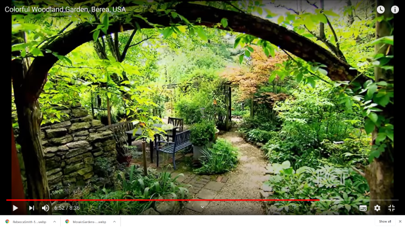
</a>

**Linda Vater Garden Tour (Decorative)**

This style is fantastic and I would love to try and achieve something akin to this style in our landscape. I am not certain it will be possible. One idea I would like to try is use the fruit/nut trees in the upper story and then place edibles where possible, and where insufficient sun shaded out place decorative plants to fill in the gaps.

I like the balance achieved in this garden with the larger trees, shrubs near the boundary fences hiding them, the seating places is a focus area and destination in the scene.

<a href="https://www.youtube.com/watch?v=i6IU6VAVWvA">
  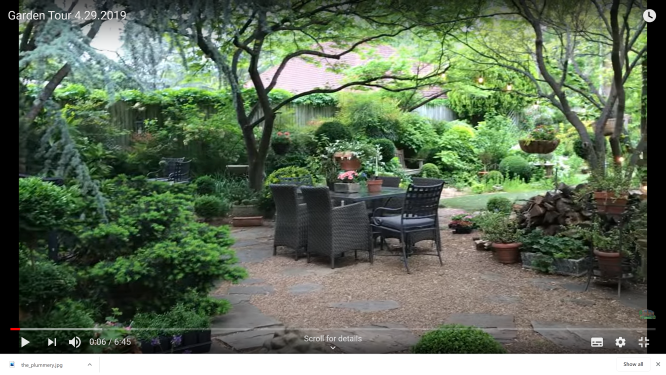
</a>

**Ideas for creating an amazing edible garden (Edible)**

I like this, though prefer the more enclosed woodland/tropical/jungle style. It is however much more likely our garden will look like this when it is finished (if I am lucky) as with edibles and other constraints in my garden such as size, I think this is probably close to what may be possible. I might avoid the vegetable mountain though :-)

What is missing is a decent overview of that garden in the video I can use to compare.

<a href="https://youtu.be/Vf8Vqc9SLtE?t=104">
  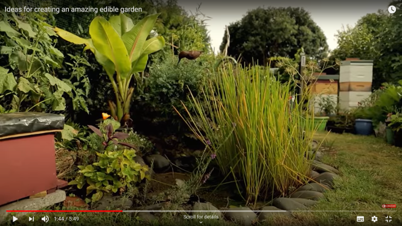
</a>

**The Plummery (Edible)**

This is a *tiny* block. It is very densly packed using lots of vertical space. I like this style except we plan to use more perannials and not make use of garden beds in the same way.

<a href="https://www.katlavers.com/the-plummery/">
  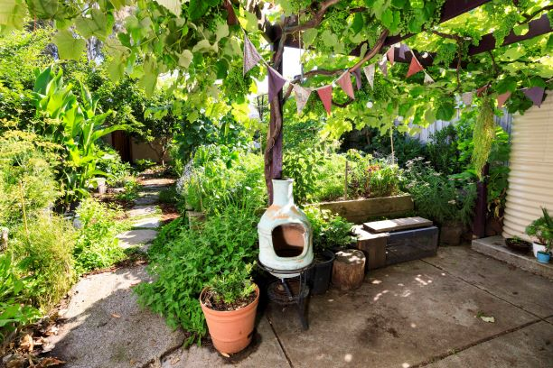
</a>

**A Friends Garden (Edible)**

I love this garden, it belongs to a friend of mine. This is a 360 photo so looks very stretched, but you can see the height around the edges, there is a hidden chicken run, a space of grass for kids to play in and I think the decked path he has really make a beautiful line for the eyes to follow.

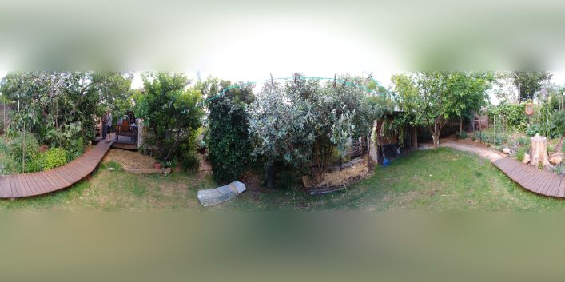

**Agriscape (Edible)**

This is a company creating edible landscape designs in America, they call the process Agriscaping, thus the name of the company.

Theses images of agriscaped yards look similar to what we may be able to attian. I dont like it as much as the very dense plantings with winding mysterious paths and zones, but again it is a trade off and this seems to have pkanted density at the edges and open spaces in the center.

<a href="https://youtu.be/msXu8aXJGvk?t=36">
  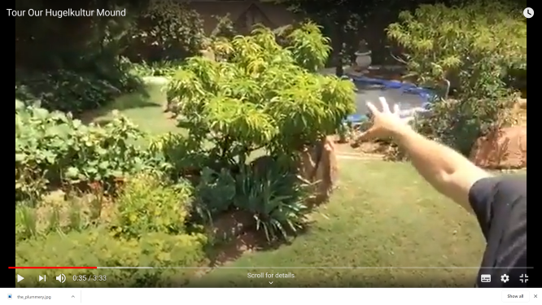
</a>
<a href="https://youtu.be/xalTDHuC_ao?t=42">
  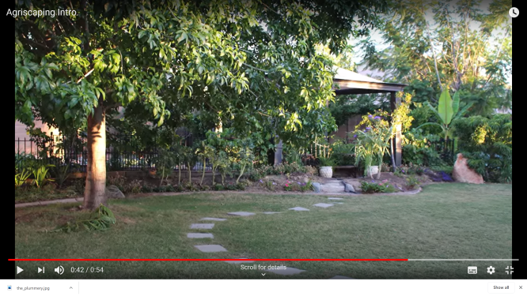
</a>
<a href="https://youtu.be/-qv1nfwHC80?t=727">
  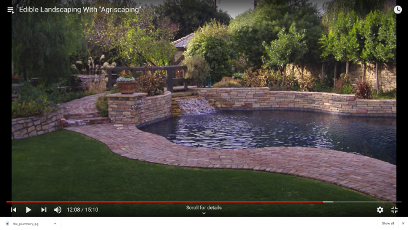
</a>

**Justin Rhodes Urban Garden (Edible)**

This is another open space in the center and planted edges edible garden. It is less tidy than the others, but again, is another example of what ours could end up looking like. They did make more use of lower layers in the center in garden beds, which I also plan to avoid as I prefer not having such defined garden beds. Also, I think there needs to be something larger in the center to provide balance.

<a href="https://youtu.be/BUHSvzUZdHs?t=76">
  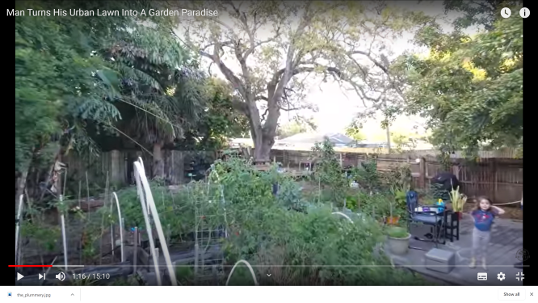
</a>

**Permaculture Garden (Edible)**

This isn't as clean looking as the others but a nice garden still. I am wondering if ours will look more like this. I would like to try and use artistic design to make it more like the agriscape versions. 

<a href="https://youtu.be/cyxs-kMejWo?t=16">
  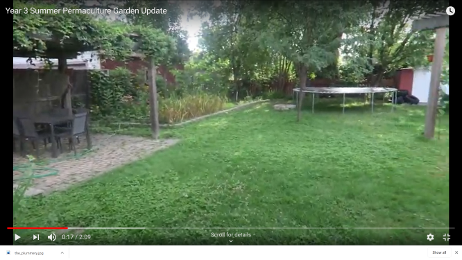
</a>

**Lizzie Dean Before / After Garden (Edible)**

<a href="https://youtu.be/ohfZB_IrPYY?list=PL-27vli8h689tiaU-dYnJiT1tuxYIzrM_&t=9">
  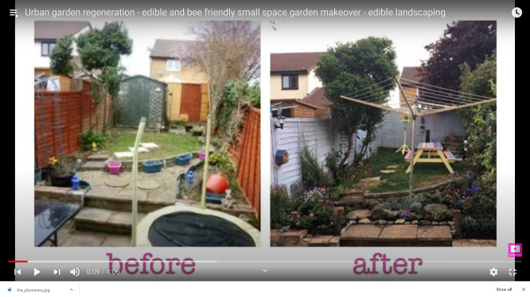
</a>

**The Spruce : English Garden Designs**

<a href="https://www.thespruce.com/english-garden-designs-4588055">
  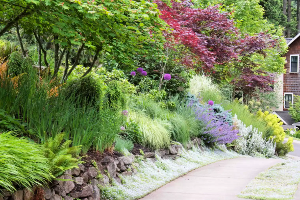
  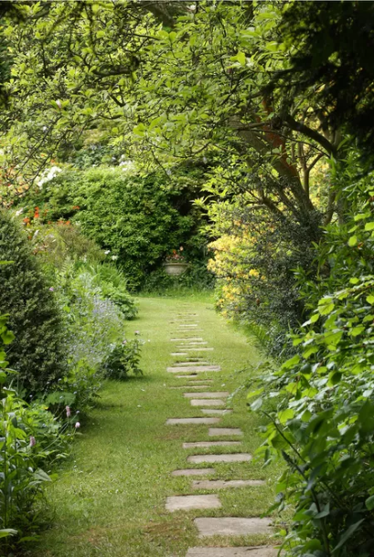
</a>

**Springy’s (Steve) Windswept exotic/tropical garden in Abingdon on Thames, UK.**
<a href="https://youtu.be/MFw7w6uKCos?t=111">
  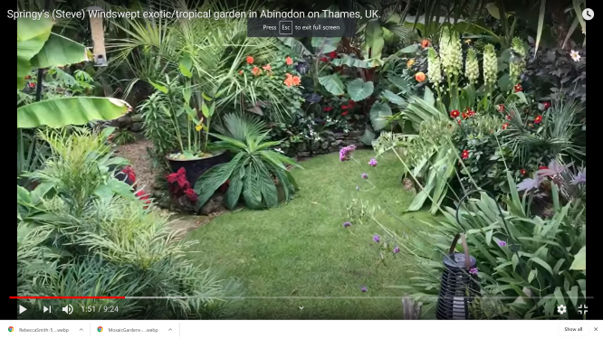
</a>

--------------------------------
RANDOM NOTES BELOW HERE

TODO READ IN DETAIL: https://www.thespruce.com/landscape-design-for-beginners-2130815

Shows 3 good example images: https://www.youtube.com/watch?v=1AdA49mMfF0
	https://youtu.be/1AdA49mMfF0?t=15
	https://youtu.be/1AdA49mMfF0?t=129
	https://youtu.be/1AdA49mMfF0?t=181

Love woodland garden style, but not enough space:
* https://www.youtube.com/watch?v=sFOGipSXeqk
* https://www.youtube.com/watch?v=Gy3bKcjdvq0

This channel has a LOT of really interesting gardens, more like what I am looking ta: https://www.youtube.com/c/TropischHoogerheide/videos

This search is showing up many examples:
https://www.youtube.com/results?search_query=urban+edible+forest

This guy is quite artistics, I like the end result of thing he did. It is worth looking at a few of his vids to see how to handles artistic style in landscaping:
https://www.youtube.com/c/suburbanhomestead/videos

Edible Landscape Architect brought up a few interesting hits:
https://www.onlinegardendesign.com.au/landscaping-articles/creating-an-edible-garden/
This is similar in some ways but has more space: https://www.pinterest.com.au/pin/56787645290666285/
Lots of publications on edible landscaping architecture: https://research.unsw.edu.au/people/dr-joshua-zeunert/publications

Books on edible landscaping:
Edible Landscaping : Referenced a few places: https://www.amazon.com.au/Edible-Landscaping-Rosalind-Creasy/dp/1578051541/ref=asc_df_1578051541/?tag=googleshopdsk-22&linkCode=df0&hvadid=341773529662&hvpos=&hvnetw=g&hvrand=17511164374999321101&hvpone=&hvptwo=&hvqmt=&hvdev=c&hvdvcmdl=&hvlocint=&hvlocphy=9071799&hvtargid=pla-497253007376&psc=1
	Authorws facebook: https://www.facebook.com/RosalindCreasy/
Foodscape Revolution : https://www.amazon.com.au/Foodscape-Revolution-Finding-Better-Beauty/dp/1943366187/ref=pd_bxgy_img_2/356-6465409-6755241?_encoding=UTF8&pd_rd_i=1943366187&pd_rd_r=89c3d74b-629f-444e-97cd-51b0c70e25a0&pd_rd_w=cb5Tl&pd_rd_wg=Rxatr&pf_rd_p=1cfa3607-3721-44d1-b97c-9194d593a1e8&pf_rd_r=XA927G9STR4YS64C226Z&psc=1&refRID=XA927G9STR4YS64C226Z
Landscaping with Fruit: https://www.amazon.com.au/Landscaping-Fruit-LEE-REICH/dp/1603420916/ref=pd_sim_14_7?_encoding=UTF8&pd_rd_i=1603420916&pd_rd_r=89c3d74b-629f-444e-97cd-51b0c70e25a0&pd_rd_w=5iOVz&pd_rd_wg=Rxatr&pf_rd_p=cb3cee4a-ac4e-4a56-8989-a52ef5b3a583&pf_rd_r=XA927G9STR4YS64C226Z&psc=1&refRID=XA927G9STR4YS64C226Z
Foodscaping: https://www.amazon.com.au/Foodscaping-Practical-Innovative-Create-Landscape/dp/1591866278/ref=pd_sim_14_5/356-6465409-6755241?_encoding=UTF8&pd_rd_i=1591866278&pd_rd_r=89c3d74b-629f-444e-97cd-51b0c70e25a0&pd_rd_w=5iOVz&pd_rd_wg=Rxatr&pf_rd_p=cb3cee4a-ac4e-4a56-8989-a52ef5b3a583&pf_rd_r=XA927G9STR4YS64C226Z&psc=1&refRID=XA927G9STR4YS64C226Z
Edible Landscaping with a Permaculture Twist : https://www.amazon.com.au/EDIBLE-LANDSCAPING-PERMACULTURE-TWIST-HAVE-ebook/dp/B00WN8I8BU
	Wollongong library: https://wollongong.spydus.com/cgi-bin/spydus.exe/FULL/WPAC/BIBENQ/4242694/17647090,1

More good references:
Tropical, dense, small, cheap: https://youtu.be/-BexliKDZNg?list=RDCMUCjtII5B3hpBzAqDjeb0gBAQ&t=65
TINY, Tropical, edges open middle: https://youtu.be/hmvcLzNwRTA?list=RDCMUCjtII5B3hpBzAqDjeb0gBAQ&t=34
Another densly planted yard: https://youtu.be/6QdBptraki8?t=72
How to plan a jungle garden: https://www.youtube.com/watch?v=zWbalTF2BOM&ab_channel=GrowVeg VERY GOOD HIGH LEVEL VIEW

Great example slightly denser with tree cottag garden: https://youtu.be/fJj5CS1RGEs?list=PL3VEy0_tuFgQFV9Dn_o4NnpTtvGAyVry3&t=29

Look at this for phases of food forrest: https://www.youtube.com/watch?v=JNNSbCiFqho&ab_channel=FloridaEdibleLandscaping

Change Ideas:
* Two trees closer where both sides join heading towards hidden cove, kind of like an arch 
  * Will need shade loving plants in summar between them
* Add a path they always seems to be nice aesthetically in drawing the eyes
* Make the kickout hidden cover more dense, cant see what is behind it. I.e. more planting shade loving plants on north side
* Maybe the pond out the back is better, thouh we then have a singl zone instead of multiple
  * Maybe the pond closer to fence? Shrink retaining wall and extend plants on north side a bit
* Make destination for shaded path a bit mor einteresting than a shed, can probably do something here with chickens that is also of interest
* Bridge over pond doesnt work, nt enough space on other side, unless extend out more somehow and add seating amidst the trees
* Pond location is difficult to "surround" in planting like I tend to like it is too exposed

<!-- Global site tag (gtag.js) - Google Analytics -->

