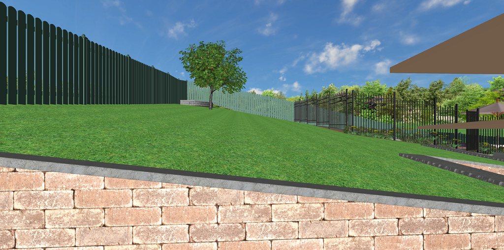

# Old Designs

This is a list of previous designs I made to a fairly stable point and then decided to change something significant. It gives a reasonable idea of the process tha has happened over the last few years:

## Shaded pond and more balance 2020/08

After seeing a video on pond based auqaponics, I realized that being able to shade the pond might make sense if I want to try and use it for aquaponics. This is normal in aquaponics to prevent too much algae, but also in Koi ponds. 

Additionally we decided having a large flat section of grass was unnecessary and that the whole design was a little un-balanced. So I decided to restructure things significantly.

* Moved pond near pool fence
* Pond *can* be shaded if desired
* Creates a hidey-hole in the back-yard where we can entertain next to the pond

This is where I am up to at the moment, and I have a lot of things to consider still.
* Run-off needs to be diverted, now closer to chickens
* Proximity to retained section of retaining wall is probably ok but a little worse than last location
* Better location to install drainage to prevent hydro-static pressure raising the liner

TODO Need to update all the above with useful

Issues:
* Vegetable gardens are often ugly and near house
* Vegetable gardens occasionally smell bad after digning in compost
* I read the ponds in the shade were a bad idea
* retaining wall was not feasible (too sharp angles, difficult to draw on ground not geometric shapes)
* Retaining walls adjusted boundary fence level 
* Deciduous and large trees overhang petes yard/pool and he wont like that
* Pond was still on a slope, not feacible to build without more retaining

## Pond below retention 2020/03

After learning more regulations about retaining walls I realized I should try not to bring any retaining walls to the boundary fence. Also the retention of a pond is structurally more difficult than placing it below the retaining wall.

This change was significant and ideally would reduce the cost and complexity significantly. 
* Pond is now below the retaining wall, and not much overlap with actual retaining height
* Retaining wall height reduced to 600mm
* Retaining wall goes no where near boundary fence (it is not retaining wher it approaches but just a garden border)
* Pond is now visible from kitchen, and potential future deck
* Main access now easier to get to (not up on retaining but level with house)

## Pond Leveling 2019/10

In this revision, I realized that the pond wasn't going to work unless the ground it was on was flat (or we retain the pond specially). Additionally I was tring to move the pond away from the boundry fence a little.

I tried a few different configurations but settled on one where the pond was in the middle retained section, there was also a seating area and other things. Key points here were:
* Pond was infeasible to build on the given slope
* Pond plants want full sun to thrive not full shade
* Digging pond and stream next to boundary fence might cause issues with fence stability so moved it
* Creating a long stream served little purpose and just made it cost more and build complex
* Chickens moved to top of slop so nutrient leeching would benefit plants
* Pond sufficient distance from chickens

This revision was looking very promising for a while until I thought about the retaining walls and the complexity of building this with a few different retained sections.

Table on Grass  |  Pond on Grass
:---:|:---:
  |  

I finally settled on this idea:

## Flattened Grass using Retaining Wall 2019/09

In this revision, a key point was to try and make the grassy space more usable by adding a retaining wall. 

Additionally, I thought the area near the house could have vegetable gardens as the grass doesnt grow well there and they are close for easy harvesting.

* Added raised beds near kitchen window
* Added more planting next to pool fence
* Added entertainment area instead of a simple seat that has view of pond and shade
* Added chicken coup near pool area (Sufficient distance from surrounding dwellings)
* Added small chicken-run along back fence, hidden by bushes so ugly chicken scratched soil is not visible

Perspective View  |  Topdown View
:---:|:---:
  |  

## First 3D Model 2019/02

This was my first 3D modeled design. It was simple, based off the 2D one. 

I also included a significant design for an extension to the house with a deck overlooking the yard and pool and closing in a granny flat under the deck that I thought would maybe be something we might do one day.

Some things I tried to achieve in this design were:
* Tall trees on the south and layer plants like in a food forrest smaller towards the north and down-slope, providing light at all layers
* Pond and stream near back to create a micro-climate with more temperate/tropical plants near it (Bananas, Mango, Davidsons Plum)
* Black bricks along southern boundary fence to hold warmth and create a micro-climate good for bananas, mangos etc
* Use the existing raised bed in the corner for a small pond
* Cover back fence with bushes to hide it
* Keep compost bins, paving near them to make easier access
* Include a fire-pit as we were using one regulary
* Minimal work

## Existing Property Modeling 2019/01

I played with a few CAD packages, and finally settled on one called Realtime Landscaping Pro (https://www.ideaspectrum.com/landscape-design-software-overview/) It was simple to use, flexible and fairly cheap as CAD packages go.

All the free ones I tried were much less productive to use, where as this software had a nice intuitive interface, a good set of features and the tutorial videos were amazing (https://www.ideaspectrum.com/landscaping-software-tutorials/). The free version was sufficient for what I wanted to do, but I ended up paying for it to support what I think is good software and get access to more tree models.

To model my house + yard, I did a few things:
* Lots of measuring dimensions and photos of my house and yard
* Downloaded image from googe maps for base : https://www.ideaspectrum.com/using-google-maps/
* Used another overlay image of the houses floor plan to accuratly line up doors / windows
* Estimated the slope of my yard using a long straight pole, tape measure and some math
* Drew up the landscape with slope, then modeled the house
* Using photos, validate the landscape contour and make relevant minor adjustments
* Validated the aspect was set correctly in the software for shadow simulation

After this I had a fairly accurate model of the existing property including landscape contour and house. It took a while to get the contour correct and I think contour and elevation controls are probably the worst parts of the Realtime Landscaping pro software. 

Perspective View  |  Topdown View
:---:|:---:
  |  

Slope viewed from north  |  Slope viewed from east
:---:|:---:
  |  

## First Draft 2018/12

Using a very simple 2D garden planning tool (http://www.smallblueprinter.com/garden/), I outlined a basic structure for my back-yard design.

This included rough measurements of the yard, and identified a few key things I would like in the design:
* Deciduous trees near the house to permit light to enter the house in winter and maybe some shade in summer
* Taller trees on the south boundary and layer plants like in a food forrest smaller towards the north and down-slope, providing light at all layers
* Covering all boundaries with something productive (vines on fences for example)
* Started to identify the types of plants I wanted
* Raised beds for annuals (Veggies and herbs)
* Herbs and leafy greens closer to the kitchen for easy access
* Pond near back (I love water features)

I started to realize that I couldnt easily visualize what this would look like and how the sunlight would work etc, so I went looking for other software to model it better.

