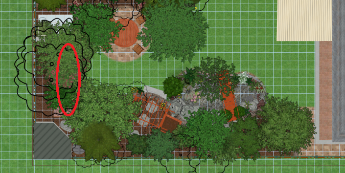

# Plant Selection and Positioning

On this page I walk through the various requirements and planting zones that exist in the garden plan. By first defining the local environment, setting requirements on various plantings and then looking at individual species that may meet those requirements.

TODO: I now have a structure for this page, I need to fill out the details obtained from elsehwre

# Contents
{:.no_toc}

1. Will be replaced with the ToC, excluding the "Contents" header
{:toc}

# Requirements

* No deciduous trees near southern neighbouring property
* No trees that are poisonous to fish within the proximity of the pond (prunus family, and others)
* Max height of tree must not cause un-accounted for shading in the design (or tree should be feasible to prune and keep at the expected height)
* Roots of trees near pool must not impact on its retaining wall and cause failure

# Goals

* Each plant added should serve more than one purpose, and one of those should always be something we typically eat
* Preferrably good for our hardiness zone
* Avoid shading of neighbouring southern property (some is ok, but not a lot)
* Avoid deciduous near pond and pool (likely not going to be possible)
* Design so colour exists through most if not all the year (Ideally flowers or colourful leaves at different times of the year)
* Avoid overhang of trees on any boundary fence
* Roots of trees near highest point (south-eastern) of new small retaining wall should not impact it causing failure (not a requirement like the pool retaining wall as I can easily repair it myself)
* Use tall trees like bananas to block view on eastern boundary fence into our backyard

# Local environment

* Frosts: Never observed (Nearby Albion park apparently 1.1 days mean a year, we maybe more protected)
* Chill hours: 400-500 (Medium)
* Soil pH: 5.1  : Acidic, need to improve using Calcitic lime (calcium carbonate), not dolomitic lime as high sodium content
* Soil type: Clay, bad drainage (will attempt to improve using lime and adding organic matter)
* Soil notes: Quite high salinity (Sodium, need to increase calcium)
* Sun: 80-100% (Full)
* Wind: Windy gusts a lot in August/September
* Rainfall: 893mm per year, most in feb/mar fairly even through rest of year lowest month is sep
* Slope aspect: Northerly
* Hardiness Zone: 10b (1.7 - 4.4 degrees Celcius) (Or an aus specific zone 4 : <https://www.anbg.gov.au/gardens/research/hort.research/zones.html> )
* Pests: Fruit fly, Cabbage moth, Aphids all the normal things

I am going to have to do some work on improving the soil. The report says there is a high sodium content, and I should increase the calcium content and raise the pH the solution is to treat with calcitic lime which I plan to do reguary and re-test. Additionally other normal processes like mulching, composting and generally trying to improve the soil structure as well.

One thing I have noticed with my currently small scale stuff is that there seem to be a lot more pests around Illawarra than I recall ever seeing up near Picton. Maybe it is the density of people, or thre warmer climate. Either way I have observed in everything we have planted to date significant pest issues. I am hopeful that the diverse ecosystem will help a little with this. I mention this here as plant selection can impact this a little too.

Some pests I have observed:
* Fruit fly on almost all nectarines from my tree
* Larvae in many larger tomatoes grown
* Cabbage moth caterpillars on many leafy plants especially liked broccoli
* Aphids (and ants) really liked the kale
* Ants I think burrowed into new into new prunings of young mango tree

Some things we may be able to do is use thicker-skinned varieties etc.

References: 
* Soil report: [../soil/soil_report_2018_09_25_edited.pdf](../soil/soil_report_2018_09_25_edited.pdf)
* Weather data: <http://www.bom.gov.au/climate/averages/tables/cw_068241_All.shtml>
* Interractive Plant hardiness Zone: <https://www.plantmaps.com/interactive-australia-plant-hardiness-zone-map-celsius.php>
* Chill calculations made from: <https://blog.daleysfruit.com.au/2012/05/chill-hours-for-fruit-trees-calculation.html>

# Good references

* Growing fruit trees in the back-yard : <https://www.davewilson.com/home-gardens/backyard-orchard-culture>
  * One key idea is groing multiple trees together in the one planting hole, to get a spread of fruit times.

# Key locations with specific requirements

There are a few key locations that have specific requirements, these are mostly trees and is why I needed to wait until design before selection.

## Large canopy evergreen tree : [Mango R2E2](#mango-r2e2)

  We have planned for a single larger canopy evergreen tree. This is still not a huge tree but can grow a bit larger as it is a reasonable distance from the south boundary fence and expected to provide shade in the south-western corner of our yard year-round creating a shady, cool micro-climate.
  
  I have already chosen an R2E2 Mango tree for this location, it has been planted and is doing well. I saw multiple mango trees in the area thriving and producing fruit. Of all the other specifies we might have planted here, the mago is maybe less suited but more useful to our consumption. 

  Available space:
  * Ideally: 5m wide, 5m high
  * Maximum: 6m wide (prevent overhang of fence), 6m high as well, though height is less important here
  
  Considered species:
  * [Mango R2E2](#mango-r2e2)
  * Maccadamia
  * Avacado
  
  Purposes of tree at this location:
  * Food
  * Shade and structure to garden creating a shaded micro-climate
  * Asthetics : Also considered a macadamia tree here, but macadamia trees do not look as good IMO

## Large canopy deciduous tree

  
  We have planned for a single larger deciduous tree located near the pool (and the pond), which is undesirable for a deciduous tree, but unavoidable as I need something here on the northern side of the yard that permits light in during winter or the entire back yard is in shade. 

  Consider multiple species in a single planting hole or multipe species on single graft: <https://www.davewilson.com/home-gardens/backyard-orchard-culture>
  
  If this tree doesn't work out it isnt super important to the design. It just adds balance and shading for a seating area.

  Available space:
  * Ideally: 5m wide, 5m high
  * Maximum: 6m wide (prevent shading of pond plants), 6m high as well, though height is less important here

  Considered species:
  * Apple
  * Pear
  * Almond
  * Fig
  * Red Mulberry
  * Hortulan Plum
  * Persimmon (Dont eat much of)
  * Little Walnut
  * Cherry (Looks lovely, but likely too close to pond and seeds from species prunus is toxic for fish)
  * Nectarine (Prunus)
  * Peach (Prunus)
  * Sweet Cherry
  * TODO Other nut trees might be suitable as well?

  Purposes of tree at this location:
  * Food
  * Sunlight in winter, shade in summer
  * Asthetics adding balance to the backyard design

  Issues to consider:
  * Root system and pool retaining wall
  * Proximity to pond and toxicity for fish
  * Shape and proximity of branches to pool fence (for pool safety, there are regulations, but probably far enough away)
  * Size is important for impact on the sunlight to plants on south boundary fence

## Smaller evergreen trees

  We have planned for multiple smaller evergreen trees along southern boundary fence. There is a bit more choice in this selection as it is not creating deliberate micro-cimates or structure in the yard. As long as the trees meet the requirements outlined below it should be fine for many choices. They should get reasonable amount of sunlight and ok drainage.
  
  Available space (for each plant):
  * Ideally: 2m wide, 3m high
  * Maximum: width variable depending on where located, 3.5m high

  Considered species:
  * Lemon (Eureka)
  * Orange (Dwarf)

  Purposes of tree at this location:
  * Food
  * Fewer other considerations here so we have more choice

  Issues to consider:
  * Must not be too tall and overly shade southern neighbouring property
  * Unless very small (under fence-line) should not be deciduous as neighbouring property will not like extra leaves in his pool 
  * Must not have branches overhanging neighbouring property
  * Some of them are close to fish pond and cant be species that are toxic to fish

## Dense evergreen bushes

  The purpose of this is to hide the chicken run. It will be along the western boundary and we want to use it to make the chicken run and boundary fence hidden.
  
  We have space for multiple different varieties here. Ideally evergreen but not a requirement. We can also choose to add a single deciduous smaller tree and a few shrubs, so long as the shrubs can grow under the tree.
  
  Available space (for each plant):
  * Ideally: 2m wide, 3m high
  * Maximum: 3m wide, 3.5m high

  Considered species:
  * Coffee (Not particulary dense but ok to mix with others)

  Purposes of tree at this location:
  * Food
  * Density to hide chicken run

  Issues to consider:
  * Not full sun, probably >50% summer but less in winter

## Tall narrow trees for blocking eastern view into our back yard : [Banana Cavendish](#banana-cavendish)

  We need a row of trees planted in the chicken run that ideally have a narrow base, are tall and have leaves high up. Some examples are plams or bananas. 
  
  The neighbouring property on the west have built a large deck that looks into our backyard. The goal of these is to provide some privacy. We shouldn't make trees too tall that will block their view, but ideally grow such that the leaves block to the top of our roof.
  
  Available space (for each plant):
  * Ideally: ? wide, 5m high TODO need to model accuratly deck height and measure thi view.
  * Maximum: ?m wide, 6m high

  Considered species:
  * [Banana Cavendish](#banana-cavendish)
  * Palm trees
  * Date trees (wont work I dont think in out climate)
  * Bamboo

  Purposes of tree at this location:
  * Food
  * Privacy screen

  Issues to consider:
  * Narrow chicken run at base about 1.2m wide
  * length to cover is about 5m long
 
## Smaller deciduous near glass house / pool fence

  We have space in the corener and ideally to add balance to the yard for a single smaller deciduous tree/shrub like a fig. This is for asthetics adding balance and also some shade in the summer. Must be deciduous to permit light through in the winter.

  Available space (for each plant):
  * Ideally: 3m wide, 4m high 
  * Maximum: 4m wide, 5m high

  Considered species:
  * Fig
  * Almond
  * Peach etc

  Purposes of tree at this location:
  * Food
  * Asthetic balance

  Issues to consider:
  * Must be deciduous
  * Ideally mushroom shape, could be taller and overhang table.chairs area

# Additionaly less specific planting zones

In addition to the above specific locations, I have a few zones in which I expect to be able to plant a variety of smaller shrubs/ground covers that are not as specific for purposes as the ones above. Instead these have the luxury of being "fillers" and so can serve purposes other than shade/structure, hiding things etc.

These can add colour/asthetics, and will likely include berries, herbs and other bushes and ground covers. I dont mind a few of these being exotic and occasional use as they dont take lots of space. Also, it is helpful to include flowers in these areas to attract bees and other insects.

The goal is to layer the planting so get the most out of the vertical space.

* Aquaponic growbed (Annuals / Vegies)
  * The aquaponics system will largely be for leafy greens and other fast growing annuals that are good at taking nutrients from the pond
  * Planning to have in high sunlight, though one bed will probably have a bit more shade than the other

* Raised garden bed (Annuals / Vegies)
  * We will not place annuals in the main garden, instead we plan to have 2x raised garden beds close to the kitchen window we can use to grow annuals  

* Garden bed near BBQ area mostly shaded in winter
  * Near the BBQ area, this is temporary and may be replaced one day with a decking area.
  * Been successful growing sweet potatoes and pumpkin in here, but in winter not much sun at all.

* Full shade
  * There is a little space near the chicken coop for any plants that can grow ok in full shade. Not a lot of these, we are looking for shrubs, vines, and ground covers

* Southern fence 50-80% sun probably
  * Especially on the southern fence, there is space for numerous shrubs, vines and ground covers that will have partial shade. More shade in summer and less in winter.
  * These will want to be layered to get the most fro mthe light with shrubs at the south side. The pka with the small trees is at the back, shrubs next and ground cover after that. This is probably the prime space for shrubs/ground covers in the design as it has decent sunlight access

* Full sun climber
  * Over the arbor / trellis at the entrance to the walkway, we have space for one climber (maybe two one on each side). I am considering grapes here.
  * They will have access to nearly full sun climbing up the arbor.

* Pool fence climber
  * Already planted passionfruit along here but is a good location for full sun climber on the fence.

* Aquatic plants
  * Some specific ones needed for providing shade to fish (Lillies for example)
  * Maybe some are edible? What can we do here with edible planting? 
  * Some specifically for the frog area (need research on plants for frog ponds in our area)
  * Take into account height, asthetics etc

# Considered Species List

Here I plan to document the species I have considered and the research I have done on them ordered in a way that helps me to make simpler decisions.

## Mango R2E2 

Photo of a local mango tree

* Scientific Name: Mangifera indica
* Category: Tree
* Sun requirements: 80%-100% (<https://www.daleysfruit.com.au/buy/mango-r2e2-grafted-tree.htm>)
* Water requirements: Moderate (<https://www.daleysfruit.com.au/buy/mango-r2e2-grafted-tree.htm>)
* Height: 5-10m (<https://www.daleysfruit.com.au/buy/mango-r2e2-grafted-tree.htm>)
  * 3-7m (<https://www.gardenclinic.com.au/how-to-grow-article/mangoes>)
* Width: 5m (<https://www.daf.qld.gov.au/business-priorities/plants/fruit-and-vegetables/fruit-and-nuts/mangoes/mango-varieties/r2e2>)
* Root system: 
* Flowering Months: August (From observation)
  * May, June  (<https://dpir.nt.gov.au/__data/assets/pdf_file/0018/232920/598.pdf>)
* Fruiting/Harvest Months: February, March, April (<https://www.daleysfruit.com.au/buy/mango-r2e2-grafted-tree.htm>)
  * By December (<https://dpir.nt.gov.au/__data/assets/pdf_file/0018/232920/598.pdf>)
* Soil pH range: 6.6-7.0 (subset of seen ranges)
  * 6.6 - 7.3 (<https://www.daleysfruit.com.au/buy/mango-r2e2-grafted-tree.htm>)
  * 5.5 - 7.5 (<https://www.gardenclinic.com.au/how-to-grow-article/mangoes>)
  * 4.5 - 7.0 (<https://homeguides.sfgate.com/soil-mango-tree-58272.html>)
  * 6 - 7.2 (https://www.nda.agric.za/docs/Infopaks/mango.htm)
* Soil type: Good Drainage (<https://www.daleysfruit.com.au/buy/mango-r2e2-grafted-tree.htm>)
* Chill hours: N/A
* Frosts: Sometimes (<https://www.daleysfruit.com.au/buy/mango-r2e2-grafted-tree.htm>)
* Aus Climate Zones (Will use daleys ones): Sub Tropical, Tropical (See <https://blog.daleysfruit.com.au/2014/02/climate-zones.html>, <https://www.gardenia.net/guide/australian-hardiness-zones> and <https://www.anbg.gov.au/gardens/research/hort.research/zones.html>)
* USDA Plant Hardiness Zones: 
* Diseases: Susceptible to Black Spot and Anthracnose (<https://www.daleysfruit.com.au/buy/mango-r2e2-grafted-tree.htm>)
* Maintanence: 
  * Pruning: 
    * Very good description and reasoning of pruning (<https://dpir.nt.gov.au/__data/assets/pdf_file/0018/232920/598.pdf>)
    * Young Trees prune any time of the year
    * Older trees prune after harvest: by the end of December (Also mentioned at <https://www.gardenclinic.com.au/how-to-grow-article/mangoes>)
  * Fertalizer:
    * Organic best suceptible to burn, Young trees are particularly sensitive to over-fertilising, but respond well to seaweed and fish emulsion (<https://www.gardenclinic.com.au/how-to-grow-article/mangoes>)
  * Spray:
	* Regularly spray anti-fungal alternate Mancozeb and copper oxychloride spray: during flowering then monthly until harvest : https://www.gardenclinic.com.au/how-to-grow-article/mangoes
* Notes:
  * RTL Model: Using "Cashew Tree" is too wide for height. TODO : Fix this with a better model
  * Chose R2E2 as it is supposed to be good in colder climates (<https://www.gardenclinic.com.au/how-to-grow-article/mangoes>)
  * Chose R2E2 as it is supposed to be a hardy vigorous tree and we need it for shade
  * Mango trees like moderately fertile soil but have a low tolerance for salty soil (<https://homeguides.sfgate.com/soil-mango-tree-58272.html>)
  * Withhold water for the three months prior to flowering, to encourage flowers, then water evenly until fruit ripens. (<https://www.gardenclinic.com.au/how-to-grow-article/mangoes>)
  * Most useful calendar of things to do and when it grows etc: <http://era.daf.qld.gov.au/id/eprint/1647/8/HG-1mango.pdf>
  * Very reliable and detailed commercial info for mangos and growing: <https://www.daf.qld.gov.au/business-priorities/plants/fruit-and-vegetables/fruit-and-nuts/mangoes>
  * Simple to read succinct and informative: <https://www.gardenclinic.com.au/how-to-grow-article/mangoes>
  * <http://horticultureworld.net/botany-taxonomy.htm>
  * <https://gardenerdy.com/mango-tree-care>
  * <https://www.daleysfruit.com.au/buy/mango-r2e2-grafted-tree.htm>
  * <https://www.daf.qld.gov.au/business-priorities/plants/fruit-and-vegetables/fruit-and-nuts/mangoes/mango-varieties/r2e2>

## Banana Cavendish

Photo of a Banana tree I grew at our last property

* Scientific Name: Musa acuminata
* Category: Tree
* Sun requirements: 80%-100% (<https://www.daleysfruit.com.au/Banana-DPM-25-Musa-acuminata.htm>)
* Water requirements: Frequent (<https://www.daleysfruit.com.au/Banana-DPM-25-Musa-acuminata.htm>)
* Height: 2-5mm (<https://www.daleysfruit.com.au/Banana-DPM-25-Musa-acuminata.htm>)
* Width: 
* Root system: 
* Flowering Months: 
* Fruiting/Harvest Months: All year (<https://www.daleysfruit.com.au/Banana-DPM-25-Musa-acuminata.htm>)
* Soil pH range: 6.6-7.3 (<https://www.daleysfruit.com.au/Banana-DPM-25-Musa-acuminata.htm>)
* Soil type: Good Drainage (<https://www.daleysfruit.com.au/Banana-DPM-25-Musa-acuminata.htm>)
* Chill hours: N/A
* Frosts: Likes Temps >5 degrees (<https://www.daleysfruit.com.au/Banana-DPM-25-Musa-acuminata.htm>)
* Aus Climate Zones: Sub Tropical, Tropical (<https://www.daleysfruit.com.au/Banana-DPM-25-Musa-acuminata.htm>)
* USDA Plant Hardiness Zones: 
* Diseases: 
* Maintanence: 
  * Pruning: 
  * Fertalizer:
  * Spray:
* Notes:
  * Maybe try to get Ducasse good cold or PISANG CEYLON
  * Was considering dwarf, but think for purpose will need full size
  * <https://www.diggers.com.au/shop/edibles/banana-dwarf-cavendish/wbac/>
  * <https://www.gumtree.com.au/s-ad/taree/plants/banana-trees-for-sale-1-dwarf-banana-plant-1-available/1140246061>
  * May not be able to buy Cavendish in NSW as not permitted north of Taree (Is permitted here but people dont sell)
  * Maybe preferrable variety is the Williams: <https://www.daleysfruit.com.au/Banana-Williams-Musa-acuminata.htm>
  * <https://www.daleysfruit.com.au/Banana-Pisang-Ceylan-Musa-acuminata.htm>

----------------------------
TODO Not done anything below here needs to update and format like above

Each item can have sub-points that identify varying values from different references in case there seems to be inconsistency. The main one will be what we use though

Template for each species:
* Scientific Name: Mangifera indica
* Category: Tree/Shrub/Vine/Ground Cover
* Sun requirements: X%-Y% (reference)
* Water requirements: Low/Moderate/High (reference)
* Height: 5-10m (reference)
* Width: 5m (reference)
* Root system: 
* Flowering Months: August (reference)
* Fruiting/Harvest Months: February, March, April (reference)
* Soil pH range: X-Y (reference)
* Soil type: Good Drainage (reference)
* Chill hours: N/A
* Frosts: Sometimes, Never, Yes, Required (reference)
* Aus Climate Zones (Will use daleys ones): Sub Tropical, Tropical (See https://blog.daleysfruit.com.au/2014/02/climate-zones.html, https://www.gardenia.net/guide/australian-hardiness-zones and https://www.anbg.gov.au/gardens/research/hort.research/zones.html)
* USDA Plant Hardiness Zones: (reference)
* Diseases: (reference)
* Maintanence: 
  * Pruning: 
  * Fertalizer:
  * Spray:
* Notes:

@TODO What is most important for selection?

Shade tolerant plants:
* Currants and gooseberries, on the other hand, thrive in fairly shady conditions an
* Kolomitka Kiwi : https://modernfarmer.com/2016/07/shade-plants/
* Hazelnuts : https://modernfarmer.com/2016/07/shade-plants/
* Pawpaw : https://modernfarmer.com/2016/07/shade-plants/
* Huckleberry : https://modernfarmer.com/2016/07/shade-plants/
* Fiddlehead Ferns : 
* Alpine Strawberries
* Mint 

DONE : Banana: (Using banana 2D 2.3mW,3mH)
	Dwarf Cavendish: Width To 2m, Height To 3m
	Try get in following order: Dwarf Cavendish(perfect), Cavendish(too big), (Either Ducasse good cold or PISANG CEYLON)
	Dwarf Cavendish Banana : Musa acuminata
	https://www.diggers.com.au/shop/edibles/banana-dwarf-cavendish/wbac/
	https://www.gumtree.com.au/s-ad/taree/plants/banana-trees-for-sale-1-dwarf-banana-plant-1-available/1140246061
	can grow to 2m still
	May not be able to buy in NSW
	NOT: M. basjoo  inedible fruit
	Cavendish Banana (Also called WIlliams) : Musa acuminata
	* https://www.daleysfruit.com.au/Banana-Williams-Musa-acuminata.htm
	2-5m high
	https://www.daleysfruit.com.au/Banana-Pisang-Ceylan-Musa-acuminata.htm

DONE : Lemon:
	* Full sized lemon Eureka : https://www.daleysfruit.com.au/buy/lemon-eureka-tree.htm
	2-5m heigh
	* Dwarf Lemon Eureka (typically 2.5m high and 2m wide)
		Sparse foliage
		http://www.grevilleanursery.com.au/kbm/products.php?product=Lemon-Eureka-Dwarf-200mm
		Eureka better no thorns, fruits all year (not as hardy)
		Can buy from rngalls nursery?
		Dwarf can still grow upto 3m : http://www.engalls.com.au/citrus/dwarfcitrus/tabid/63/default.aspx
		https://www.dpi.nsw.gov.au/__data/assets/pdf_file/0003/137712/4-lemon-varieties.pdf

Passion fruit (pool fence)
	* Nellie Kelly *Grafted* Black (6-8 m^2 area : say 2m either side of the roots according to daileys) : Passiflora edulis 
	https://www.daleysfruit.com.au/Passionfruit-Nellie-Kelly.htm
	http://www.nelliekelly.com.au/grafted-black-passionfruit.html

DONE : Maybe try a davidsons plum behind the mango in shade:
	2-5m high
	https://www.daleysfruit.com.au/buy/smooth-davidsons-plum-tree.htm
	Upto 10m high like a fern/palm a bit with leaves at topwhen small more like a bush
	wants shade + moisture in rainforrest
	no frost
	http://plantnet.rbgsyd.nsw.gov.au/cgi-bin/NSWfl.pl?page=nswfl&lvl=sp&name=Davidsonia~johnsonii
	https://www.environment.nsw.gov.au/threatenedspeciesapp/profile.aspx?id=10209
	https://www.sgaonline.org.au/davidsons-plum/

Juneberry/Saskatoon Berry : Amalanchier Alnifolia
	2 - 5m shrub
	prolific fruit easy to grow
	like blueberries
	https://www.daleysfruit.com.au/buy/Saskatoon-Berry-Plant-Tree.htm
	https://www.ag.ndsu.edu/trees/handbook/th-3-33.pdf
	If can find specifically : Pembina Saskatoon (is best eating variety)

Grapes: (where?)

Coffee Bushes:
	Seven Son Flower similar (but decid)
	Japansese Cleyera
	Inkberry
	Coffee Arabica : Coffea arabica (2-5m high can be pruned to 2m)
	https://www.daleysfruit.com.au/buy/coffee-arabica-tree.htm
	http://www.bambooland.com.au/coffea-arabica-coffee-tree
	Doesn't like cold < 5 deg

DONE : Citrus: (Maybe in middle of coffee?)
	Dwarf Orange Navelina : Citrus sinensis (1 - 2 m high, wide spreading)
	Smaller than most varieties
	https://www.daleysfruit.com.au/buy/dwarf-orange-navelina-tree.htm
	or maybe bigger tree Valencia (2 - 5m)
	https://www.daleysfruit.com.au/buy/orange-valencia-tree.htm

DONE : Stone Fruit or Avacado or Lychee:
	Nectarine Fantasia : Prunus persica (2-5m high, can be pruned to 2m, )
	400-600 chill hours required for this variety according to: https://www.grandpasorchard.com/_ccLib/attachments/pages/GO-Web-Chill+Hours+Chart-PEACH+(2013).pdf
	Soft when ripe
	Easy remove seed
	https://www.daleysfruit.com.au/buy/nectarine-fantasia-tree.htm
	https://summerfruit.com.au/wp-content/uploads/2016/09/Nectarines-Variety-Chart-Summerfruit-Australia.pdf
	Cherry too difficult where we are, Peach not as nice to eat, plum needs multiple
	Nectarine, Peach, Plum, Cherry
	I like cherries the most... But too difficult to grow
	Plums not great need cross pollinator
	Peaches other option but furry

DONE Fig:
	Their fig looks nothing like a real one
	Picone Black : Ficus carica (2-5m can be pruned to 2m)
	Either Picone Black or Black Genoa, I think I prefer the Picone more similar to my parents one
	https://www.daleysfruit.com.au/buy/fig-catalogna-tree.htm
	https://www.daleysfruit.com.au/buy/fig-black-genoa-tree.htm

* Macadamia (A16, A38, 814)
	Can grow to 20m high, but can be pruned
	Daleys: 5-10m high
	?? How wide ??
	Rich well drained soil
	Good supply of Nitrogen + Potassium
	Addition of Foul manure and compost before planting
	Dont use high phosphorous fertalizers
	Needs constant moisture while growing (mulch)
	4m between trees so probably a bit less than 2m spread
	Dwarf macca, 2-4 m high when established
	?? Temperature?? I think will be fine is good at parents, and good in QLD

* Avacado (Pinkerton, Wurtz)

* Mango (Valencia, Glenn)
	4-8m
	dont like temperature <4degrees C
	plant late winter early spring
	dig hole 2x wide and 2x deep as root ball
	best slightly acidic sandy loam
	wet summers, dry winters and springs
	established can tolerate occasional hard frost down to -5deg
	full of organic matter
	use shade cloth to protect against frost for saplings
	annual pruning + dwarf variety can be limited to 2-3m tall + wide
	Pruning and training should start early. In spring or summer, cut the top off young trees, 1m above the ground to stimulate multiple branching. Retain four to five main limbs and encourage them to form a low spreading vase-shaped framework.
	For the following three years, continue to prune the tips of the main branches each summer to promote multiple shoots. Remove any vigorous upward growth to keep the canopy low and compact.
		Good info pruning: https://www.organicgardener.com.au/articles/make-mine-mango
	both deep tap and shallow feeder roots
	
* Cherry
	Susceptible to root rot
	Needs great drainage
	Never permitted to be shaded by other trees
	Sweet variety needs a few trees to cross polinate
	Sour variety is fine to self polinate

* Nectarine (Dwarf varieties?)
	Will be fine except for fruit fly
	Daleys: 2-4m High
	Well drained
	
* Lychee (Bosworth 3, Wai Chee)
	Is it too cold? It seems like it might be ok, but some chance of frost
	Daleys: 3-6,4-8m (Ideal apparently 3 - 5 metres)
	* Fruit only on sun exposed
	* Organic mulch
	* Do NOT mound
	* Needs windbreak (suggest banana)
	* Plant late spring, need lots of water at start never dry out
	* Moist well drained soil
	* Preferrable ph 5.0 - 7.5 (alkalinity may result in iron deficiency)
	* Shallow root
	* Lots of water but never water logged
	* Do not bury root crown (between roots and trunk) must be exposed
	* 100-200 hours < 20 degrees
	* No temperature <0 degrees for more than 8 hours
	* Buy air layers NOT grafted
	* Dont need two trees to fruit one is fine
	* Apparently air layerd dont have tap roots
	
	
* Custard Apple (African Pride)
	Daleys: 3-5m (one), most 5-8m
	1m deep well drained sandy loam
	bad bacterial wilt disease from tomatos, potatos, eggplant, capsicums, ginger
	very brittle wood needs protection
	25-28 degrees Oct to Feb best, above 28 just more growthi instead of fruit
	<13degree early winter damage fruit
	want relative humidity of 70% for fruit set
	Custard Apples need high temperatures and high humidity. 
	They are very wind sensitive and will not tolerate any frost when young and only light frosts when mature.
	

* Persimmon (Fuyu, Flat Seedless, Hachiya)
	4-7m,3-5m
	Dwarf: 2-4
	Very rounded shape tree
	Plant in winter
	PH 6.5 - 7.5 (but not finiky)
	Say not so good with wet feet, but was not such trustworthy site
	15-20ft tall
	
	
* Fig (Black Genoa, Excel)
	2-5m
	Love lots of water in winter and dry summer ()
	Ficus ‘Black Ischia’ good for backyard
	plant in late winter
	give shallow soil (concrete slab underneath) and will force to spread + have lots of fruit, if deep roots set then pruduce big canopy of leaves
	full sun, well drained soil 
	ph 6.0-6.5, will tolerate 5.5 - 8.0
	want heat in summer
	lots of organic matter in soil
	Figs don’t like wet feet and are often are planted in raised beds or mounds to ensure good drainage.
	plant 15 to 20 feet apart
	deep rooted
	well draining soil with cold protection

* Paw Paw (Southern Red, RB3)
	2-4m high
	try different varieties first, some smell/taste awful either love or hate. bisexual red variety apparently good (not in cooler climates, will revert to males)
	need variety that is bisexual or both male/female trees
	
	deep, rich, humusy loam with good drainage and a steady moisture supply
	will tolerate many different soils including heavy clay or sand
	do not tolerate water logged soils
	pH 5.5 to 7.0.
	15-20 feet tall.
	3-5m in height. They are relatively short lived trees, averaging 5-10 years in life expectancy
	 It’s a good idea to create a shallow mound of soil rich in compost and plant the paw paw no earlier than late spring
	 

* Dwarf orange (Valencia, Washington navel)
	1-2m
	Valencia best for many parts of australia apparently
	4m tall non-dwarf
	
* Dwarf Lemon Eureka
	1-2m
	Actuall Eureka better than lisbon
		Not thorny
		Fewer seeds
		Lisbon better in Melbourne and cold areas
		Fruit all year not in blocks
		about 4m tall non-dwarf
Citrus in general:
	Dont love frost but work fine
	Like sunny days
	Need lots of nutrients
	Washington Navel best eating but hard to grow (gets lots of diseases, detoriates fast, less fruit than valencia)
	Dwarf: These are exactly the same as the big ones, only they grow to about half the size
	pH of 6.0–7.0.* An ideal citrus soil is well-structured, with good drainage and a minimum 60 cm of topsoil. 
	Citrus does not like very acid soils (pH below 5.0)
	Citrus does not like very alkaline soils (pH above 8.0). 
	
* Banana ()Cavendish (Williams), Lady Finger)
	- Go for dwarf varieties, make a banana circle?
	full sized ends up too large for a circle
	they alternate banana and paw paw
	https://treeyopermacultureedu.wordpress.com/chapter-10-the-humid-tropics/banana-circle/
	http://permaculturenews.org/2014/04/08/banana-circles/
	http://permaculturenews.org/2008/06/23/build-a-banana-circle/
	suggests that can soak up extra rain water: http://www.cabi.org/gara/FullTextPDF/2009/20093005655.pdf

* Coffee
	Maybe too cold? Probably ok after canopy above it
	2-4m
	Coffea Arabica? 2m high
	Can grow high, but usually pruned to 2m high shrub
	15-24 degrees preference, fine 7-30 degrees
	shady spot sheltered from cold/hot winds
	very frost sensitive
	any soil slightly acid (pH6), doesnt get waterlogged and isnt dry and sandy
	plant late spring
	30 plants for a cup per day
	http://www.daleysfruit.com.au/buy/coffee-arabica-tree.htm
	
* Kiwi fruit might work too (Sweetie, H4,(need male pollinator))
	Is it cold enough for this?
	Need male + female
	ph between 5.0 and 6.5
	Develop crown rot when water sits on surface soil after rain
	north facing slopes, shielded from low winter and early spring sun best
	raised mounds, very touchy about sitting water in early years
	Can be coaxed up gazebos, pergolas or split rail fences
	700 hours <7 degrees
	WELL DRAINED SOIL
	requires lots of pruning VERY prolific
	plant at least 3m apart
	can grow 3 m wide
	dont get dual male/female grafted ones
	The ideal soil is a slightly acid, sandy loam
	Maybe behind vege patch on fence?

* Grapes (Golden muscat, Isabella black)
	http://www.wikihow.com/Grow-Grape-Vines
	Full sun
	Any soil type, slightly acidic to neutral
	Make sure at least gets morning sun, a little bit of afternoon shade apparently ok
	Space vines 6 to 10 feet apart (16 feet for muscadines)
	Your soil needs to be deep, well-drained, and loose. You also need good air circulation.
	In order to start flowering, grapes require temperatures below 5ºC for a period of 4-6 weeks
	they require a cool winter, wet-ish spring and a long, dry summer
	When possible, get them certified virus-free
	Use soil that slightly rocky or sandy with a pH just above 7
	
	
* Passion Fruit (Purple, Panama Gold(not grafted))

* Miracle fruit in a pot
	http://www.daleysfruit.com.au/fruit%20pages/miracle.htm
	Likes warm/light maybe ok on verandah be a very interesting plant to have

* Carnivorous plants (in a small bowl)

Shrubs:
* Atherton Raspberry (Better than normal as not cold enough for normal here)
* Blueberry (Low chill varieties)
* Coffee ()

Climbers:
* Logan berry
* Passion fruit
* Kiwi fruit (Large climber)
* Dragon fruit (Large climber)
* Grape (Large climber)

Ground cover:
* Strawberries

Juneberry?
Many small farm operators and fruit enthusiasts see blueberries as Plan A.  We all know that blueberries are popular, tasty, and they practically market themselves.  But if you do not have very well-drained, acidic soils, you have to go with Plan B.  It would be great if there was a productive berry that very much looked and tasted like a blueberry, but was not so fickle about soils.  That’s where juneberries come in.  And it turns out, juneberries have several advantages over blueberries.

List of herbs for dame, wet and in water: https://www.richters.com/show.cgi?page=InfoSheets/d9005.html

Things in design:
* Where to put things like corn, pumpkin, zuccini and other larger vegetables? Probably not in garden bed. Use that for leafy greens and smaller things. So want a spot that is easy to dig up occasionally without disturbing the trees too much

Companion plants:
https://permaculturenews.org/resources_files/Poster_GDN_Com_Plant.pdf

Things in design:
* Where to put things like corn, pumpkin, zuccini and other larger vegetables? Probably not in garden bed. Use that for leafy greens and smaller things. So want a spot that is easy to dig up occasionally without disturbing the trees too much

Flowers:
* Sunflowers
* Nasturtiums
* Calendula flowers
* https://lovelygreens.com/companion-plants-edible-flowers/

Maybe:
* Orange (dwarf)

Support trees (remove later):
* Bleeding Heart
* sickle wattle

Trees:
* Mango
* Lemon (dwarf?)
* Bananas
* Fig
* Nectarine? or Peach? or Apricot?

Bushes:
* Coffee
? Blueberry
* Guava?
* Finger lime
* Sage
* Rosemary
* Lavender
* Wormwood

Vines:
* Passionfruit
* Grapes??

Medium Sized Perennials:
* Asparagus?
* Raspberries? (Spread a lot)

Small Perennials:
* Comfrey
* Parsely
* Chamomile
* Strawberries
* Oregano
* Chives

Ground cover:
* Pennyroyal
* Lawn Chamomile
* Sweet Potato
* Mint

Water:

Veggies + Herbs:
* Annuals all in raised bed

For the layerd approach:
* Figured out trees and large shrubs
* Small shrubs to plant:
	- Blueberry
	- galangal (Ginger like plant)
* Herbs:
	- Comefry 
	- Paresly
	- Tumeric
* Ground covers
	Sweet potato? Apparently improves soil, is edible and helps in a number of ways
	Clover?
	Strawberries
	Pinto peanut looks good

After trees are up, then things change a little
* Shrubs and herbs only on edges no longer scattered
* Ground covers use shade tolerant like pinto peanut

Fruit trees available in RTLP
Trees available in application:
Lemon 6.1m
Loquot 9.14
Little Walnut 9.14m decid
Carob Tree 9.14m good shape
Cashew Tree 9.14m good shape
Guava 7.6m
Kumquat : 4.57m
Mandarin Orange 7.62
Meyer Lemon 3.66
Olive 7.62
Orange 6.1
Red Mulberry 12.19m decid
Hortulan Plum
Rio Red Grapefruit 6.1
Sweet Cherry 18.29m decid
Red Mulberry 12.19m decid
Hortulan Plum

Tamarind 15,24 decid

