 

# Pond Design

Designing and building a pond is a huge amount of work compared to other parts of my backyard transformation. I have now watched hundreds of tutorials, examples and read numerous blocks of information about building and designing ponds and still feel there is more to learn. I will try and keep a reference of information I have looked at and summarize what I think are the major aspects of pond design that I have considered, what choices I made in my design and why. The hope is if you are looking to design a pond and want to be very thorough, then this information may be helpful to identify things to consider.

That said, a standard ecosystem pond install is quite simple in concept, with a skimmer, waterfall filter and a rocked in liner. The rest is just understanding what other options exists and trying to get the most out of the pond (I plan to be using aquaponics in my pond to grow vegetables as well as edible fish).

Near House  |  Near Back
:---:|:---:
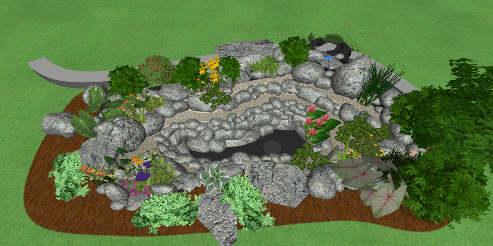  |  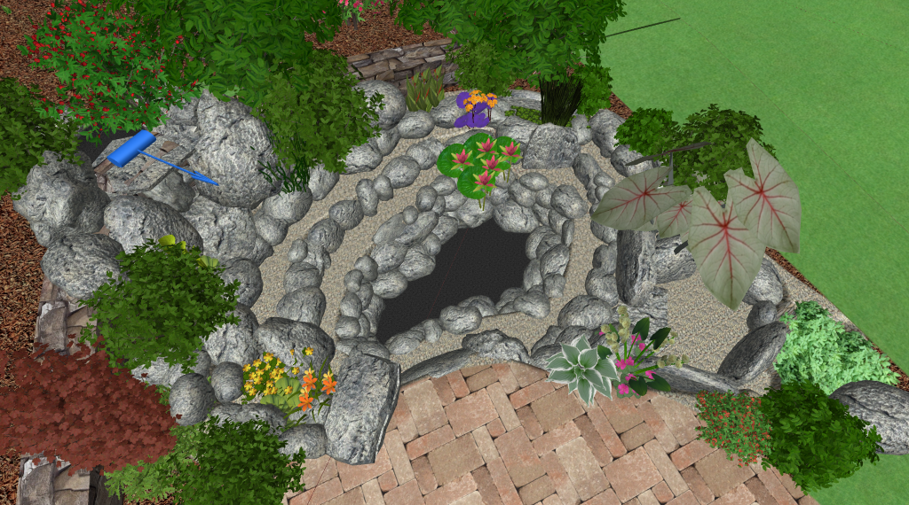

# Contents
{:.no_toc}

1. Will be replaced with the ToC, excluding the "Contents" header
{:toc}

# Current Pond Design

I am considering two options on where to position my pond, one is close to the house and one where it is further down the back-yard. 

Near House  |  Near Back
:---:|:---:
  |  <a href="version_4/topdown.png"> 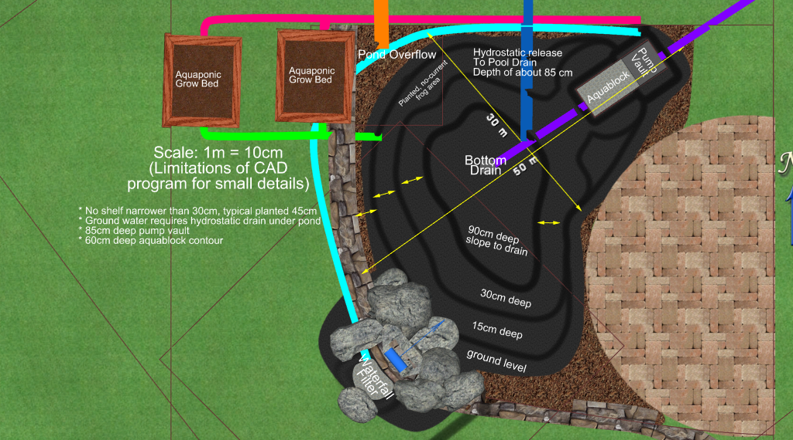 </a>
<a href="version_3/topdown_visual.png"> 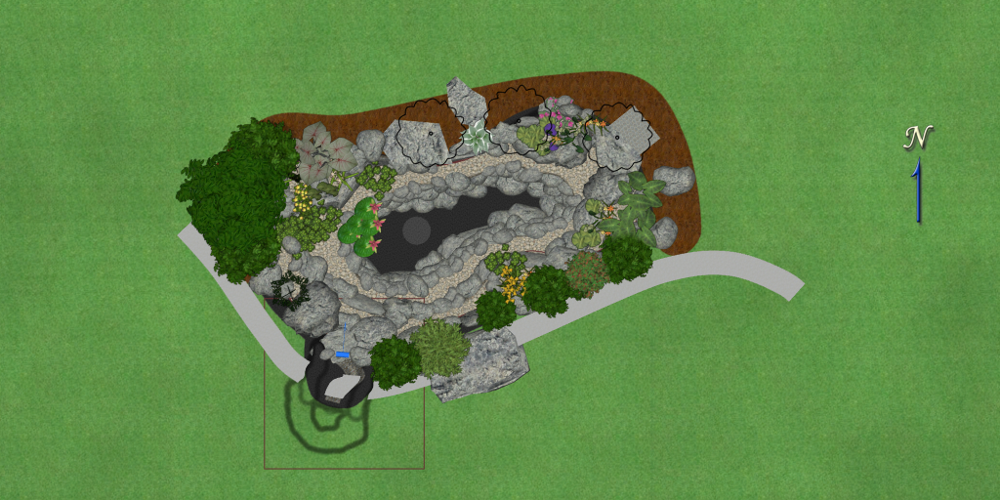 </a>  |  <a href="version_4/topdown_visual.png"> 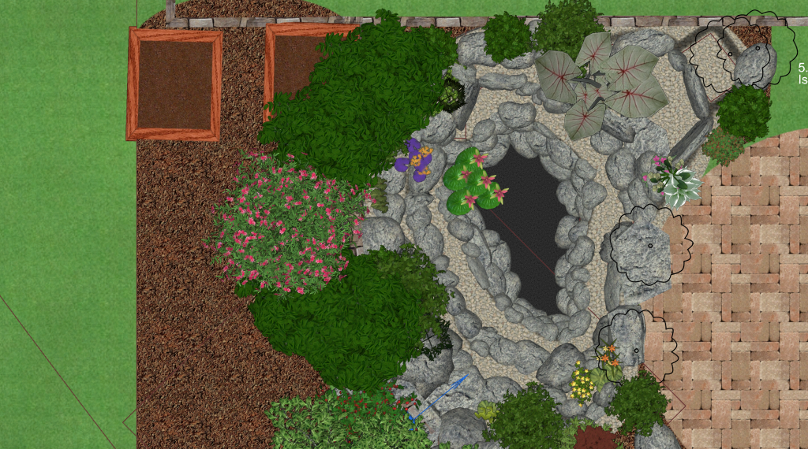 </a>

The key differences in these locations are around shade vs sun exposure, excavation work required for drainage, retaining walls, aesthetics and proximity to inside and outside viewing areas. There is no clear winner in this at the moment and I think we will choose mostly based on cost.

The other thing is that the design near the back of the house being butted right up to the paved seating area, may benefit from a slightly more formal look than I have designed.

# My pond design : Big question to answer early (Pond position)

I have narrowed down to two main design options that have a big impact on the structure of the overall backyard. It is about where to place the retaining wall and pond. This decision needs to be made early, can't be changed later and has a big impact on everything else. 

Near House  |  Near Back
:---:|:---:
  |  

## Pond near the house

* 8.5 m^2 area, 1.7 m ^ 3 (Straight 70cm walls is 4 m ^3) volume, 12 m perimeter (Can probably extend length a bit but not width)
* Has access to full sun (Not sure this is good in my situation. Extra water loss, likely more algae with high fish stocks and I am using an external grow bed so no need for sun loving pond plants for removing nitrates)
+ Positive: Is easily visible from the kitchen
+ Positive: Looks good for possible future larger deck build
+ Positive: Little or no impact by run-off from chickens
+ Positive: Retaining wall very low height around pond better for structural support
+ Positive: No issues with pool fence regulations
+ Positive: Extra retaining for the pond itself should be unnecessary
- Negative: Smaller pond (A little narrower)
- Negative: Difficult to control shading (naturally or artificially)
	* I may be able to use a small over pond bridge to create some shade (and a cool path to thinking rock on other side of pond)
	* I can probably work something out here with planting shrubs on north/west edge
- Negative: Drainage in area has been bad in the past, maybe runoff from neighbors pool
- Negative: More difficult plumbing of the hydrostatic release drain (Needs to pipe further under grass down to pool retaining wall)
- Negative: Less space available for planting trees

## Pond near the back of the property

* 9.3 m^2 area, 2 m ^ 3 (Straight 70cm walls is 5 m ^3) volume, 12 m perimeter
+ Positive: My wife prefers this one
+ Positive: Larger pond
+ Positive: Easy to control shading (naturally or artificially)
+ Positive: More space available for planting trees
+ Positive: Simpler plumbing of the hydrostatic release drain
+ Positive: Simple to plumb future radial flow filter if desired
+ Positive: Maybe able to work some kind of fencing into design if necessary but will still be ugly
+ Positive: Can build decking for place to sit and dangle feet in pond
- Negative: No access to full sun there is forced part shading
- Negative: Not visible from the kitchen
- Negative: Blocks access back of property/glasshouse
- Negative: Looks cramped if we do larger deck extension one day
- Negative: Potentially impacted by run-off water from chickens unless suitable drainage is sufficient
- Negative: Nearer to steep section of retaining wall may have issues with structural support
- Negative: Maybe issues with pool fence regulations
- Negative: May need extra retaining for pond itself as land still sloped there without significant retaining wall above

# Inspiration

These are some stand-out places for information and inspiration for pond design:

**Bama Bass pond**

* The best pond I have seen for aesthetics and diversity
* A great example: <https://youtu.be/ddzmDF7Ds78>
* YouTube Channel: <https://www.YouTube.com/channel/UCSTueQfft5yfjNuRu2DZsHw>

<a href="https://youtu.be/ddzmDF7Ds78">
  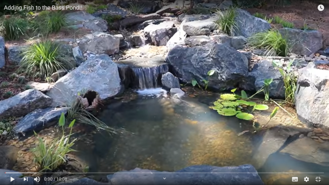
</a>

**Melbourne Aquaponics**

* Great example using an aesthetically pleasing pond for Aquaponics: <https://www.YouTube.com/watch?v=p4Saas9WRws>
* YouTube Channel: <https://www.YouTube.com/channel/UCZ1Otify84TlwZ90OJ18SAQ>

<a href="https://www.YouTube.com/watch?v=p4Saas9WRws">
  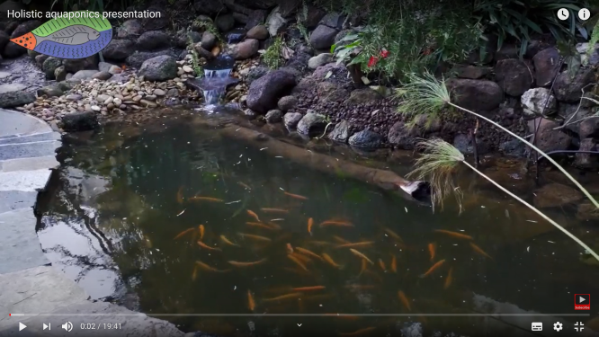
</a>

**The Pond Digger**

* Has LOTS of informative tutorials, how to build ponds, ponds gone wrong etc.
* YouTube Channel: <https://www.YouTube.com/channel/UCgdXrQHVEVUMCinKmrSfFxA>
* Not just a single style of pond but covers multiple different use cases
* How to build a fish pond: <https://www.YouTube.com/playlist?list=PLqM5Qn1K_DPwBIjJEMcKgzg8jPLjUUmG->
* How to build a koi pond: <https://www.YouTube.com/playlist?list=PLqM5Qn1K_DPy8JG3GRi8Sk-_TRYDospCD>

<a href="https://youtu.be/rYRALgjRq7g?t=178">
  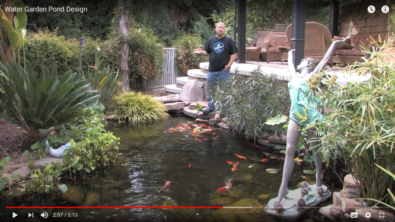
</a>

**Team Aquascape**

* YouTube Channel: <https://www.YouTube.com/channel/UCbOyl13WDs8xYECSKZgoYsw>
* Very strong on the advertisement but they do have some amazing ponds that they showcase
* One amazing example in Australia: <https://youtu.be/Rm-V0n-76UI?t=405>

<a href="https://youtu.be/Rm-V0n-76UI?t=405">
  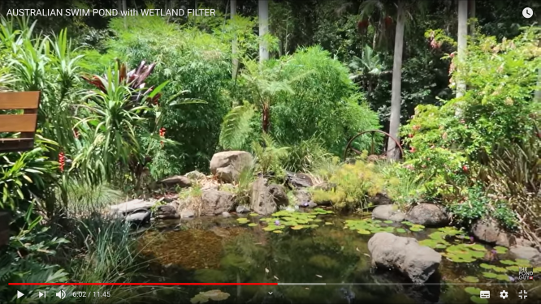
</a>

**Rob Bob's Aquaponics & Backyard Farm**

* Lots of great information on Aquaponics (not using ponds though but IBCs)
* YouTube Channel: <https://www.YouTube.com/user/bnbob01>

<a href="https://youtu.be/1q_MN4kZRlY?t=2">
  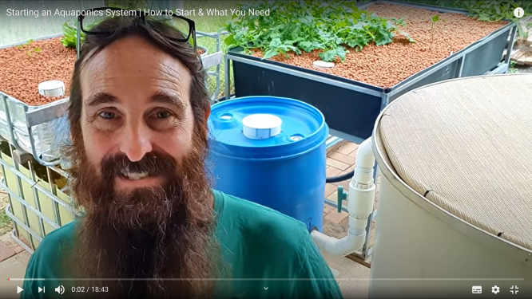
</a>

**The Pond Advisor (Also Mark from Any Ponds)**

* YouTube Channel: <https://www.YouTube.com/c/AnyPondTV/featured>
* A good example: <https://www.YouTube.com/watch?v=8X2mjw3cfzE>
* Does some nice smaller ponds. I saw a few of these early on that inspired me

<a href="https://youtu.be/8X2mjw3cfzE?t=8">
  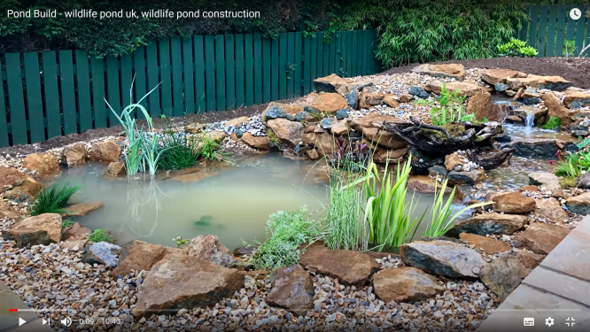
</a>

# Overview of pond styles

There are a few major pond building styles I have seen. Many of the "best practices" between these styles also seem to contradict and it is important to understand what the reasons are for the differences to make good decisions unless your pond fits into one of the existing molds (which mine does not). 

## Koi/Fish Ponds
* Optimized for pond volume and filtration
* Steep tall walls, deep pond, few if any planting shelves, often using concrete (walls or collar) to prevent wall collapse
* No loose rocks on the bottom
* Use a bottom drain and some form of mechanical filtration often a seive and/or settling tank like swirl, radial flow etc
* Use a skimmer for surface filtration almost exclusively
* Often external bio-filtration
* Sometimes extra complex filtration and pumps (Including UV, bead, tumblers etc)

## Ecosystem Ponds

In contrast to koi builds, there appears to be a more recent movement of what I am calling Aquascape ponds (largely fueled by the company making many of the components for these ponds, though not the only group doing so). These ponds seem to have quite a different style on builds:

* Tiered shelf design with planting pockets, usually multiple smaller walls (thus less volume), using natural dirt under liner (not concrete)
* Usually put loose rocks on the bottom and cover liner so not visible
* Rarely a bottom drain or any pumps on the bottom
* A skimmer (Or intake bay which I like the concept of) for surface filtration
* A waterfall of some kind for aeration and up-flow bio-filtration

# Aspects of Pond Design

Here I will list various aspects of pond design that should be considered. Detailing a few common options in each category and listing pros/cons for each option and how it relates to the type of pond being built.

## Mechanical surface waste collection

This is something that removes floating debris like leaves from the surface of the pond.

The most common option by far is installing a skimmer box and is on most pond builds I have seen. The first choice for my pond would be an intake-bay because it reduces risk of killing animals in the pond compared to the skimmer or negative edge filtration and looks very natural like a negative edge. It has some drawbacks though.

Note that I have combined filtration and surface waste collection in here. In a skimmer the skimmer itself is the collector and the leaf basket is the filter, for negative edge and intake bays the rocks are the filter. I mention this as there are some possibilities like a skimmer in which you can install a rotary drum filter to do the cleaning. Assume the RDF is sufficient for removing leaf debris, you can have a filtration with no real maintenance as the RDF is a self cleaning filter that can be attached to a bottom drain or a skimmer and actually physically removes the waste from the water so it can't contaminate the water if left there for a long time.

Options include:

* Skimmer box (most common in all designs)
	+ Positive: Well known and tested
	+ Positive: Usually easy to hide by placing under/near viewing area also makes maintenance more accessible
	+ Positive: Good support for water level maintenance with hidden auto-water level top-up using float valve and overflow / drain
	+ Positive: Due to the design of skimmers if you have a failure in the plumbing you wont pump the pond dry
	+ Positive: Great way to hide pump/plumbing in an accessible way
	+ Positive: When connected to RDF can completely remove debris from the water without manual cleaning
	- Negative: Needs manual maintenance maybe weekly?
	- Negative: Can suck in small animals and kill them (not great for ecosystem ponds with frogs, turtles etc)
	
* Intake bay (Seen only a few of these)
	+ Positive: Look amazing, they look very natural you cant see them at all
	+ Positive: Regular maintenance (maybe weekly) uses a rake to take out debris instead of pulling out baskets (Yearly maybe cleaning out rocks?)
	+ Positive: Due to the design of intake bays if you have a failure in the plumbing you wont pump the pond dry (if intake bay done correctly)
	+ Positive: Great way to hide pump/plumbing in an accessible way
	- Negative: Not seen a lot on these, I like the concept, do they work well I don't see much information on these after installed?
	- Negative: Takes up a significant portion of the pond volume/area (Skimmers are usually installed on the side, so less liner required)
	? Are they as effective as skimmer boxes? I assume the water flow is the same but no flapper so velocity of water more variable
	? Can probably install same water level maintenance in pump vault with hidden auto-water level top-up using float valve and overflow / drain

* Negative edge filter
	* <https://youtu.be/f_4mpaH-LtU>, <https://youtu.be/XrhitnCBRDE>
	+ Positive: Great water quality, nothing remains in pond on surface
	+ Positive: Lowest maintenance
	+ Positive: Improved thermal stability (underground reservoir)
	- Negative: Fish can still jump the edge (reduced in design but still possible), though frogs etc are fine
	- Negative: Requires significant space
	- Negative: More expensive as need further excavation, extra storage in aqua blocks, more detailed design required to prevent running dry or overflow

* Lid over pond (for Aquaponics)
	In aquaponics usually they just cover the pond with a lid to prevent external debris getting in the first place. Not feasible in most ponds.
	
* Manual netting and rely on bottom drain (for people with nothing better to do)

* Using a scoop net (Like anyone has the time for that :-) )

## Biological filtration

The purpose of biological filtration is to convert waste produced by fish (and other decaying matter) from Ammonia, to Nitrites and then from Nitrites into Nitrates (no I didn't just repeat myself). The Ammonia and Nitrites are toxic to fish at very low concentrations, where as Nitrates need a much higher concentration to become toxic. See the section below on [Nitrate removal](#nitrate-removal). For now though we will focus on the Biological filter whose purpose is to convert the toxic Ammonia and Nitrites into the non-toxic Nitrates.

All biological filtration requires a few things:
* Surface area in contact with slowly flowing water
* Oxygenated water

There are other things like pH and temperature that affect this process and the toxicity to fish as well.

The main options I have seen for biological filtration include:
* Up-flow waterfall filter
* Moving bed bio-filters 
* Aquaponic grow-beds/bog-filters (if water is oxygenated before the bog filter, the surface area make a good location for bacteria)
* Separate bio-filter using sponges, balls, etc

As an ideal it is good to have two separate bio filters and overdo it a bit. If the filter needs to be cleaned for example, quite often it will become less effective for a period of time after the cleaning and if you are running close to the limit you may kill any stocked fish.

**Up-flow waterfall filter**

In many smaller modern ecosystem ponds, the biological filtration is typically provided by an up-flow waterfall bio-filter. This is a design I think popularized by the company Aquascape, where the highly oxygenated water is pumped from the surface of the pond usually using a skimmer box, flows slowly upwards through a sponge or other medium with lots of surface area for the bacteria to colonize and flows out back into the pond as a waterfall re-oxygenating the water. 

There are a few important aspects to this:
1) Water entering biological filter is highly oxygenated to start with
2) Water flows upwards slowly pass the filter medium (gravity fed is probably too fast, thus the up-flow)
3) Water is re-oxygenated before entering the pond (biological filters consume oxygen in water to achieve the nitrification process)

The waterfall filter option commonly used in ecosystem ponds works quite well on many ponds. My only gripe with it is that the water at the bottom of the pond is rarely oxygenated or filtered, also you need to rely on the fact that the majority of the waste can be captured by the surface skimmer. Over time this may result in sludge buildup in the bottom of the pond requiring occasional pond drain and cleanout. 

**Moving bed bio-filters**

This is usually a variation of the waterfall filter (not always you can buy them as standalone not for waterfalls as well) except instead of using a sponge or heavy plastic balls for the biological medium, it uses buoyant plastic wheels and often their is an aerator added to the bottom of the container oxygenating the water and keeping the balls agitated. The plastic wheels used in this are key and have been designed such that the colonizing bacteria will not be dislodged from the inside of the wheel as the media floats about running into each other. 

The advantage of these filters is that they rarely need to be cleaned out unlike when using sponges and heavy plastic bio-balls. They can also be used with water not from the surface of the pond as there is often an aerator added to the container causing oxygenation. 

**Aquaponic grow-beds**

There are multiple different types of aquaponic grow-beds. The most common one I have seen is a flood-drain system using expanded clay balls. In most of these designs, the water enters from the surface and falls down through the clay-balls slowly filling up the grow bed tub. Once the water gets to a certain level it is drained quickly back into a sump tank. This flood/drain cycle is often managed by something called a bell siphon. You can see a lot more about this on my [aquaponics](aquaponics/README.md) page.

In these systems often oxygenation happens on entry to the grow bed, and also on drain when flushing to the sump tank. Additionally the expanded clay balls have a large surface area for the bacteria to colonize.

I have heard from <a href="https://youtu.be/1q_MN4kZRlY?t=214">external sources</a> that these types of flood/drain expanded clay grow beds can support 500 grams of fish per 25L of grow-bed volume. This is apparently a safe ratio and can possibly be pushed. 

Bog filters also provide a level of bio-filtration, very similar to flood/drain grow-beds in aquaponics. The key difference is that they are often continuous up-flow systems and will need some amount of oxygenation before reaching the bog filter.

## Nitrate removal

The purpose of the biological filter is to convert ammonia and nitrites produced as waste from the fish (in poo a little but mostly from their gills apparently) which are toxic to fish at low concentrations into nitrates which require high levels to become toxic to fish. However there is still a level of nitrates that are toxic to fish and the biological filters don't help with this so it must be removed some other way.

There are really two ways of removing the nitrates from the water I know of:

1. Water changes 
2. Using plants

The idea of a water change is that you regularly remove say 50% of the water in the pond and replace with new water (not directly from the tap as usually has chlorine, and typically you want to avoid the new water having significant differences from the pond water for temperature etc as that can cause shock to the fish). The idea here is the old pond water with a higher concentration of nitrates is removed and replaced with new water with no nitrates thus reducing the overall concentration of nitrates in the water. 

The other option is to use plants which use the nitrates as they grow (Many common fertilizers are made from from nitrate salts) thus removing them from the pond water. In most pond installs there are a few options on how this is typically done:
* Ecosystem ponds often have aquatic plants growing in the ponds
* Some ponds have external bog filters
* Aquaponics use glorified bog filters called grow beds (often with slightly different designs than typical bog filters though)
* And some ponds go bright green to the annoyance of the owners as the algae basically grows using the nitrates instead of nicer useful plants :-) 

The idea here is that as plants grow with the water flowing over their root systems, they consume the nitrates from the water. What this also often requires is some form of plant removal or harvesting over time. Bog filters and planted ponds occasionally need to have the plants pruned or thinned and be cleaned out, and muck cleaned out of the bog filters. In aquaponics the idea is that these nitrates act as a fertilizer to grow useful plants like leafy greens for spinach, but all sorts of plants can be grown in aquaponics. Aquaponics is hydroponics but providing the nutrients for the plants from the waste of the fish instead of manually adding to the water as is done in typical hydroponics. You harvest the plants and eat them and the fish are providing the majority of the nutrients the plants require to grow creating a mostly closed ecosystem where you can grow both fish and plants.

One point to note about normal ecosystem pond plantings vs using a bog-filter is that I believe bog filters are more effective at nitrate removal simply because of the way the water flows past the root systems. In typically full sun planted ecosystem ponds, the planting seems to be sufficient for typical ponds with a low fish stocking ratio, but for more highly stocked fish ponds I believe it is important to incorporate a bog filter or aquaponic grow bed to improve the effectiveness of the nitrate removal, but also add some extra biological filtration to the pond.

One key thing that I see a lot is that for the plants to grow properly and thus consume more nitrates, they need a good amount of sunlight. As a result many planted ecosystem ponds are recommended to be installed in full sun locations so that the aquatic plants have sufficient sunlight to grow. This is especially true for many flowering plants like water lilies. There are some shade loving aquatic plants which is a good option for planted ponds in the shade, but my understanding is they typically consume less of the nitrates than those that grow in full sun.

This is where bog filters and aquaponic grow beds become useful. The idea here is that the pond can be installed in a shaded location, but the plants used to take the nitrates out of the pond can be placed elsewhere in full sun and the pond water passes directly over their root systems (more so than a normally planted ecosystem pond) so they can extract the nitrates more easily fom the water and also have access to full sun to permit them to grow faster.

This is the preferable option IMO, as a shaded pond has smaller temperature fluctuations, the algae has less access to sunlight in the pond to grow but the nitrates are removed by the plants in the bog-filter/aquaponics-grow-bed outcompeting any algae. Additionally depending on the fish you stock, some fish like Koi apparently prefer not being in full sun is what I have read. I also think you will lower the overall evaporation in the pond by installing in shade, though I am not yet certain the impact of this compared to say water temperature and wind etc.

Bog filters/grow-beds can be constructed in many different ways, but so far most people seem to suggest that up-flow bog filters (where the water enters at the bottom under the rocks and slowly rises through the rocks to to the top) is preferable to down-flow (where water enters at the top of the rocks and is drained from the bottom). Most bog-filters I have seen constructed, are given a more precise name in aquaponics as an up-flow continuous flow grow bed. 

There is a LOT more to discuss about this including reducing accumulation of fish waste in the grow bed medium, avoiding anoxic zones in the grow beds, grow beds as biological filters, flood-drain vs continuous flow, pond to grow bed ratios, grow bed materials to use etc. I have a page on [aquaponics](../aquaponics/README.md) where I discuss many more of these things in detail and you can get a better idea of how bog filters or grow beds can be constructed.

In short, the idea I wish to follow for nitrate removal in my pond is to create two up-flow flood and drain grow beds using expanded clay balls in raised beds. I believe this will give me multiple benefits over other forms of nitrate removal including:
* Effective nitrate removal (arguably more efficient than normal pond planting)
* More flexible positioning of pond and grow beds (can be sun or shade for pond, grow beds don't need to be fixed locations for full sun)
* Additional bio-filtration using clay balls with lots of surface area
* Reduction of fish waste accumulating in the grow beds (Using up-flow flood drain I believe we will greatly reduce this, however solids will drain back to pond and hopefully arrive back in settling tank later)
* Production of edible fast growing food (will probably grow mostly leafy greens in these)
* Construction can wait until later (but before I start stocking fish), no need to pre-dig the location for a bog filter

The main disadvantage of this system over other continuous up-flow systems is that the pond water level will fluctuate significantly depending on the volume of the two grow beds and it may cost a bit more time and money for the construction. I have some ideas however on how to improve the water level fluctuation by adding a hidden satellite sump under each grow-bed.

## Mechanical bottom waste collection

The purpose of this is to collect debris that was missed by the surface filtration and sunk to the bottom of the pond (often decomposes into sludge) and also to try and collect fish waste. Also flow of water through bottom filtration may prevent anaerobic (smelly) bacteria colonizing the bottom of the pond by providing slightly more oxygenated water on the bottom which is usually is oxygen depleted.

The most common option considered here is a bottom drain, and is often installed in Koi ponds. Another solution to this I have seen a little bit of is the under-gravel suction grid. However because it makes the rocks act as a mechanical filter arguably it clogs the rocks on the bottom with all the debris and makes cleaning very difficult.

I have seen very polarized views on the under-gravel suction grids. It will cause debris to be caught in the gravel no matter what if it is filtering effectively as that is what a filter does, however a theory I have seen is that much of that debris is broken down by bacteria living in the rocks over the large surface area of the pond bottom and if well balanced will keep it unblocked/clean except for the larger sticks etc. The bottom of the pond is usually a haven for anaerobic bacteria, but with a suction grid the flow of water provides slightly more oxygenated water supply to the bacteria on the bottom of the pond, permitting aerobic bacteria to colonize more effectively which is good for the health of the pond.

Often any filters attached to bottom drains or suction grids need the ability to settle/filter fine solids (fish waste) from the water. See more on this under the topic of [Solids filtration](#solids-filtration) as there are a lot of things to consider here as well.

Options include:

* Bottom drain

	This is the most common solution I have noticed for a koi/fish pond. A bottom drain is almost never seen in ecosystem ponds as they usually have rocked in bottoms that prevent the waste travelling to the drain and also rocks can block the drain. 

	+ Positive: Very effective for fish waste and small debris that is not caught by a surface skimmer
	+ Positive: If working properly greatly reduces larger yearly maintenance (No need for yearly drain/wash)
	- Negative: More difficult to install, must be done from the beginning as it is hard to add afterwards (you can install on top of liner ones but they are less effective apparently)
	- Negative: Requires bare liner on bottom of pond for waste to flow to drain (I.e. not able to rocked in the bottom of the pond)
	- Negative: Ideally requires sloped contour on the bottom of the pond to permit waste to flow to drain
	- Negative: Ideally (not required) wants aeration on top of the drain (to create an eddy/current-flow of water that hopefully pushes waste down the walls and along the floor back to the drain)
	- Negative: Often requires extra external filtration (Most common is a solids settling filter like swirl, radial flow, sieve etc)
	* Some people worry about them leaking or rising, but if installed correctly shouldn't be an issue

* Under-gravel suction grid

	Must be done "correctly". Apparently many are not constructed well. You must use larger smooth gravel to prevent muck accumulating/getting caught in the smaller gravel. It must be easy for the muck to flow past the gravel into the grid pipes. I assume as well the water flow must be sufficient to permit these to work effectively.

	+ Positive: Looks great as you don't see it and can have a rocked bottom still. Sometimes installed in ecosystem ponds, rarely in koi ponds
	+ Positive: Can be installed more simply as can be constructed entirely on top of the liner
	- Negative: Likely to need a second pump
	? Effectiveness compared to bottom drains is greatly debated
	? Some people say reduces yearly maintenance but the drain/washing still needs to happen just less frequently (maybe 5 years)

* Yearly manual drain and clean 

	This seems to be a very common solution for ecosystem ponds that I have seen on YouTube. This looks like a LOT of work and is stressful on the fish. In most ecosystem ponds there is no bottom drain or suction grid. Instead muck just accumulates under the rocks. Without fish or a very light load stocked in the pond, this is not a huge issue. However it is clear that a LOT of muck can accumulate under the rocks if the bottom of the pond is rocked in and is often much worse with fish stocked in the pond. 

	Also to be clear the issue is not just cleanliness but if you have fish in the pond this can be quite dangerous for them. If the muck remains undisturbed on the bottom it is often ok, however as soon as say larger winds, or a big flush of rain or you working on the pond disturbs the muck on the bottom it can case the water to become toxic for the fish. 

I really want the best of both worlds (bottom drain for reduced maintenance, and rocked pond bottom for aesthetics and liner protection) and not sure what is feasible. My plan is to install a bottom drain on the pond at construction including a sloped floor on the bottom contour as it is difficult to do so later. However I still plan to install normal planting shelves, and rock those in like in an ecosystem pond, fully aware that the shelves may accumulate muck and prevent it flowing into the bottom drain.

I have a few ideas I would like to try:
* Rocked shelves, and pond walls but bottom contour bare liner to bottom drain
* Add under-gravel pumping or cycle grid (not suction, or maybe cycle suction/pumping regularly) in the shelves (and around edge of bottom contour), the goal is to agitate debris from the shelves and behind the rock walls so it doesn't settle and will be eventually pushed to the bottom drain. Not sure if this will work/help.
* Create a 3D printed adapter to plug a suction/pumping grid into the drain hole and convert a drain to a grid

One much more expensive option I have seen is cementing in the rocks on the bottom like with pebble crete pools. This fills in the gaps under the rocks preventing accumulation of material underneath them but still looks good. 

## Solids filtration

Usually only considered for koi/fish ponds and is closely tied to the [Mechanical bottom waste collection](#mechanical-bottom-waste-collection). The bottom waste collection usually feeds into a solids filter of some kind (usually by gravity feed before the pump to prevent further breakup of the already fine solid waste).

Categories of solids filters include (Information from <a href="https://euaquaponicshub.files.wordpress.com/2016/03/challenges-and-opportunities-in-aquaponics.pdf">Challenges and opportunities in Aquaponics</a>):
* Gravity based (Radial flow, swirl, sediment), successful >100um (density of fish waste only slightly higher than water)
* Screening (drum, sieve, screens, belt), variable
* Media (sand, floating bead), successful >20um
* Flotation (Foam fractionation, protein skimmers), successful <30um

*Gravity based filters* are very simple and cheap to construct, however their effectiveness is not as good as other filters from everything I have read. I see a lot of these on home built aquaponic systems in the form of radial flow and swirl filters. Many home hydroponic installs use a gravity based radial flow or swirl filter and then the grow bed takes care of the rest. The idea is that the remaining particles that get trapped can be mineralized inside the grow bed, but apparently it often results in clogging and anaerobic areas preventing the mineralization in the grow beds and thus grow beds need to be cleaned out occasionally.

*Screening filters* are common on Koi ponds and professional aquaponic installations, and probably the best of these is the drum filter. It is fairly robust and automatically cleaning. Additionally unlike gravity and media based filters, most screen filter designs remove the solid waste from the water which is a real bonus and means cleaning can be done much less regularly. Actually skimmer boxes are a form of screening filter with very coarse mesh to block debris. 

*Media filters* are the most common on pool systems. The typical sand filter is used there. These are quite effective for smaller particles as the media gets clogged slowly the gaps get finer and finer eventually causing clogging and thus needing a backwash, but before then it results in finer particles being filtered out. One of the better designs I have seen for media filters is the floating bead filter. However there are disadvantages compared to drum filters in that the solids remain in contact with the water until backwashing time. Also from what I can tell it uses a little more water for backwashing than the drum filters and is rarely automated.

*Foam fractionation filters* are not common on ponds I have seen. I believe the very fine particles and dissolved organic compounds (DOC) that this removes are rarely an issue and break down of their own accord over time but if you have issues with foam forming on the surface of the pond, these filters can help improve that. There are a few koi sites indicating that these filters are useful for water quality, though I get the impression they are optional.

These are just random notes I am keeping for later review:
* Paper comparing effectiveness of radial flow and swirl filters: <https://core.ac.uk/download/pdf/82493576.pdf>
* Don't place these filters after the water pump, instead have them gravity fed pre-pump from the bottom drain, to reduce churning up fish waste even smaller
* Lots of random posts on radial flow filter examples (and others): <https://aquaponictrend.blogspot.com/2018/07/aquaponics-radial-flow-filter.html>
* Interesting small drum filter: <http://www.dracodrum.com/solum-range.html>
* Nice demo of floating bead filter: <https://youtu.be/hhu1bcKmzrM> , <https://www.1h2o3.com/en/aquatic-ecosystems/aquaculture-supplies/ras-aquaculture-bead-filters/small-and-compact-bead-filters-for-aquaponics/>
* Really interesting read on Aquaponics Solids Filtration, they also have many other FAQ papers that are well written: <https://www.aquaponic.com.au/Solids%20filtration.pdf>

### Solids mineralization

The solids extracted by filtration can also broken down into more simple nutrients that are then available for plants to utilize instead of discarding them. This process is called mineralization and takes longer than nitrification. In many fish ponds the idea is to simply remove the solids using filtration and discard them onto the garden. In Aquaponics, these solids contain a lot of valuable nutrients like phosphorus that ideally we would like to keep in the system for plant uptake and growth. 

Two common approaches described in the article on <a href="https://www.aquaponic.com.au/Solids%20filtration.pdf">Solids filtration, Treatment and Re-Use</a> are that solids can be mineralized:
* In situ : Inside the grow beds, which is in reality what happens in many backyard aquaponic systems (though ineffectively)
* As a separate process : Solids filtered and mineralized using a aerator externally to be re-introduced to the pond later

It proposes that removing solids from the water and mineralizing them separately is preferable as it gives more control over the parameters to prevent issues in water quality and often the in grow-bed mineralization is ineffective and can cause anaerobic areas to form in the grow bed. 

The basic process for solids mineralization is as simple as using an aerator on the concentrated solids until they are all broken down by aerobic bacteria. There are other more complex methods used in sewerage treatment plants, but this seems to be the most common solution.

## UV Steralization filter

TODO Discuss UV sterilization (not really filtration)
Really good info on pond filters: <https://www.koiphen.com/forums/showthread.php?93019-Filtration-Basics>

## Oxygenation

TODO: 
* Different parts of pond to consider, bottom/surface, bottom oxygenation less common
* Must be before bio-filters (often waterfall biofilter fed from surface skimmer with high oxygen water, not useful from bottom drain)
* Surface agitation
* Temperature
* Night time and plants/algae suck oxygen out in dark must run pumps at night
* Aerator purpose (bottom drain creates current flow desirable for drain as well as surface disturbance and is cheap to run, good for failover in power outsage as can run on battery easily)

## Current flow

TODO: Discuss flow required, bottom/depth and lack of flow, pond shape and filter locations, plants and frogs, koi in still ponds vs moving etc

## Redundancy

TODO
Including skimmers/intake bays vs pump on bottom vs aquaponics style much safer gravity fed etc if plumbing failure wont empty out pond
Including aerators and battery backups for power outage
Power reduction and solar (small pump 24/7 larger filtration pump during day)

## Pond shape

My choice: Natural almost kidney bean shape

This decision is more about aesthetics, but some thought needs to be put into current flow and ensuring no stagnant areas of the pond

Options:

* Circle
	+ Positive: Easiest to understand current flow, helping to keep it clean and reduce maintenance
	* Good for formal look

* Sharp corners (like a square or rectangle)
	- Negative: Difficult to ensure current flow in corners and thus keeping them clean
	* Good for formal look, often easier to fit with existing hardscape

* Natural other shape (Kidney bean common)
	+ Positive: No sharp corners to prevent water flow
	- Negative: Still more difficult to understand water flow than circle
	* Great for more natural looking ponds

## Pond location/positioning

The general positioning of the pond is the most important early decision that needs to be made. Bad selection in this can not be fixed simply and may impact you appreciation of the pond, the maintenance required and the health of the pond.

Some key issues to consider in identifying the best position for a pond include:

**Sun vs shade**

Ecosystem ponds all tend to want full sun for plant growth. Without enough sunlight you will be limited on the selection of aquatic plants available to you to [shade tolerant aquatic plants](https://www.woodvalefishandlilyfarm.com.au/products/plants/water-plants/shade-tolerant-water-plants/), as sun loving plants will not grow as well and the [nitrate removal](#nitrate-removal) may be less effective. 

Many Koi ponds and ponds used in Aquaponics tend to want to limit sun exposure on the pond itself to limit algae growth and prevent fish getting sunburn :-) Often in these cases a bog filter or aquaponics grow bed is placed separate from the pond in full sunlight to permit effective [nitrate removal](#nitrate-removal)

The other thing to consider with this, is a shaded pond is likely to have smaller fluctuation in water temperatures resulting in a healthier ecosystem. In my consideration for the pond position, I am thinking of locating a position where most maybe 3/4 of the pond is shaded and the other 1/4 is in the sun. I will try and locate planting pockets in the sunny section, I also plan to have an external aquaponic grow-bed that will be used for nitrate removal that is positioned in full sun.

With the water restrictions more common and the heat we get in summer here, I also believe a pond that is shaded in summer will be beneficial where I live. 

One common option for shade, is to place a shade-sail across the pond. This is effective especially when a pond is near an existing hardscape as it can look like it is just part of the existing hardscape and will not drop lots of leaves into the pond.

**Visibility from living area**

Ideally the waterfall of the pond will be visible from common living areas as this will permit appreciation of the pond during winter when we are spending less time outside. If there is a natrual slope to the property, ideally you want to place the pond below the house so the whole surface of it is visible from the living areas. For me I an stuck with an incline from the house and so the only aspects really visible will be plants and the waterfall.

Position yourself from primary viewing areas and consider what the view will look like.

Also consider the approachability of the pond. Is it easy to get to the edge of the pond to feed the fish? Does the approach look natural and inviting.

**Water run-off**

When placing the pond at a low point in the property, often when it rains heavily you will get a lot of run-off water from the surrounding landscape drain into the pond. This can flush lots of nutrients into the pond causing algae blooms but also flush toxic chemicals (like herbicides, pesticides from the lawn/garden) and other debris into the pond. 

Ideally this means the normal place you would usually consider is less than idea for the positioning of the pond.

The best solution to this is adding large enough berms around the pond to divert any run-off around the pond. No matter what you do though, there is some chance you will get run-off in really heavy rains.

**Hydrostatic pressure**

Similar to run-off, when placing a pond under a retaining wall or at a low point in the yard, you can get pressure under the liner which is strong enough to lift the boulders on top of it and for a bubble that rises the liner to the surface. 

People talk about a high water table. This is caused by the pressure of water in the ground above the pond trying to drain through the path of least resistance. When placing a pond in a high spot, often there is little earth above the pond that can exert this kind of pressure. 

I have seen for example after lots of rain (after the rain has stopped it is easiest to see this), my back yard is sometimes water logged and not from the surface. I see for example holes in the nearby bitumen on the road leaking water in the middle of the road coming up from under the ground. This shows that there is ground-water that has pressure exerted from a place higher than the location of the road forcing the water to escape here. 

The easiest solution to this problem is to create a path of least resistance for the water to drain from underneath your pond liner by installing a French drain under the pond liner draining to a location further down-slope that exits lower than the pond. The outlet must be lower than the pond for this to be effective. 

**Soil loading and retaining walls**

Another thing to consider is that if placing a pond directly below a retaining wall, there is the chance that you will compromise the footing of the retaining wall and extra pressure exerted by the soil above the retaining wall may increase the chances of pond wall collapse. 

This will depend a lot on the soil characteristics, proximity of the pond to the wall and depth gradient of the pond itself. 

**Avoid toxic or deciduous trees**

Nearby deciduous trees and other things that may drop a lot of debris into the pond will cause issues for water quality or increased maintenance. In my case with limited space, and wanting to shade the pond I do plan to place it near deciduous trees and have other measures like netting in Autumn to help reduce the maintenance required. 

The other thing to be very careful about is that there are many plants that are toxic to fish. You will find various lists online including:
* <https://pondinformer.com/plants-toxic-to-pond-fish/>
* <https://www.funkykoi.com/list-of-plants-toxic-to-pond-fish/>
* <https://www.gardengatemagazine.com/articles/flowers-plants/plant-guide/poisonous_plants/>
* <https://www.hyanniscountrygarden.com/wp-content/uploads/2018/10/plants-harmful-for-pond-fish.pdf>

**Local regulations**

This will differ by area, for example where I live I am permitted a pond (not a swimming pool) without a safety fence. There are however other restrictions for example with retaining walls not being permitted within a certain proximity of the boundary fence of the property, the same reasons for this are likely to apply to ponds excavation. 

Also you may need to address the impact the pond will have on the flow of water through the property to ensure that it doesn't negatively affect the drainage of adjoining properties etc.

## Pond bottom contour and shelves

For an ecosystem pond we usually want to create a tiered set of shelves usually of different heights, based on planting zones. This is different for a koi or fish pond where often we want fairly steep walls and fewer shelves.

**Tiered shelves**

+ Positive: Good for aquatic plants that require shallow water (alternative is floating baskets in deep ponds)
+ Positive: Safer/easier to exit if an animal or child falls into the pond
+ Positive: Less chance of wall collapse, usually cheaper to construct direct onto bare earth
+ Positive: Shallow planted shelves required for beneficial insects and frogs
- Negative: Shelves reduce volume of water and all the implications that comes with in water quality etc
- Negative: Shelves give areas for predators like Herons to attack your fish
- Negative: Rocked in shelves often trap fish waste causing water quality issues and do not work as well with a bottom drain installed

**Steep walls**

- Positive: Steep walls increase volume of water and all the implications that comes with in water quality etc
- Positive: Steep walls prevent predators like Herons from attacking your fish
- Positive: Steep walls are often smooth and permit flow of fish waste to a bottom drain
+ Negative: Aquatic plants typically need to be installed in floating baskets
+ Negative: More risk for animals and children drowning, you may consider fencing in the pond to keep children safe
+ Negative: To prevent wall collapse it is common to install concrete collars or line the pond with concrete, or place retaining walls under the liner

For these reasons, Koi ponds often don't have shelves and are steep walled but ecosystem ponds usually do. For my pond I plan to try using shelves. I would like to keep fish though as well and have some plans to improve the downsides of using shelves in my pond. 

When using shelves in a pond there are a few guidelines as to what height/size they should be (that vary depending on who you ask). Following is a list of things to consider (and more detail about specific depths that seem to vary between depending on who you ask):

* Shelve widths smaller than 30cm are difficult to seat rocks on, may collapse (depending on depth) and do not provide much space for planting
* Shelves near waterfall need larger width to support the weight and size of large character boulders (45cm+ width)
* Shelf widths should vary for a natural look, consistent widths look more formal
* Often wider shelves at far end of pond for lots of planting and fewer/narrower shelves near approach to pond to get out of the way of seeing fish
* Avoid sheer steep shelves to prevent wall collapse : <https://www.gardenpondforum.com/threads/do-pond-walls-need-reinforcing.20670/>
  * "An angle of 15 - 20 degrees from the vertical will offer satisfactory protection from any structural collapse", "providing pond depth does not exceed 4 feet"
* Avoid shelf depth changes larger than 30cm (12 ") to make rock selection easier: <https://cepontzsons.com/pond-ledges/>
  * Usually a larger rock sits at the back of a shelf and rises above the level of the shelf above
  * This creates lips on the shelves to hold back pebbles and prevent them falling further into the pond
* Shelf depths should vary, a pond usually has shelves defining a few different planting "zones"
  * Good guidelines: <https://www.watersidenursery.co.uk/tips-advice/planting-the-pond-shelves-shelf-0-shelf-1-shelf-2/>
    * Shelf 0 : 13-15cm (5-6")
    * Shelf 1 : 15-22cm (6-9")
    * Shelf 2 : 23-44cm (10-17") OPTIONAL
    * Shelf 3 : 75cm+ (45" +)
  * <http://www.ozwatergardens.com.au/zone-map>
    * ZONE 1 : Pond floaters and drifters such as Duckweed.
    * ZONE 2 : For pond edges or bog areas. eg. Tassel Rushes, Pennyworts, Sweet Flags, Irises and plants that like wet feet.
    * ZONE 3 : 0-20cm plant depth. Suitable for marginal or bog plants like Water Irises, Milfoils and some grasses.
    * ZONE 4 : 20-40cm plant depth. Ideal for smaller water plants such as Miniature Waterlilies, Water Poppies, Water Fringes and large marginal plants such as Rushes, Reeds and Sedges.
    * ZONE 5 : 40cm or more in depth. Recommended for Waterlilies, Lotuses and underwater plants.
  * Pond digger example: <https://youtu.be/1Ak2wa28nE4?list=PLqM5Qn1K_DPwBIjJEMcKgzg8jPLjUUmG->
    * Also same as pond digger : <https://www.everything-ponds.com/water-garden-shelves-and-plants.html>
    * First Shelf : 20cm (8")
    * Second shelf: 50cm (20")
    * Bottom: 76cm (30")

Given all the above variations, I decided that I would like to do the following:
* Shelf 0 : 15 cm
* Shelf 1 : 30 cm
* Bottom  : 85? cm (As deep as feasible ideally, gives a 55cm wall which is large)
* Around entire edge of pond is mostly 15cm but occasionally 30cm, meaning I can place rocks on shelf next to pond and not require stacking at the edge requiring a few 30 cm+ rocks but mostly 15cm with some smaller for variation
* Minimal shelf width of 30cm, with 15-20cm rocks (even round) gives 10-15cm planting space
* Shelf under waterfall >= 45cm
* 2x planting pockets >= 45cm
* Drop to 30cm at approach points (not full bottom depth)
* The 30cm shelf max depth around perimeter of pond was chosen to be in the spirit of the local safety regulations for pools. Pools less than 30cm deep do not require safety fences (this rule doesn't apply to ponds), but my assumption here is that a 30cm depth if a child does fall in is better than say a 45cm shelf. So I intend to have a 15cm shelf the majority of the perimeter and a 30cm shelf where we will be feeding the fish.

## Safety

It is important that the design considers safety of children and also animals (You dont want an animal getting stuck and drowned in your pond).  A typical ecosystem pond is usually designed with various levels of shallow shelves giving a gradual change to depth than say a typical Koi pond. 

Additionally lining the bottom with rocks also makes it easier to purchase and get back out of the pond if an accident does happen than a bare exposed slippery liner. 

Nothing is child proof, but this needs to be considered. 

There are things you can do with pond positioning, edge treatment and planting choices to help make it a little safer. Having the main approaches to the pond be shallow with a rocked in bottom is probably a key item to consider here along with planting higher barriers in areas it would be less safe to approach from.

## Underlay and Concrete

Prevent rodents burying in liner use concrete" <https://www.houzz.com.au/magazine/build-a-backyard-fish-pond-without-going-belly-up-stsetivw-vs~91523708>
Expert tip: If you do go with a rubber liner, Leidner recommends buying a few bags of concrete, poking holes in them and using the bags to line the hole. Then spray the bags with water and put the rubber liner on top. The bag will dissolve and the concrete will harden, creating a barrier that rodents can’t get through.

## Hydrostatic pressure

## Overflow

## Top-up

## Rocks on bottom or not

Most ecosystem ponds have rocks on the bottom they look great and it is beneficial for smaller fish, insects and other aquatic animals like frogs. Most koi ponds have bare liner all the way and are deep from the start as the koi produce huge amounts of waste and this prevents the yearly maintenance of emptying the pond by maintaining cleaner water all the time. 

Using the pond for aquaponics we would probably be more like a koi pond, however I want to try and achieve the best of both worlds. 

The rocks and planting pockets make the ecosystem pond more suitable for other aquatic creatures, insects and small fish, and also serve as a way for trapped animals to escape if necessary. I am actually considering rocked bottom and planting pockets in the shallows and bare exposed liner and aerated bottom drain for the deeper shelves. 

My idea of using the pond for aquaponics means it is much more like a koi pond and the regular evacuation of fish waste is important. This will permit me the ability to not have to drain the pond every year I think to clean out the sludge forming under the rocks. We will see though. if all else fails I will then just do big rocks (not small) in the shallows with planted pots. But I think this isnt as good for other creatures.

I have also considered adding under-gravel suction grid for the shallows to help. The goal would be every day to reverse this to ensure no detritus is lodged in-between the rocks and flush it out. Not sure if this will work. I know if you don't do it regularly you should never do it as it will cause real issues dislodging the waste but doing it each day might be helpful and cause it to flush to the bottom drain.

However I also want it to be suitable for frogs, for small fish, insects and other aquatic creatures. To achieve this I need planting and gradual slopes near the edges with protected coves. For frogs my understanding is they want basically still shallow warm water with planted cover. So I may have a section like that which is effectively separated off from the rest of the pond with no real current flow to it. More detail later.

My thinking is the larger fish will not spend much time in the shallows and it will accumulate very little waste as a result. 

* <https://www.koiphen.com/forums/showthread.php?70879-Why-Most-Koiphen-Members-Discourage-Rocks-In-Ponds!>

## Rock choice
Rock types, toxicity and suitability
Angular vs smooth
Size and selection (what to put where as well)

## Planting
Planting pockets, types of plans and shelf depth etc

## Fish selection

## Maintenance

TODO: Write this section

I am expecting the following maintenance tasks:
* Daily: Feeding fish (Long term will consider an automatic feeder)
* Weekly: Cleaning out skimmer or intake bay (Long term will consider skimming into a drum filter with auto cleaning hopefully changing this to monthly)
* Weekly: Cleaning out the waterfall and solids filter (Long term will consider drum filter and aquaponic grow-bed for bio-filtration and avoid clogging the bio sponge in waterfall)
* Weekly: Water top-ups (Long term considering auto top-up)
* Weekly: Water test (Long term will consider auto-test, maybe make chromatic with peristaltic pump like we see on some pools but using pond reagents)
* Yearly: Pruning and cleaning out aquatic plants
* Bi-Yearly: Drain and clean pond (Will like to try and avoid this one through design, will see how ideas work out)

## Pump location

Discuss head, efficiency and piping etc

* Pump in skimmer box
	This is the Aquascape way. They typically have a skimmer and nothing ese.

* Pump bottom of pond
	This seems uncommon these days as is pumping the water with low oxygen content. 

* Underwater pumps vs External pumps
	Efficiency?

* External pumps
	Efficiency?
	Maintenance?

## Council regulations

These regulations will be different for each local council area, so make sure to check the regulations that apply in your area. Where I live in Wollongong, Australia the rules that cover the construction of a pond are defined by:

"Exempt and Complying Development Codes": <https://www.legislation.nsw.gov.au/#/view/EPI/2008/572/part2/div1/subDiv40>

> (1)  The standards specified for that development are that the development must—
>      (a)  not have a water depth of more than 300mm, and
>      (a1)  not have a surface area of more than 10m2, and
>      (b)  if it is constructed or installed in a heritage conservation area or a draft heritage conservation area—be located in the rear yard.
> (2)  Despite sub clause 1(a), a pond sump may be placed in a water feature or pond below a water depth of 300mm if the sump is covered with a bolted or anchored grate that is capable of supporting a weight of 150kg.

What this means that if the pond is less than 300mm deep (and less than 10 m^2 surface area), then the pond fits into the "Exempt and Complying Development Code" and does not require a development application to be built. Otherwise a DA needs to be submitted to the council to build the pond.

The issue with this is that a pond of <300mm depth is very difficult to maintain and likely a little dangerous to any fish stocked in it as it has very fast temperature fluctuations, will get very warm in summer (especially here in Australia). This will be detrimental to the beneficial bacteria, the oxygenation levels and overall health of the pond. Ideally from everything I have read a pond should be at a minimum of 600mm deep.

The other area of the ruling on this that is important was to consider if a safety fence was required as is for pools which are >300mm deep. In my back-yard requiring a fence around the boundary of the pond is just not feasible and would require I exclude it from the design.

NSW Pool fencing regulations define a pool according to: <https://www.fairtrading.nsw.gov.au/housing-and-property/building-and-renovating/pools-and-pool-safety/swimming-pools-and-spas>

> The law applies to any excavation, structure or vessel including swimming pools and spa pools that are:
> 
> * capable of being filled with water to a depth greater than 30cm, and
> * used, designed, manufactured or adapted for swimming, wading, paddling or any other human aquatic activity.

There were other definitions specifying that a pool is a body of water whose primary purpose is for swimming in. I spoke with a Duty Planner from Wollongong Council and they said yes we will need a DA as it is deeper than 300 mm, but they also confirmed that it is not classified as a pool and thus will **NOT** require boundary fencing. The DA will need to outline this information.
<https://www.fairtrading.nsw.gov.au/housing-and-property/building-and-renovating/pools-and-pool-safety/pool-fencing-requirements>

This document is also very clear: <https://www.swimmingpoolregister.nsw.gov.au/inspection/Inspection%20Page%20FAQ.pdf>

> **Question:**  Do I need to fence (install a child resistant barrier for) my fish pond?
> 
> **Answer:** No. If a fish pond has been designed and, manufactured to be solely used as a fish pond, then no child-resistant barrier is required.

With all this, I have also received confirmation that a DA is required and a boundary fence is not required from an external contractor that builds ponds (and will hopefully be building my pond or part of it based on my budget) and another pond builder in Australia discussing this topic: <https://ozponds.com/do-ponds-need-a-fence/>

With that said, I plan to address the safety aspect of the pond in the design through position selection, bottom contour design (shallow rocked in shelves) and planting choices to make it as safe as possible for children without requiring a boundary fence.

# History

Throughout the process I have created a few different pond designs based on where they were situated. This page documents prior stages in the pond design so I can keep a record of major changes and thoughts.

This page is largely for my benefit and is probably of little use for others.

[history.md](history.md)

<!-- Global site tag (gtag.js) - Google Analytics -->

