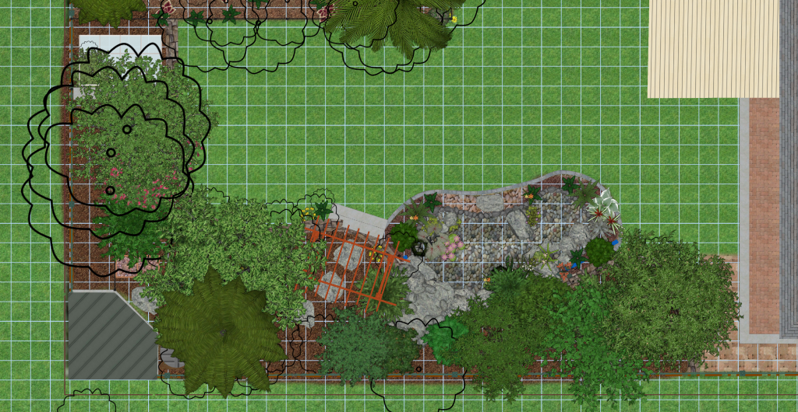

<!-- Global site tag (gtag.js) - Google Analytics -->

# Pond Design

Designing and building a pond is a huge amount of work compared to other parts of a backyard transformation. I have now watched hundreds of tutorials, examples and read numerous blocks of information about building and designing ponds and still feel there is a lot more to learn. I will try and keep here a reference of information I have looked at and summarize what I see are the major aspects of pond design that I have considered, my choices and why.

# Contents
{:.no_toc}

1. Will be replaced with the ToC, excluding the "Contents" header
{:toc}

# My pond design : Big question to answer early (Pond position)

I have narrowed down to two main design options that have a big impact on the structure of the overall backyard. It is about where to place the retaining wall and pond. This decision needs to be made early, can't be changed later and has a big impact on everything else.

I may also need more iterations on this when I get feedback about regulations from my local council about any requirements.

## Pond near house

* 8.5 m^2 area, 1.7 m ^ 3 (Straight 70cm walls is 4 m ^3) volume, 12 m perimeter (Can probably extend length a bit but not width)
+ Positive: Has access to full sun
+ Positive: Is visible from the kitchen
+ Positive: Looks good for larger deck build
+ Positive: Little or no impact by run-off from chickens
+ Positive: Retaining wall very low height around pond better for structural support
+ Positive: No issues with pool fence regulations
+ Positive: Extra retaining for the pond itself should be unnecessary
- Negative: Smaller pond (A little narrower)
- Negative: Difficult to control shading (naturally or artificially)
	* I may be able to use a small over pond bridge to create some shade (and a cool path to thinking rock on other side of pond)
	* I can probably work something out here with planting shrubs on north/west edge
- Negative: More difficult plumbing of the hydrostatic release drain (Needs to pipe further under grass down to pool retaining wall)
- Negative: Less space available for planting trees

## Pond near back of property

* 9.3 m^2 area, 2 m ^ 3 (Straight 70cm walls is 5 m ^3) volume, 12 m perimeter
+ Positive: My wife prefers this one
+ Positive: Larger pond
+ Positive: Easy to control shading (naturally or artificially)
+ Positive: More space available for planting trees
+ Positive: Simpler plumbing of the hydrostatic release drain
+ Positive: Simple to plumb future radial flow filter if desired
+ Positive: Maybe able to work some kind of fencing into design if necessary but will still be ugly
+ Positive: Can build decking for place to sit and dangle ferrt in pond
- Negative: No access to full sun there is forced part shading
- Negative: Not visible from the kitchen
- Negative: Blocks access back of property/glasshouse
- Negative: Looks cramped if we do larger deck extension one day
- Negative: Potentially impacted by run-off water from chickens unless suitable drainage is sufficent
- Negative: Nearer to steep section of retaining wall may have issues with structural support
- Negative: Maybe issues with pool fence regulations
- Negative: May need extra retaining for pond itself as land still sloped there without significant retaiing wall above

## Council regulations

These regulations will be different everywhere, but where I live in NSW Australia, I need to find out if a pond deeper than 300 mm is considered a pool and will require a fence. In which case I dont think a pond is feasible to put into my design (well not one that is incapable of sustaining a small ecosystem with fish and not just a bowl full of algae). 

NSW Pool regulations define a pool according to: <https://www.fairtrading.nsw.gov.au/housing-and-property/building-and-renovating/pools-and-pool-safety/swimming-pools-and-spas>

> The law applies to any excavation, structure or vessel including swimming pools and spa pools that are:
> 
> * capable of being filled with water to a depth greater than 30cm, and
> * used, designed, manufactured or adapted for swimming, wading, paddling or any other human aquatic activity.

There are however many extra documents since the original definition changing different aspects of pool and fencing regulations, I didn't see any changes in the definition of swimming pool. Also I spoke with a Duty Planner from Wollongong Council and they said yes we will need a DA as it is deeper than 300 mm, but they also confirmed that it is not classified as a pool and thus will not require boundary fencing. The DA will need to outline this information.
<https://www.fairtrading.nsw.gov.au/housing-and-property/building-and-renovating/pools-and-pool-safety/pool-fencing-requirements>

This document is very clear, though is it current and official? It looks to be so: <https://www.swimmingpoolregister.nsw.gov.au/inspection/Inspection%20Page%20FAQ.pdf>

> **Question:**  Do I need to fence (install a childresistance barrier for) my fish pond?
> 
> **Answer:** No. If a fish pond has been designed and, manufactured to be solely used as a fish pond, then no child-resistant barrier is required.

Another useful bit of information, is I think I will need a DA to approve a pond deeper than 300 mm. According to this document which defines "Exempt and Complying Development Codes": <https://www.legislation.nsw.gov.au/#/view/EPI/2008/572/part2/div1/subDiv40>

> (1)  The standards specified for that development are that the development must—
>      (a)  not have a water depth of more than 300mm, and
>      (a1)  not have a surface area of more than 10m2, and
>      (b)  if it is constructed or installed in a heritage conservation area or a draft heritage conservation area—be located in the rear yard.
> (2)  Despite subclause 1(a), a pond sump may be placed in a water feature or pond below a water depth of 300mm if the sump is covered with a bolted or anchored grate that is capable of supporting a weight of 150kg.

I believe this means if the pond was < 300 mm deep and surface area < 10 m ^2 then no approval is required. 

One other reference about pond fencing and depth requirements is not official but helpful (and helped me locate the FAQ with a clear answer is): <https://ozponds.com/do-ponds-need-a-fence/>

With that said, I plan to address the safety aspect of the pond in the design as well though position selection, bottom contour and planting choices.

The two designs I am looking at are below. 

# Inspiration

These are some stand-out places for information and inspiration for pond design:

* Bama Bass pond
  * The best pond I have seen for asthetics and diversity
  * A great example: <https://youtu.be/ddzmDF7Ds78>
  * Youtube Channel: <https://www.youtube.com/channel/UCSTueQfft5yfjNuRu2DZsHw>

* Melbourne Aquaponics
  * Great example using an asthetically pleasing pond for Aquaponics: <https://www.youtube.com/watch?v=p4Saas9WRws>
  * Youtube Channel: <https://www.youtube.com/channel/UCZ1Otify84TlwZ90OJ18SAQ>

* The Pond Digger
  * Youtube Channel: <https://www.youtube.com/channel/UCgdXrQHVEVUMCinKmrSfFxA>
  * Has LOTS of informative tutorials, how to build ponds, ponds gone wrong etc.
  * Not just a sinle style of pond byt covers multiple different use cases
  * How to build a fish pond: <https://www.youtube.com/playlist?list=PLqM5Qn1K_DPwBIjJEMcKgzg8jPLjUUmG->
  * How to build a koi pond: <https://www.youtube.com/playlist?list=PLqM5Qn1K_DPy8JG3GRi8Sk-_TRYDospCD>

* Team Aquascape
  * Youtube Channel: <https://www.youtube.com/channel/UCbOyl13WDs8xYECSKZgoYsw>
  * Very strong on the advertisment but they do have some amazing ponds that they showcase
  * One amazing example in Australia: <https://www.youtube.com/watch?v=Rm-V0n-76UI&t=448s>

* Rob Bob's Aquaponics & Backyard Farm
  * Lots of great information on Aquaponics (not using ponds though but IBCs)
  * Youtube Channel: <https://www.youtube.com/user/bnbob01>

* Any Ponds (Also was Mark the Pond Advisor)
  * Youtube Channel: <https://www.youtube.com/c/AnyPondTV/featured>
  * A good example: <https://www.youtube.com/watch?v=8X2mjw3cfzE>
  * Does some nice maller ponds. I saw a few of these early on that inspired me

# Current Pond Design

# Overview of pond styles

There are a few major pond building styles I have seen. Many of the "best practices" between these styles also seem to contradict and it is important to understand what the reasons are for the differences to make good decisions unless your pond fits into one of the existing molds (which mine does not). 

## Koi/Fish Ponds
* Optimized for pond volume and filtration
* Steep tall walls, deep pond, few if any planting shelves, often using concrete (walls or collar) to prevent wall collapse
* No loose rocks on the bottom
* Use a bottom drain + some form of mechanical filtration often a seive and/or settling tank like swirl, radial flow etc
* Use a skimmer for surface filtration almost exclusively
* Often external bio-filtration
* Sometimes extra complex filtration and pumps (Including UV, bead, tumblers etc)

## Ecosystem Ponds

In contrast to koi builds, there appears to be a more recent movement of what I am calling Aquascape ponds (largely fulled by the company making many of the components for these ponds, though not the only group doing so). These ponds seem to have quite a different style on builds:

* Tiered shelf design with planting pockets, usually multiple smaller walls (thus less volume), using natural dirt under liner (not concrete) + rocks above liner
* Usually put loose rocks on the bottom and cover liner so not visible
* Rarely a bottom drain or any pumps on the bottom
* A skimmer (Or intake bay which I like the concept of) for surface filtration
* A waterfall of some kind for aeration + upflow bio-filtration

# Aspects of Pond Design

Here I will list various aspects of pond design that should be considered. Detailing a few common options in each category and listing pros/cons for each option and how it relates to the type of pond being built.

## Mehanical surface filtration

The most common option by far is installing a skimmer box and is on most pond builds I have seen.

My first choice would be an intake-bay because it reduces risk of killing animals in the pond, but also my initial thought is that they are simpler to clean/maintain every week. However there are some significant complexities with installing an intake bay in my pond. As a result I am going to start with a typical skimmer box. 

I also have an idea I plan to try to convert a skimmer box into a intake bay using a 3D printed adapter to replace the flapper that insteads draws the gravity fed intake from an aquablock under the rocks just in front of the skimmer. This may have some issues (like limited flow of water causing the pump to run dry), but I will give it a shot sometime after getting a working pond and see how it turns out.

Options include:

* Skimmer box (most common in all designs)
	+ Well known + tested
	+ Usually easy to hide by placing under/near viewing area also makes maintainence more accessible
	+ Good support for water level maintainence with hidden auto-water level topup using float valve + overflow / drain
	+ Due to the design of skimmers if you have a failure in the plumbing you wont pump the pond dry
	+ Great way to hide pump/plumbing in an accessible way
	- Needs manual maintainence maybe weekly?
	- Can suck in small animals and kill them (not great for ecosystem ponds with frogs, turtles etc)
	
* Intake bay (Seen only a few of these)
	+ Look amazing, they look very natural you cant see them at all
	+ Regular maintainence (maybe weekly) uses a rake to take out debris instead of pulling out baskets (Yearly maybe cleaning out rocks?)
	+ Due to the design of intake bays if you have a failure in the plumbing you wont pump the pond dry (if intake bay done correctly)
	+ Great way to hide pump/plumbing in an accessible way
	- Not seen a lot on these, I like the concept, do they work well I dont see much information on these after installed?
	- Takes up a significant portion of the pond volume/area (Skimmers ar eusually installed on the side, so less liner required)
	? Are they as effective as skimmer boxes? I assume the water flow is the same but no flapper so velocity of water lower
	? Can probably install same water level maintainence in pump vault with hidden auto-water level topup using float valve + overflow / drain
	
* Lid over pond (for Aquaponics)
	In aquaponics usually they just cover the pond with a lid to prevent external debris getting in the first place. Not feasible in most ponds.
	
* Manual netting and rely on bottom drain (for people with nothing better to do)

## Mechanical bottom filtration

The purpose of this is to clean/filter derbis that was missed by the surface filtration and sunk to the bottom of the pond (often decomposes into sludge) and also to try and filter/clean fish waste. One other thought here is that a flow of water through bottom filtration may prevent anerobic (smelly) bacteria colonizing the bottom of the pond by providing slightly more oxygenated water on the bottom which is usually is oxygen depleted.

The most common option considered here is a bottom drain, and is often installed in Koi ponds. Another solution to this I have seen a little bit of is the under-gravel suction grid. However because it makes the rocks act as a mechanical filter arguably it clogs the rocks on the bottom with all the debris and makes cleaning very difficult.

I have seen very polarized views on the under-gravel suction grids. It will cause debris to be caught in the gravel no matter what if it is filtering effectively as that is what a filter does, however a theory I have seen is that much of that debris is broken down by bacteria living in the rocks over the large surface area of the pond bottom and if well balanced will keep it unblocked/clean except for the larger sticks etc. The bottom of the pond is usually a haven for anerobic bacteria, but with a suction grid the flow of water provides slightly more oxygenated water supply to the bacteria on the bottom of the pond, permitting aerobic bacteria to colonize more effectively which is good for the health of the pond.

Often any filters attached to bottom drains or suction grids need the ability to settle/filter fine solids (fish waste) from the water. See more on this under the topic of [solids settling filters](#solids-settling-filters) as there are a lot of things to consider here as well.

Options include:

* Bottom drain

	This is the most common solution I have noticed for a koi/fish pond. A bottom drain is almost never seen in ecosystem ponds as they usually have rocked in bottoms that prevent the waste travelling to the drain and also rocks can block the drain. 

	+ Very effective for fish waste and small debris that is not caught by a surface skimmer
	+ If working properly greatly reduces larger yearly maintainence (No need for yearly drain/wash)
	- More difficult to install, must be done from the begining as it is hard to add afterwards (you can install on top of liner ones but they are less effective apparently)
	- Requires bare liner on bottom of pond for waste to flow to drain (I.e. not able to rocked in the bottom of the pond)
	- Ideally requires sloped contour on the bottom of the pond to permit waste to flow to drain
	- Ideally (not required) wants aeration on top of the drain (to create an eddy/current-flow of water that hopefully pushes waste down the walls and along the floor back to the drain)
	- Often requires extra external filtration (Most common is a solids settling filter like swirl, radial flow, seive etc)
	* Some people worry about them leaking or rising, but if installed correctly shouldn't be an issue

* Under-gravel suction grid

	Must be done "correctly". Apparently many are not constructed well. You must use larger smooth gravel to prevent muck accumulating/getting caught in the smaller gravel. It must be easy for the muck to flow past the gravel into the grid pipes. I assume as well the water flow must be sufficient to permit these to work effectively.

	+ Looks great as you dont see it and can have a rocked bottom still. Sometims installed in ecosystem ponds, rarely in koi ponds
	+ Can be installed more simply as can be constructed entirely on top of the liner
	- Likely to need a second pump
	? Effectiveness compared to bottom drains is greatly debated
	? Some people say reduces yearly maintainence but the drain/washing still needs to happen just less frequently (maybe 5 years)

* Yearly manual drain + clean 

	This seems to be a very common solution for ecosystem ponds that I have seen on youtube. This looks like a LOT of work and is stressful on the fish. In most ecosystem ponds there is no bottom drain or suction grid. Instead muck just accumulates under on the bottom. Without fish or a very light load stocked in the pond, this is not a huge issue. However it is clear that a LOT of muck can accumulate under the rocks if the bottom of the pond is rocked in and is often much worse with fish stocked in the pond. 

	Also to be clear the issue is not just cleanliness but if you have fish in the pond this can be quite dangerous for them. If the muck remains undistrubed on the bottom it is often ok, however as soon as say larger winds, or big flush of rain or you working on the pond disturbs the muck on the bottom it can case the water to become toxic for the fish. 

I have been thinking this issue through. I really want the best of both worlds (bottom drain for reduced maintainence, and rocked pond bottom for asthetics and liner protection) and not sure what is feasible. My plan is to install a bottom drain on the pond at construction including a sloped floor on the bottom contour as it is difficult to do so later. However I still plan to install normal planting shelves, and rock those in like in an ecosystem pond, fully aware that the shelves may accumulate muck and prevent it flowing into the bottom drain.

I have a few ideas I would like to try:
* Rocked shelves, and pond walls but bottom contour bare liner to bottom drain
* Add under-gravel pumping grid (not suction, or maybe cycle suction/pumping regulary) in the shelves (and around edge of bottom contour), the goal is to agitate debris from the shelves and behind the rock walls so it doesnt settle and will be eventually pushed to the bottom drain. Not sure if this will work/help.
* Create a 3D printed adapter to plug a suction/pumping grid into the drain hole and convert a drain to a grid

## Biological filtration

TODO

## Solids Settling Filters

Usually only considered for koi/fish ponds and is closely tied to the [Mechanical bottom filtration](#mechanical-bottom-filtration). Key aspects to consider:

* Usually slow flow of water through these to permit separation of solids/liquids
* Radial flow considered more effective than swirl for close density materials (fish waste + water)
* Often seives used
* Not post-pump, but often gravity fed pre-pump to reduce churning up fish waste even smaller
* Cleaning process, and reuse on garden (TODO robobs aquaponics radial flow example)

TODO more info

## Other filtration
* Bead filters, tumblers etc
* UV sterilization (not really filtration)
* Under gravel suction grids
* Bog filters
Really good info on pond filters: <https://www.koiphen.com/forums/showthread.php?93019-Filtration-Basics>

## Oxygenation

## Current flow

## Redundancy and fish/bacteria safety

TODO
Including skimmers/intake bays vs pump on bottom vs aquaponics style much safer gravity fed etc if plumbing failure wont empty out pond
Including aerators and battery backups for power outage
Power reduction and solar (small pump 24/7 larger filtration pump during day)

## Pond shape

My choice: Natural almost kidney bean shape

This decision is more about asthetics, but some thought needs to be put into current flow and ensuring no stagnant areas of the pond

Options:

* Circle
	+ Easiest to understand current flow, helping to keep it clean and reduce maintainence
	* Not great for a natural look, is good for formal look

* Sharp corners (like a square)
	+ Difficult to ensure current flow in corners and thus keeping them clean
	* Not great for a natural look, is good for formal look

* Natural other shape (Kidney bean common)
	+ No sharp corners to prevent water flow
	- Still more difficult to understand water flow than circle
	* Great for more natural looking ponds

## Pond location/positioning

Honestly this is what I am having the most difficulty deciding on. It is something I cant afford to get wrong and has so many considerations.

My choice: Not sure?? IMPORTANT cant change afterwards!

Key points here that I have been considering:
* Ideally visible from common living areas (especially waterfall and plants)
* Approachable for feeding fish
* Avoid debris from nearby trees
	Was planning shade provded by nearby trees (deciduous, everyone advises against it)
	Now considering a shade sail and more careful planting near pond
* Many trees/plants are poisoness for fish
* If not highly elevated in landscape, consider water runoff in large rain downpours to prevent runoff entering pond, also hydrostatic-pressure
? Sun vs shade
	Ecosystem ponds all tend to want full sun for plant growth
	Koi ponds and Aquaponics all tend to want to limit sun exposure for the pond itself to limit algae growth and prevent fish getting sunburn :-)
		But then plants suffer
	Aquaponics covers the pond for full shade and then places growbeds externally in the sun
	Can we have a pond where there are some shallow planting areas in sun but deep are in shade?
	Shade tolerant aquatic plants: 
	Can we design so that sun hits aquatic plants and NOT the water?
	<https://www.woodvalefishandlilyfarm.com.au/products/plants/water-plants/shade-tolerant-water-plants/>
* other regulations (for me pool fence proximity, proximity to retaining wall effectively increases height of retaining wall by pond depth when considering wall loading)

## Pond bottom contour and shelves

For an ecosystem pond we usually want to create a tiered set of shelves usually of different heights, based on planting zones. This is different for a koi or fish pond where often we want fairly steep walls and fewer shelves.

When deciding on if you want to place shelves in a pond consider:
* Aquatic plants require different depths of water, most prefer shallow water
* Steeper walls have higher chance of collapse
  * Shelves are often cheaper/simpler to construct than steep walled ponds because of this
* Shelves provide locations for predatory birds to stand an stalk fish
* Adding shelves reduces the volume of water in the pond (more temperature fluctuation etc)
* Many insects and other wildlife require shallow and/or still water to thrive
* Shelves are less effective for koi ponds that use a bottom drain as they often trap waste

For these reasons, koi and fish ponds often dont have shelves and are steep walled but ecosystem ponds usually do. For my pond I plan to try using shelves. I have future plans to try different things to improve the issue of accumulated waste in the shelves but not to worry about to start with (regular cyclic suction/pushing unger-gravel grid).

When using shelves in a pond there are a few guidelines (that vary a bit depending on who you ask). Following is a list of things to consider (and more detail about specific depths etc that seems to vary between person below):

* Shelve widths smaller than 30cm are difficult to seat rocks on, may collapse (depending on depth) and do not provide much space for planting
* Shelves near waterfall need larger width to support the weight and size of large character boulders (45cm+ width)
* Shelf widths should vary for a natural look, consistent widths look more formal
* Often wider shelves at far end of pond for lots of planting and fewer/narrower shelves near approach to pond to get out of the way of seeing fish
* Avoid sheer steep shelves to prevent wall collapse : <https://www.gardenpondforum.com/threads/do-pond-walls-need-reinforcing.20670/>
  * "An angle of 15 - 20 degrees from the vertical will offer satisfactory protection from any structural collapse", "providing pond depth does not exceed 4 feet"
* Avoid shelf depth changes larger than 30cm (12 ") to make rock selection easier: <https://cepontzsons.com/pond-ledges/>
  * Usually a larger rock sits at the back of a shelf and rises above the level of the shelf above
  * This creates lips on the shelves to hold back pebbles and prevent them falling further into the pond
* Shelf depths should vary, a pond usually has shelves defining a few different planting "zones"
  * Good guidelines: <https://www.watersidenursery.co.uk/tips-advice/planting-the-pond-shelves-shelf-0-shelf-1-shelf-2/>
    * Shelf 0 : 13-15cm (5-6")
    * Shelf 1 : 15-22cm (6-9")
    * Shelf 2 : 23-44cm (10-17") OPTIONAL
    * Shelf 3 : 75cm + (45" +)
  * <http://www.ozwatergardens.com.au/zone-map>
    * ZONE 1 : Pond floaters and drifters such as Duckweed.
    * ZONE 2 : For pond edges or bog areas. eg. Tassel Rushes, Pennyworts, Sweet Flags, Irises and plants that like wet feet.
    * ZONE 3 : 0-20cm plant depth. Suitable for marginal or bog plants like Water Irises, Milfoils and some grasses.
    * ZONE 4 : 20-40cm plant depth. Ideal for smaller water plants such as Miniature Waterlilies, Water Poppies, Water Fringes and large marginal plants such as Rushes, Reeds and Sedges.
    * ZONE 5 : 40cm or more in depth. Recommended for Waterlilies, Lotuses and underwater plants.
  * Pond digger example: <https://youtu.be/1Ak2wa28nE4?list=PLqM5Qn1K_DPwBIjJEMcKgzg8jPLjUUmG->
    * Also same as pond digger : <https://www.everything-ponds.com/water-garden-shelves-and-plants.html>
    * First Shelf : 20cm (8")
    * Second shelf: 50cm (20")
    * Bottom: 76cm (30")

Given all the above variations, I decided that I would like to do the following:
* Shelf 0 : 15 cm
* Shelf 1 : 30 cm
* Bottom  : 85? cm (As deep as feasible ideally, gives a 55cm wall which is large)
* Around entire edge of pond is mostly 15cm but occasionally 30cm, meaning I can place rocks on shelf next to pond and not require stacking at the edge requiring a few 30 cm+ rocks but mostly 15cm with some smaller for variation
* Minimal shelf width of 30cm, with 15-20cm rocks (even round) gives 10-15cm planting space
* Shelf under waterfall >= 45cm
* 2x planting pockets >= 45cm
* Drop to 30cm at both approach points (not full bottom depth)

## Safety

It is important that the design considers safety of children and also animals (You dont want an animal getting stuck and drowned in your pond).  A typical ecosystem pond is usually designed with various levels of shallow shelves giving a gradual change to depth than say a typical Koi pond. 

Additionally lining the bottom with rocks also makes it easier to purchase and get back out of the pond if an accident does happen than a bare exposed slippery liner. 

Nothing is child proof, but this needs to be considered. 

There are things you can do with pond positioning, edge treatment and planting choices to help make it a little safer. Having the main approaches to the pond be shallow with a rocked in bottom is probably a key item to consider here along with planting higher barriers in areas it would be less safe to approach from.

## Underlay + Concrete:

Prevent rodents burying in liner use concrete" <https://www.houzz.com.au/magazine/build-a-backyard-fish-pond-without-going-belly-up-stsetivw-vs~91523708>
Expert tip: If you do go with a rubber liner, Leidner recommends buying a few bags of concrete, poking holes in them and using the bags to line the hole. Then spray the bags with water and put the rubber liner on top. The bag will dissolve and the concrete will harden, creating a barrier that rodents can’t get through.

## Hydrostatic pressure

## Overflow

## Topup

## Rocks on bottom or not

Most ecosystem ponds have rocks on the bottom they look great and it is beneficial for smaller fish, insects and other aquatic animals like frogs. Most koi ponds have bare liner all the way and are deep from the start as the koi produce huge amounts of waste and this prevents the yearly maintantence of emptying the pond by maintaining cleaner water all the time. 

Using the pond for aquaponics we would probably be mor elike a koi pond, however I want to try and acheive the best of both worlds. 

The rocks + planting pockets make the ecosystem pond more suitable for other aquatic creatures, insects and small fish, and also serve as a way for trapped animals to escape if necessary. I am actually considering rocked bottom + planting pockets in the shallows and bare exposed liner + erated bottom drain for the deeper shelves. 

My idea of using the pond for aquaponics means it is much more like a koi pond and the regular evacuation of fish waste is important. This will permit me the ability to not have to drain the pond every year I think to clean out the sludge forming under the rocks. We will see though. if all else fails I will then just do big rocks (not small) in the shallows with planted pots. But I think this isnt as good for other creatures.

I have also considered adding under-gravel suction grid for the shallows to help. The goal would be every day to reverse this to ensure no detritus is lodged inbetween the rocks and flush it out. Not sure if this will work. I know if you dont do it regulary you should never do it as it will cause real issues dislodging the waste but doing it each day might be helpful and cause it to flush to the bottom drain.

However I also want it to be suitable for frogs, for small fish, insects and other aquatic creatures. To achieve this I need planting and gradual slopes near the edges with protected coves. For frogs my understanding is they want basically still shallow warm water with planted cover. So I may have a section like that which is effectively separated off from the rest of the pond with no real current flow to it. More detail later.

My thinking is the larger fish will not spend much time in the shallows and it will accumulate very little waste as a result. 

* <https://www.koiphen.com/forums/showthread.php?70879-Why-Most-Koiphen-Members-Discourage-Rocks-In-Ponds!>

## Rock choice
Rock types, toxicisity and suitability
Angular vs smooth
Size and selection (what to put where as well)

## Planting
Planting pockets, types of plans and shelf depth etc

## Fish selection

## Maintainence

## Pump location

Discuss head, efficieny and piping etc

* Pump in skimmer box
	This is the Aquascape way. They typically have a skimmer and nothing ese.

* External pump bottom of pond
	This seems uncommon these days. 

* Underwater pumps
	?Efficiency?

* External pumps?
	?Efficiency?
	?Maintainence?

# History

Throughout the process I have worked on a few different pond designs based on where they were situated. This page documents prior stages in the pond design so I can keep a record of major changes and thoughts.

This page is largely for my benefit and is probably of little use for others.

[history.md](history.md)

