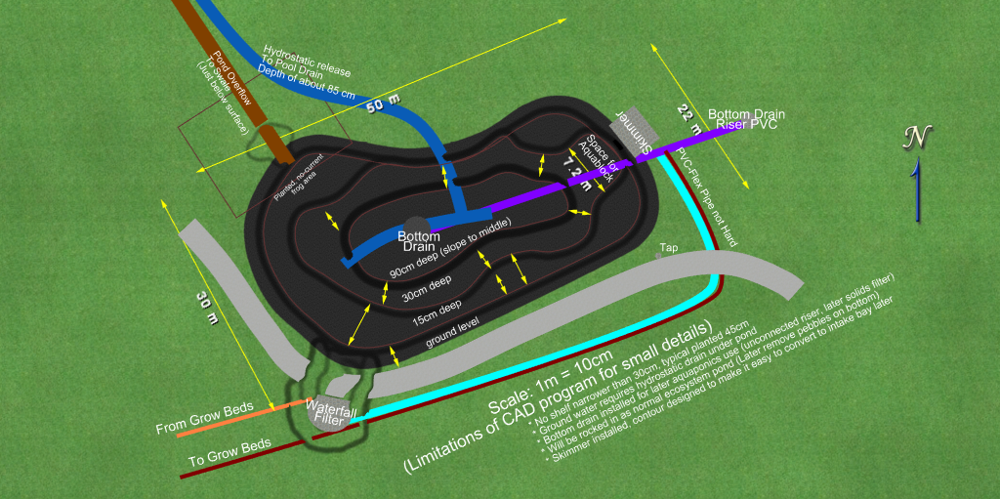

# Pond Design History

This page describes previous designs I made on my pond prject to a fairly stable point and then decided to change something significant. It gives a reasonable idea of the process that has happened over the last few years

# Contents
{:.no_toc}

1. Will be replaced with the ToC, excluding the "Contents" header
{:toc}

# Current design

TODO This page is largely a placeholder for now with some images missing all the content.

I am considering now to NOT include the intake bay to start with but just a skimmer as it increases the volume of the pond and is more likely to be beneficial for aquaponics and is likely a bit cheaper to install. If the contour is dug ok and liner wrapped up a little, we can maybe do a conversion later on in time and try out an intake bay. But for now I think I am going to go with the skimmer option.

# Pond below retaining wall 2020/03

# Pond above retaining wall 2019/09

# Pond in top corner with stream

<!-- Global site tag (gtag.js) - Google Analytics -->

