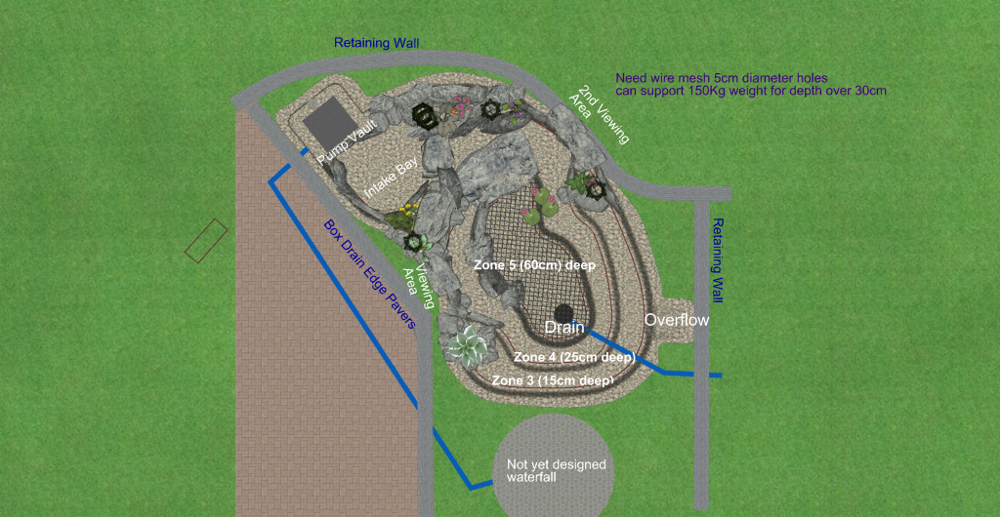

# Pond Design History

Throughout the process I have worked on a few different pond designs based on where they were situated. This page documents prior stages in the pond design so I can keep a record of major changes.

TODO This page is largely a placeholder for now with some images missing all the content.

I am considering now to NOT include the intake bay to start with but just a skimmer as it increases the volume of the pond and is more likely to be beneficial for aquaponics and is likely a bit cheaper to install. If the contour is dug ok and liner wrapped up a little, we can maybe do a conversion later on in time and try it out.

# Pond above retaining wall 2019/09

# Pond below retaining wall 2020/03

