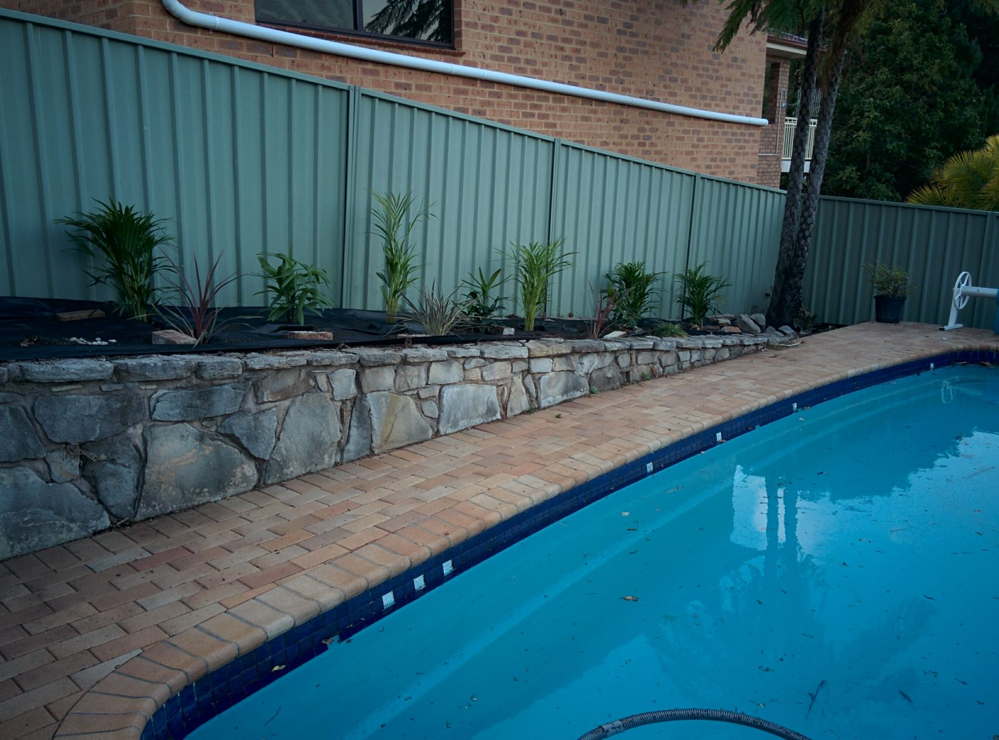
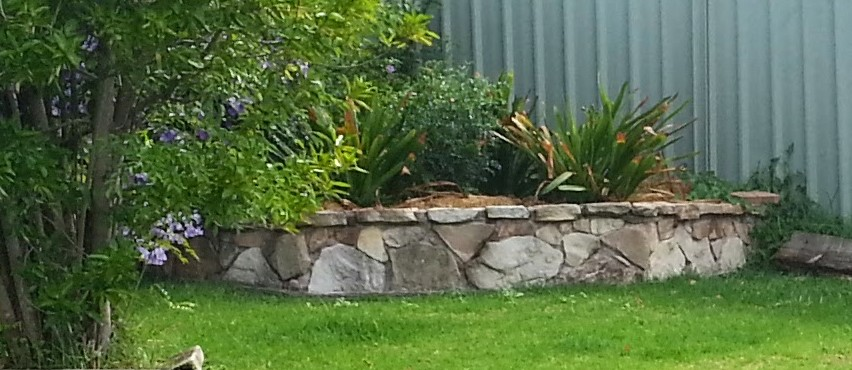

# Retaining wall design

TODO: Show current wall design, cross section, construction method, 

Include restrictions for local council and decisions made
Include info about pond design and proximity, more gradual walls closer to retaned section, steeper on other side
Include calcs for cement, rock, rio, etcreally near back southern corner near mango, but past the drip line of mango max growth
Decide if small pile idea was a bad one, likely to place more lateral pressure on the pond wall and collapse it, preferr wall to slide to be honest
Drainage and tree roots, also not wanting full retain drainage and would prefer wall collapse as want productive use above wall
So overall MUST make this a small retaining wall. Only section with retaining is 

Images showing existing retaining walls it would be nice to match in constructions of new ones:

<!-- Global site tag (gtag.js) - Google Analytics -->

