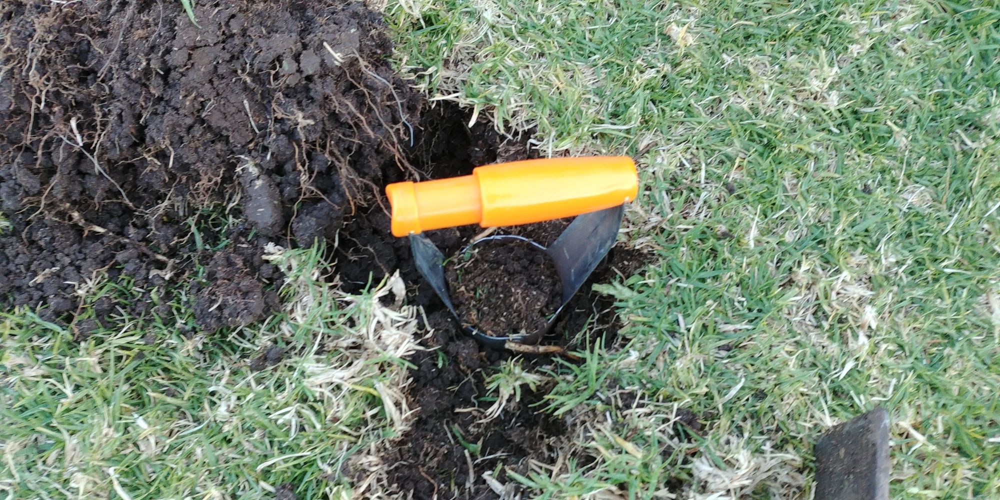
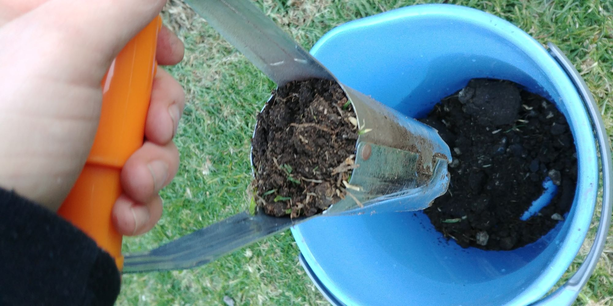

 

# Soil Analysis and remediation

As part of this process I made sure to have my soil tested to get an idea of what types of plants would work best and also to give an idea of any remdiation that would be required.

I used an external service to do the soil testing "Soil Doctor" and followed their process for obtain the soil samples: <https://www.soildoctors.com.au/soilsampling>

They provided a professional service to to use. I did find out afterwards that various universities in Australia offer free services for soil testing that also provides them with data used in research they are doing.

I obtained test results for both the top soil and sub-soil as they are quite different. 

You can see the soil report: [soil_report_2018_09_25_edited.pdf](soil_report_2018_09_25_edited.pdf)

Some photos showing the collection of the soil samples:

Perspective View  |  Topdown View
:---:|:---:
  |  

# Outcomes

This is the important part and I need to write it up. But focus is elsewhere for the moment. I will get to ths later.

TODO: Remediation
TODO: Plant choices
TODO: Drainage
TODO: Document process planned to improve the soild after the retaining wall is constructed
TODO: This page will document the details about my soil test.

<!-- Global site tag (gtag.js) - Google Analytics -->

