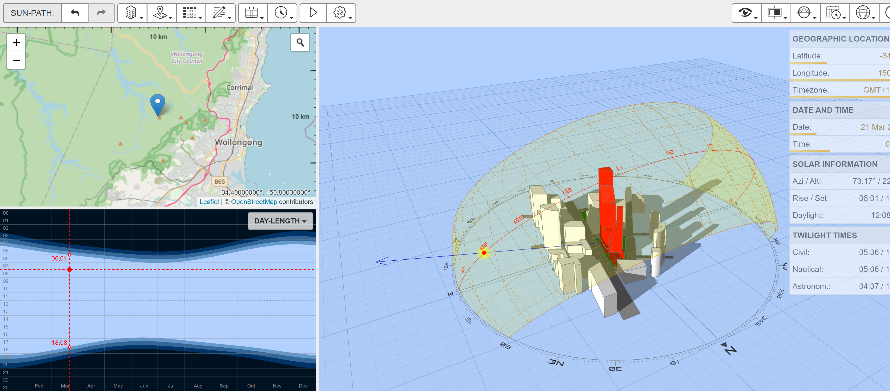

# Thoughtful Solar Design

## Observation

I first created a timelapse of the shadows in the existing landscape. This is a base line and I used it to check any models I created below and see if they were correct. I was using my old mobile phone so the image quality isnt great but it gives a good idea of how the shadows track in the old yard:

https://www.permaculturenews.org/2015/10/23/charting-the-suns-motion-in-relation-to-your-home-and-permaculture-site/

> For proper functioning and productivity gardens, greenhouses and orchards should be placed at specific locations based on the adequate availability of sunshine for the parts of the year in which the plants are growing or fruiting.

There are many tools that can be used to visualize the path of the sun at various times in the year at your specific location (Its different depending on where you live). One of the better ones I found was: https://drajmarsh.bitbucket.io/sunpath3d.html (Info at: http://andrewmarsh.com/software/sunpath3d-web/)

However to get the most use out of it you really want to create a 3D model for showing the shadows cast. I did a really quick and likely incorrect mockup in Fusion 360 using cylinders to represent trees. You can see in the (deliberatly very low bitrate) video below the difference the shadows cast between summer and winter.

## Landscaping Design Software

I roughly knew my site details already, it slopes downwards to the north so we get sunlight to all layers during winter if I have tall trees on the south short on the north. What I really wanted was more detailed view of shadows based on plantings and the location of houses. I wanted to answer questions like:

> If I plant a tree in a given spot does it prevent light getting to other plants in the back-yard that require it.

What I did find a little more useful was the software I used to model my overall landscape design. I really liked the interface and usability of "Realtime Landscaping Pro" from Ideaspectrum. It helps with modeling sloped terrain, houses, and the positioning of trees etc to evaluate where the shadows will be cast throughout the day and evaluate if we think a given plant has enough sunlight to thrive or not.

The biggest issue is that currently realtime Landscaping Pro only shows shadows as if the sun is directly overhead. I have sent in a feature request asking for the ability to configure latitude/longitude and they use an accurate model for the path of the sun in the rendering. Hopefully depending on how their software was written this could potentially be a very simple thing for them to implement if it is just modifying the path of the 3D lighting object.

You can see from the (deliberatly very low bitrate) video below, that most of the trees appear to have good access to sunlight except the understorey (and one of the aqaponic grow beds) is quite shaded. This is likely fine in real-life as the sun is not directly overhead but coming from the North for me which is more open.

I have read that ponds need either full sun (for ecosystem watergarden plants mostly) or a lot of shade (for Koi ponds and aquaponics to prevent algae growth and prevent the Koi getting sunburnt :-) ). So I have also modeled (though no veideo here) adding a lower height wide spreading shade tree/shrub on the north/west of the pond to provide this shading. I will start with the pond in full sun and if that is no good will plant some shading later.

The other benefit is that we can see how things change over time as the plants grow (there are options to change the age maturity of the trees in this software).

You can also compare the summer vs winter view.

TODO Much more I can add here
* Retaining wall impact on sunlight
* Potential glass-house location access to near full sun
* Planting zone diversity:
  * Zone: Full shade (on south west very shaded/protected)
  * Zone: Shading summer/Sunny winter where table is
  * Zone: Full sun on grass
  * Zone: Open layered sunlight on southern boundary
